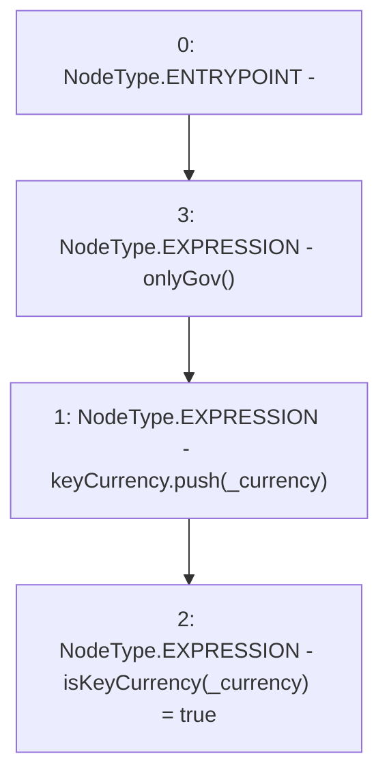

# Context: UniswapV2TokenAdapter.addKeyCurrency

**Contract:** `UniswapV2TokenAdapter` (Inherits: ICSSRAdapter)
**Signature:** `addKeyCurrency(address)`
**Method Selector ID:** `0x95545dd7`
**Visibility:** `external`
**Environment-Free:** `No (reads EVM state context)`
**Modifiers:**
- `onlyGov`
  ```solidity
  modifier onlyGov() {
          require(msg.sender == owned.governance(), "!gov");
          _;
      }
  ```

### State Variables Interaction
- **Reads:** keyCurrency
- **Writes:** isKeyCurrency, keyCurrency

### Environment & Verification Flags
- **Uses Foundry Cheatcodes:** No
- **Has Echidna Properties:** No

### Internal Calls Tree
- None

### External Calls / Value Transfers
- None

### Control Flow Graph (CFG)


### Source Mapping
Declared in: `certora-ac-datasets/detasets/web3bugs/dataset/web3bugs/42/projects/mochi-cssr/contracts/adapter/UniswapV2TokenAdapter.sol` on lines **39** to **42**

```solidity
    function addKeyCurrency(address _currency) external onlyGov {
        keyCurrency.push(_currency);
        isKeyCurrency[_currency] = true;
    }

```
