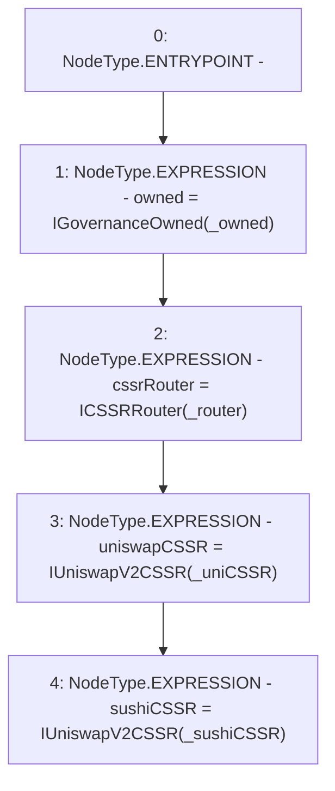

# Context: UniswapV2TokenAdapter.constructor

**Contract:** `UniswapV2TokenAdapter` (Inherits: ICSSRAdapter)
**Signature:** `constructor(address,address,address,address)`
**Method Selector ID:** `0xb0647061`
**Visibility:** `public`
**Environment-Free:** `Yes`
**Modifiers:** None

### State Variables Interaction
- **Reads:** None
- **Writes:** cssrRouter, owned, sushiCSSR, uniswapCSSR

### Environment & Verification Flags
- **Uses Foundry Cheatcodes:** No
- **Has Echidna Properties:** No

### Internal Calls Tree
- None

### External Calls / Value Transfers
- None

### Control Flow Graph (CFG)


### Source Mapping
Declared in: `certora-ac-datasets/detasets/web3bugs/dataset/web3bugs/42/projects/mochi-cssr/contracts/adapter/UniswapV2TokenAdapter.sol` on lines **27** to **37**

```solidity
    constructor(
        address _owned,
        address _router,
        address _uniCSSR,
        address _sushiCSSR
    ) {
        owned = IGovernanceOwned(_owned);
        cssrRouter = ICSSRRouter(_router);
        uniswapCSSR = IUniswapV2CSSR(_uniCSSR);
        sushiCSSR = IUniswapV2CSSR(_sushiCSSR);
    }

```
