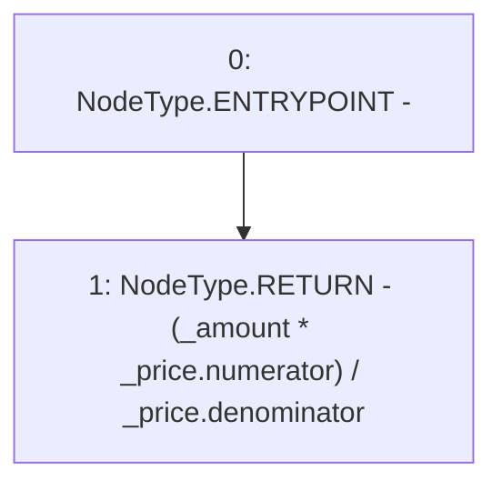

# Context: UniswapV2TokenAdapter.convertToValue

**Contract:** `UniswapV2TokenAdapter` (Inherits: ICSSRAdapter)
**Signature:** `convertToValue(uint256,float) returns (uint256)`
**Method Selector ID:** `Internal (No Method ID)`
**Visibility:** `internal`
**Environment-Free:** `Yes`
**Modifiers:** None

### State Variables Interaction
- **Reads:** None
- **Writes:** None

### Environment & Verification Flags
- **Uses Foundry Cheatcodes:** No
- **Has Echidna Properties:** No

### Internal Calls Tree
- None

### External Calls / Value Transfers
- None

### Control Flow Graph (CFG)


### Source Mapping
Declared in: `certora-ac-datasets/detasets/web3bugs/dataset/web3bugs/42/projects/mochi-cssr/contracts/adapter/UniswapV2TokenAdapter.sol` on lines **220** to **226**

```solidity
    function convertToValue(uint256 _amount, float memory _price)
        internal
        pure
        returns (uint256)
    {
        return (_amount * _price.numerator) / _price.denominator;
    }

```
