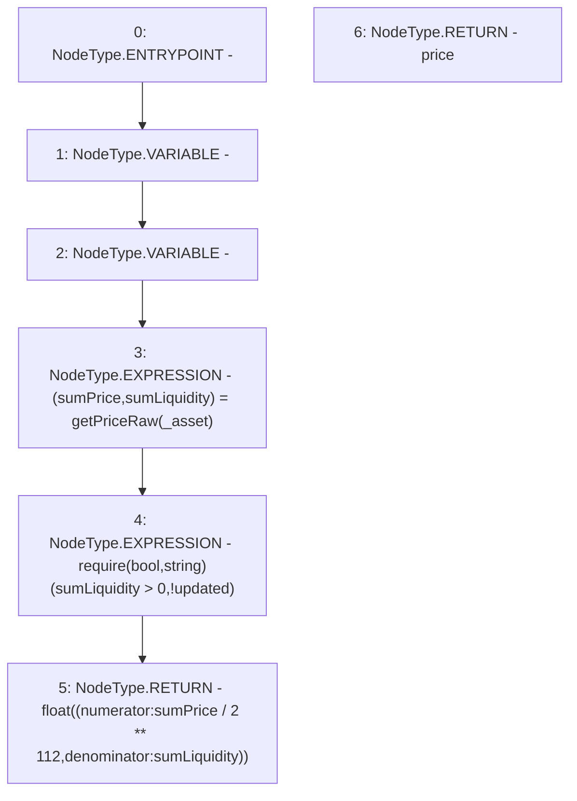

# Context: UniswapV2TokenAdapter.getPrice

**Contract:** `UniswapV2TokenAdapter` (Inherits: ICSSRAdapter)
**Signature:** `getPrice(address) returns (float)`
**Method Selector ID:** `0x41976e09`
**Visibility:** `public`
**Environment-Free:** `Yes`
**Modifiers:** None

### State Variables Interaction
- **Reads:** None
- **Writes:** None

### Assertion Checks & Business Requirements
- require/assert: `require(bool,string)(sumLiquidity > 0,!updated)`

### Environment & Verification Flags
- **Uses Foundry Cheatcodes:** No
- **Has Echidna Properties:** No

### Internal Calls Tree
- None

### External Calls / Value Transfers
- None

### Control Flow Graph (CFG)


### Source Mapping
Declared in: `certora-ac-datasets/detasets/web3bugs/dataset/web3bugs/42/projects/mochi-cssr/contracts/adapter/UniswapV2TokenAdapter.sol` on lines **158** to **167**

```solidity
    function getPrice(address _asset)
        public
        view
        override
        returns (float memory price)
    {
        (uint256 sumPrice, uint256 sumLiquidity) = getPriceRaw(_asset);
        require(sumLiquidity > 0, "!updated");
        return float({numerator: sumPrice / 2**112, denominator: sumLiquidity});
    }

```
