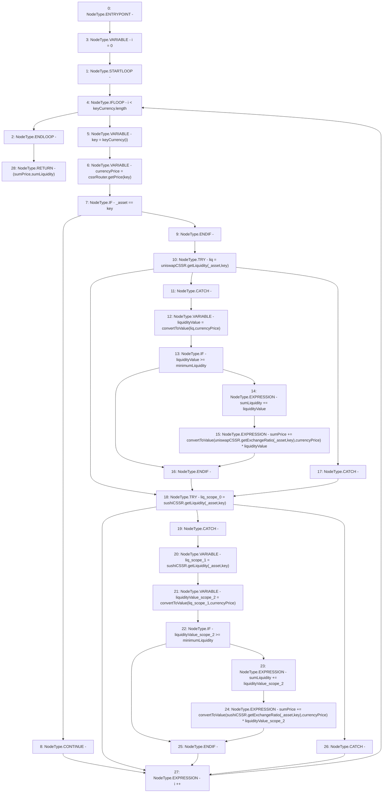

# Context: UniswapV2TokenAdapter.getPriceRaw

**Contract:** `UniswapV2TokenAdapter` (Inherits: ICSSRAdapter)
**Signature:** `getPriceRaw(address) returns (uint256, uint256)`
**Method Selector ID:** `0x9178bc7e`
**Visibility:** `public`
**Environment-Free:** `Yes`
**Modifiers:** None

### State Variables Interaction
- **Reads:** cssrRouter, keyCurrency, minimumLiquidity, sushiCSSR, uniswapCSSR
- **Writes:** None

### Environment & Verification Flags
- **Uses Foundry Cheatcodes:** No
- **Has Echidna Properties:** No

### Internal Calls Tree
- None

### External Calls / Value Transfers
- `IUniswapV2CSSR.TMP_43(uint256) = HIGH_LEVEL_CALL, dest:sushiCSSR(IUniswapV2CSSR), function:getExchangeRatio, arguments:['_asset', 'key']  `
- `IUniswapV2CSSR.TMP_33(uint256) = HIGH_LEVEL_CALL, dest:uniswapCSSR(IUniswapV2CSSR), function:getLiquidity, arguments:['_asset', 'key']  `
- `IUniswapV2CSSR.TMP_39(uint256) = HIGH_LEVEL_CALL, dest:sushiCSSR(IUniswapV2CSSR), function:getLiquidity, arguments:['_asset', 'key']  `
- `ICSSRRouter.TMP_31(float) = HIGH_LEVEL_CALL, dest:cssrRouter(ICSSRRouter), function:getPrice, arguments:['key']  `
- `IUniswapV2CSSR.TMP_36(uint256) = HIGH_LEVEL_CALL, dest:uniswapCSSR(IUniswapV2CSSR), function:getExchangeRatio, arguments:['_asset', 'key']  `
- `IUniswapV2CSSR.TMP_40(uint256) = HIGH_LEVEL_CALL, dest:sushiCSSR(IUniswapV2CSSR), function:getLiquidity, arguments:['_asset', 'key']  `

### Control Flow Graph (CFG)


### Source Mapping
Declared in: `certora-ac-datasets/detasets/web3bugs/dataset/web3bugs/42/projects/mochi-cssr/contracts/adapter/UniswapV2TokenAdapter.sol` on lines **117** to **156**

```solidity
    function getPriceRaw(address _asset)
        public
        view
        returns (uint256 sumPrice, uint256 sumLiquidity)
    {
        for (uint256 i = 0; i < keyCurrency.length; i++) {
            address key = keyCurrency[i];
            float memory currencyPrice = cssrRouter.getPrice(key);
            if (_asset == key) {
                continue;
            }
            try uniswapCSSR.getLiquidity(_asset, key) returns (uint256 liq) {
                uint256 liquidityValue = convertToValue(liq, currencyPrice);
                if (liquidityValue >= minimumLiquidity) {
                    sumLiquidity += liquidityValue;
                    sumPrice +=
                        convertToValue(
                            uniswapCSSR.getExchangeRatio(_asset, key),
                            currencyPrice
                        ) *
                        liquidityValue;
                }
            } catch {
            }
            try sushiCSSR.getLiquidity(_asset, key) returns (uint256 liq) {
                uint256 liq = sushiCSSR.getLiquidity(_asset,key);
                uint256 liquidityValue = convertToValue(liq, currencyPrice);
                if (liquidityValue >= minimumLiquidity) {
                    sumLiquidity += liquidityValue;
                    sumPrice +=
                        convertToValue(
                            sushiCSSR.getExchangeRatio(_asset, key),
                            currencyPrice
                        ) *
                        liquidityValue;
                }
            } catch {
            }
        }
    }

```
