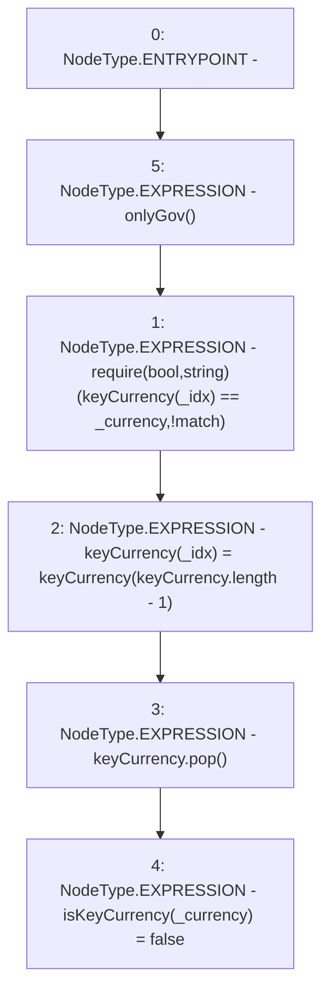

# Context: UniswapV2TokenAdapter.removeKeyCurrency

**Contract:** `UniswapV2TokenAdapter` (Inherits: ICSSRAdapter)
**Signature:** `removeKeyCurrency(uint256,address)`
**Method Selector ID:** `0x67a9be71`
**Visibility:** `external`
**Environment-Free:** `No (reads EVM state context)`
**Modifiers:**
- `onlyGov`
  ```solidity
  modifier onlyGov() {
          require(msg.sender == owned.governance(), "!gov");
          _;
      }
  ```

### State Variables Interaction
- **Reads:** keyCurrency
- **Writes:** isKeyCurrency, keyCurrency

### Assertion Checks & Business Requirements
- require/assert: `require(bool,string)(keyCurrency[_idx] == _currency,!match)`

### Environment & Verification Flags
- **Uses Foundry Cheatcodes:** No
- **Has Echidna Properties:** No

### Internal Calls Tree
- None

### External Calls / Value Transfers
- None

### Control Flow Graph (CFG)


### Source Mapping
Declared in: `certora-ac-datasets/detasets/web3bugs/dataset/web3bugs/42/projects/mochi-cssr/contracts/adapter/UniswapV2TokenAdapter.sol` on lines **44** to **52**

```solidity
    function removeKeyCurrency(uint256 _idx, address _currency)
        external
        onlyGov
    {
        require(keyCurrency[_idx] == _currency, "!match");
        keyCurrency[_idx] = keyCurrency[keyCurrency.length - 1];
        keyCurrency.pop();
        isKeyCurrency[_currency] = false;
    }

```
