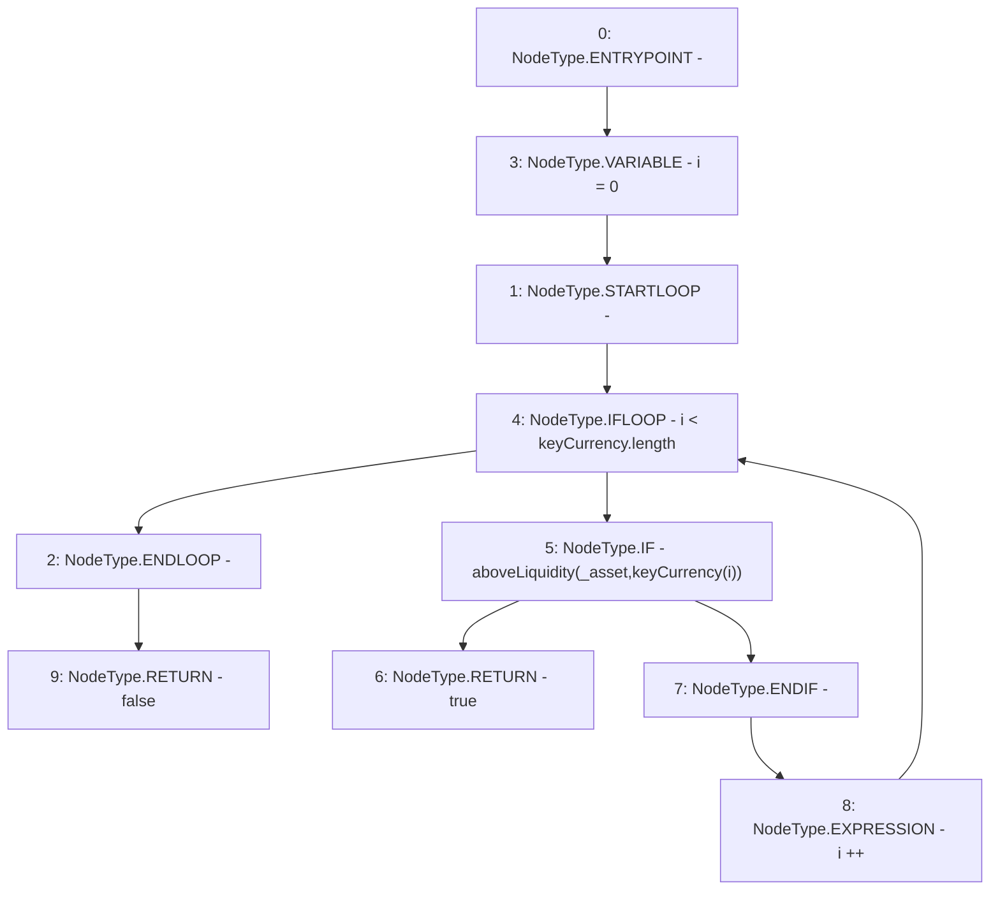

# Context: UniswapV2TokenAdapter.support

**Contract:** `UniswapV2TokenAdapter` (Inherits: ICSSRAdapter)
**Signature:** `support(address) returns (bool)`
**Method Selector ID:** `0xe660cc08`
**Visibility:** `external`
**Environment-Free:** `Yes`
**Modifiers:** None

### State Variables Interaction
- **Reads:** keyCurrency
- **Writes:** None

### Environment & Verification Flags
- **Uses Foundry Cheatcodes:** No
- **Has Echidna Properties:** No

### Internal Calls Tree
- None

### External Calls / Value Transfers
- None

### Control Flow Graph (CFG)


### Source Mapping
Declared in: `certora-ac-datasets/detasets/web3bugs/dataset/web3bugs/42/projects/mochi-cssr/contracts/adapter/UniswapV2TokenAdapter.sol` on lines **61** to **69**

```solidity
    function support(address _asset) external view override returns (bool) {
        // check if liquidity passes the minimum
        for (uint256 i = 0; i < keyCurrency.length; i++) {
            if (aboveLiquidity(_asset, keyCurrency[i])) {
                return true;
            }
        }
        return false;
    }

```
