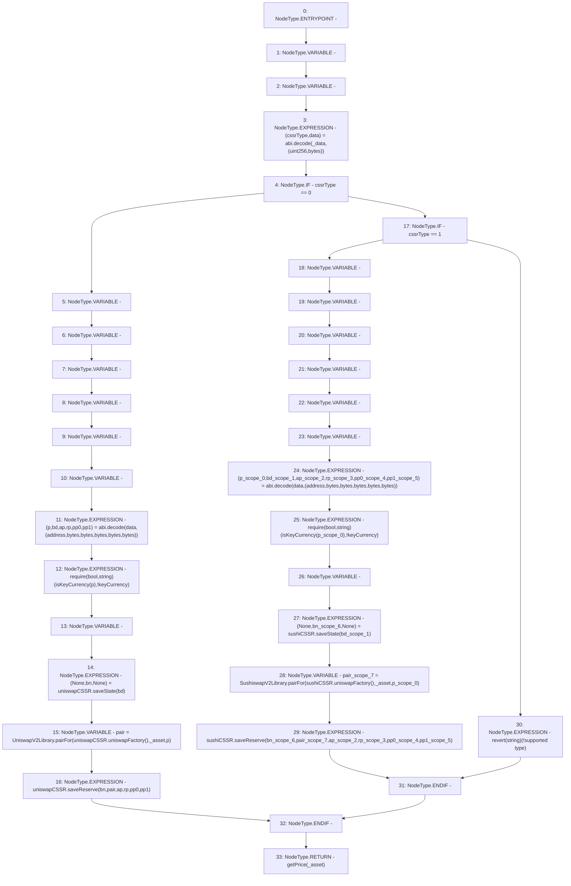

# Context: UniswapV2TokenAdapter.update

**Contract:** `UniswapV2TokenAdapter` (Inherits: ICSSRAdapter)
**Signature:** `update(address,bytes) returns (float)`
**Method Selector ID:** `0x02a688ed`
**Visibility:** `external`
**Environment-Free:** `Yes`
**Modifiers:** None

### State Variables Interaction
- **Reads:** isKeyCurrency, sushiCSSR, uniswapCSSR
- **Writes:** None

### Assertion Checks & Business Requirements
- require/assert: `require(bool,string)(isKeyCurrency[p],!keyCurrency)`
- require/assert: `require(bool,string)(isKeyCurrency[p_scope_0],!keyCurrency)`
- revert: `revert(string)(!supported type)`

### Environment & Verification Flags
- **Uses Foundry Cheatcodes:** No
- **Has Echidna Properties:** No

### Internal Calls Tree
- None

### External Calls / Value Transfers
- `UniswapV2Library.TMP_21(address) = LIBRARY_CALL, dest:UniswapV2Library, function:UniswapV2Library.pairFor(address,address,address), arguments:['TMP_20', '_asset', 'p'] `
- `IUniswapV2CSSR.TMP_27(ObservedData) = HIGH_LEVEL_CALL, dest:sushiCSSR(IUniswapV2CSSR), function:saveReserve, arguments:['bn_scope_6', 'pair_scope_7', 'ap_scope_2', 'rp_scope_3', 'pp0_scope_4', 'pp1_scope_5']  `
- `IUniswapV2CSSR.TUPLE_2(bytes32,uint256,uint256) = HIGH_LEVEL_CALL, dest:uniswapCSSR(IUniswapV2CSSR), function:saveState, arguments:['bd']  `
- `IUniswapV2CSSR.TMP_20(address) = HIGH_LEVEL_CALL, dest:uniswapCSSR(IUniswapV2CSSR), function:uniswapFactory, arguments:[]  `
- `IUniswapV2CSSR.TMP_25(address) = HIGH_LEVEL_CALL, dest:sushiCSSR(IUniswapV2CSSR), function:uniswapFactory, arguments:[]  `
- `SushiswapV2Library.TMP_26(address) = LIBRARY_CALL, dest:SushiswapV2Library, function:SushiswapV2Library.pairFor(address,address,address), arguments:['TMP_25', '_asset', 'p_scope_0'] `
- `IUniswapV2CSSR.TUPLE_4(bytes32,uint256,uint256) = HIGH_LEVEL_CALL, dest:sushiCSSR(IUniswapV2CSSR), function:saveState, arguments:['bd_scope_1']  `
- `IUniswapV2CSSR.TMP_22(ObservedData) = HIGH_LEVEL_CALL, dest:uniswapCSSR(IUniswapV2CSSR), function:saveReserve, arguments:['bn', 'pair', 'ap', 'rp', 'pp0', 'pp1']  `

### Control Flow Graph (CFG)


### Source Mapping
Declared in: `certora-ac-datasets/detasets/web3bugs/dataset/web3bugs/42/projects/mochi-cssr/contracts/adapter/UniswapV2TokenAdapter.sol` on lines **71** to **115**

```solidity
    function update(address _asset, bytes memory _data)
        external
        override
        returns (float memory)
    {
        (uint256 cssrType, bytes memory data) = abi.decode(_data, (uint256, bytes));
        if(cssrType == 0){
            (
                address p,
                bytes memory bd,
                bytes memory ap,
                bytes memory rp,
                bytes memory pp0,
                bytes memory pp1
            ) = abi.decode(data, (address, bytes, bytes, bytes, bytes, bytes));
            require(isKeyCurrency[p], "!keyCurrency");
            (, uint256 bn, ) = uniswapCSSR.saveState(bd);
            address pair = UniswapV2Library.pairFor(
                uniswapCSSR.uniswapFactory(),
                _asset,
                p
            );
            uniswapCSSR.saveReserve(bn, pair, ap, rp, pp0, pp1);
        } else if(cssrType == 1){
            (
                address p,
                bytes memory bd,
                bytes memory ap,
                bytes memory rp,
                bytes memory pp0,
                bytes memory pp1
            ) = abi.decode(data, (address, bytes, bytes, bytes, bytes, bytes));
            require(isKeyCurrency[p], "!keyCurrency");
            (, uint256 bn, ) = sushiCSSR.saveState(bd);
            address pair = SushiswapV2Library.pairFor(
                sushiCSSR.uniswapFactory(),
                _asset,
                p
            );
            sushiCSSR.saveReserve(bn, pair, ap, rp, pp0, pp1);
        } else {
            revert("!supported type");
        }
        return getPrice(_asset);
    }

```
