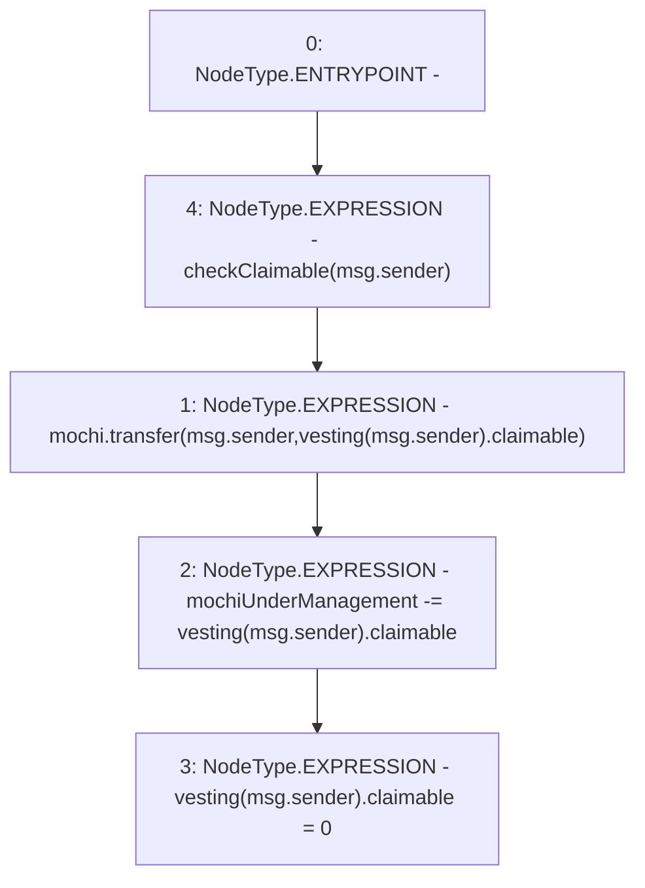

# Context: VestedRewardPool.claim

**Contract:** `VestedRewardPool` (Inherits: None)
**Signature:** `claim()`
**Method Selector ID:** `0x4e71d92d`
**Visibility:** `external`
**Environment-Free:** `No (reads EVM state context)`
**Modifiers:**
- `checkClaimable`
  ```solidity
  modifier checkClaimable(address recipient) {
          if (vesting[recipient].ends < block.timestamp) {
              vesting[recipient].claimable += vesting[recipient].vested;
              vesting[recipient].vested = 0;
              vesting[recipient].ends = 0;
          }
          _;
      }
  ```

### State Variables Interaction
- **Reads:** mochi, mochiUnderManagement, vesting
- **Writes:** mochiUnderManagement, vesting

### Environment & Verification Flags
- **Uses Foundry Cheatcodes:** No
- **Has Echidna Properties:** No

### Internal Calls Tree
- None

### External Calls / Value Transfers
- `IMochi.TMP_12(bool) = HIGH_LEVEL_CALL, dest:mochi(IMochi), function:transfer, arguments:['msg.sender', 'REF_13']  `

### Control Flow Graph (CFG)


### Source Mapping
Declared in: `certora-ac-datasets/detasets/web3bugs/dataset/web3bugs/42/projects/mochi-core/contracts/emission/VestedRewardPool.sol` on lines **48** to **52**

```solidity
    function claim() external checkClaimable(msg.sender) {
        mochi.transfer(msg.sender, vesting[msg.sender].claimable);
        mochiUnderManagement -= vesting[msg.sender].claimable;
        vesting[msg.sender].claimable = 0;
    }

```
