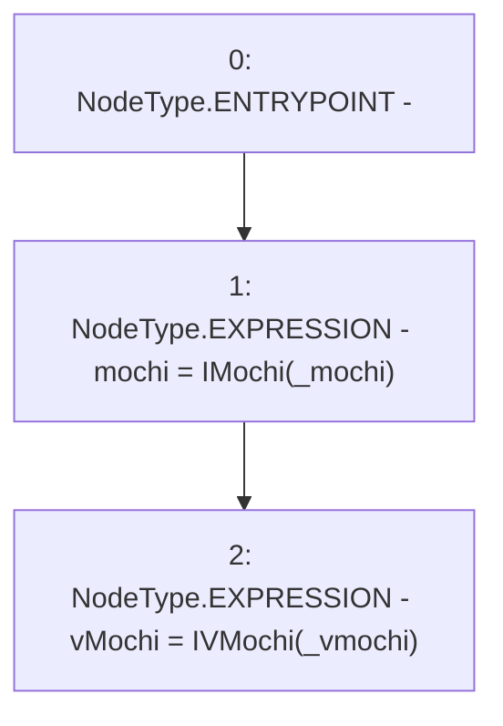

# Context: VestedRewardPool.constructor

**Contract:** `VestedRewardPool` (Inherits: None)
**Signature:** `constructor(address,address)`
**Method Selector ID:** `0x4525f804`
**Visibility:** `public`
**Environment-Free:** `Yes`
**Modifiers:** None

### State Variables Interaction
- **Reads:** None
- **Writes:** mochi, vMochi

### Environment & Verification Flags
- **Uses Foundry Cheatcodes:** No
- **Has Echidna Properties:** No

### Internal Calls Tree
- None

### External Calls / Value Transfers
- None

### Control Flow Graph (CFG)


### Source Mapping
Declared in: `certora-ac-datasets/detasets/web3bugs/dataset/web3bugs/42/projects/mochi-core/contracts/emission/VestedRewardPool.sol` on lines **31** to **34**

```solidity
    constructor(address _mochi, address _vmochi) {
        mochi = IMochi(_mochi);
        vMochi = IVMochi(_vmochi);
    }

```
