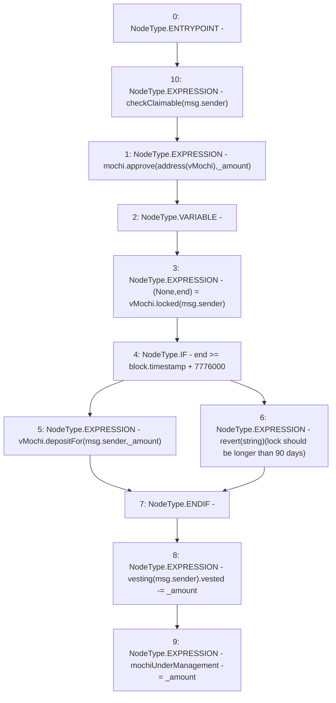

# Context: VestedRewardPool.lock

**Contract:** `VestedRewardPool` (Inherits: None)
**Signature:** `lock(uint256)`
**Method Selector ID:** `0xdd467064`
**Visibility:** `external`
**Environment-Free:** `No (reads EVM state context)`
**Modifiers:**
- `checkClaimable`
  ```solidity
  modifier checkClaimable(address recipient) {
          if (vesting[recipient].ends < block.timestamp) {
              vesting[recipient].claimable += vesting[recipient].vested;
              vesting[recipient].vested = 0;
              vesting[recipient].ends = 0;
          }
          _;
      }
  ```

### State Variables Interaction
- **Reads:** mochi, mochiUnderManagement, vMochi, vesting
- **Writes:** mochiUnderManagement, vesting

### Assertion Checks & Business Requirements
- revert: `revert(string)(lock should be longer than 90 days)`

### Environment & Verification Flags
- **Uses Foundry Cheatcodes:** No
- **Has Echidna Properties:** No

### Internal Calls Tree
- None

### External Calls / Value Transfers
- `IVMochi.HIGH_LEVEL_CALL, dest:vMochi(IVMochi), function:depositFor, arguments:['msg.sender', '_amount']  `
- `IVMochi.TUPLE_0(int128,uint256) = HIGH_LEVEL_CALL, dest:vMochi(IVMochi), function:locked, arguments:['msg.sender']  `
- `IMochi.TMP_15(bool) = HIGH_LEVEL_CALL, dest:mochi(IMochi), function:approve, arguments:['TMP_14', '_amount']  `

### Control Flow Graph (CFG)


### Source Mapping
Declared in: `certora-ac-datasets/detasets/web3bugs/dataset/web3bugs/42/projects/mochi-core/contracts/emission/VestedRewardPool.sol` on lines **54** to **64**

```solidity
    function lock(uint256 _amount) external checkClaimable(msg.sender) {
        mochi.approve(address(vMochi), _amount);
        (, uint256 end) = vMochi.locked(msg.sender);
        if (end >= block.timestamp + 90 days) {
            vMochi.depositFor(msg.sender, _amount);
        } else {
            revert("lock should be longer than 90 days");
        }
        vesting[msg.sender].vested -= _amount;
        mochiUnderManagement -= _amount;
    }

```
