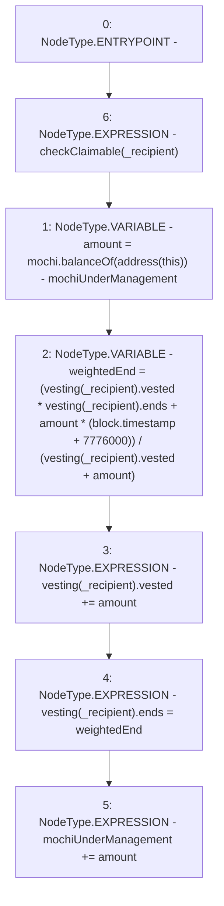

# Context: VestedRewardPool.vest

**Contract:** `VestedRewardPool` (Inherits: None)
**Signature:** `vest(address)`
**Method Selector ID:** `0xf3c5f51e`
**Visibility:** `external`
**Environment-Free:** `No (reads EVM state context)`
**Modifiers:**
- `checkClaimable`
  ```solidity
  modifier checkClaimable(address recipient) {
          if (vesting[recipient].ends < block.timestamp) {
              vesting[recipient].claimable += vesting[recipient].vested;
              vesting[recipient].vested = 0;
              vesting[recipient].ends = 0;
          }
          _;
      }
  ```

### State Variables Interaction
- **Reads:** mochi, mochiUnderManagement, vesting
- **Writes:** mochiUnderManagement, vesting

### Environment & Verification Flags
- **Uses Foundry Cheatcodes:** No
- **Has Echidna Properties:** No

### Internal Calls Tree
- None

### External Calls / Value Transfers
- `IMochi.TMP_3(uint256) = HIGH_LEVEL_CALL, dest:mochi(IMochi), function:balanceOf, arguments:['TMP_2']  `

### Control Flow Graph (CFG)


### Source Mapping
Declared in: `certora-ac-datasets/detasets/web3bugs/dataset/web3bugs/42/projects/mochi-core/contracts/emission/VestedRewardPool.sol` on lines **36** to **46**

```solidity
    function vest(address _recipient) external checkClaimable(_recipient) {
        uint256 amount = mochi.balanceOf(address(this)) - mochiUnderManagement;
        uint256 weightedEnd = (vesting[_recipient].vested *
            vesting[_recipient].ends +
            amount *
            (block.timestamp + 90 days)) /
            (vesting[_recipient].vested + amount);
        vesting[_recipient].vested += amount;
        vesting[_recipient].ends = weightedEnd;
        mochiUnderManagement += amount;
    }

```
