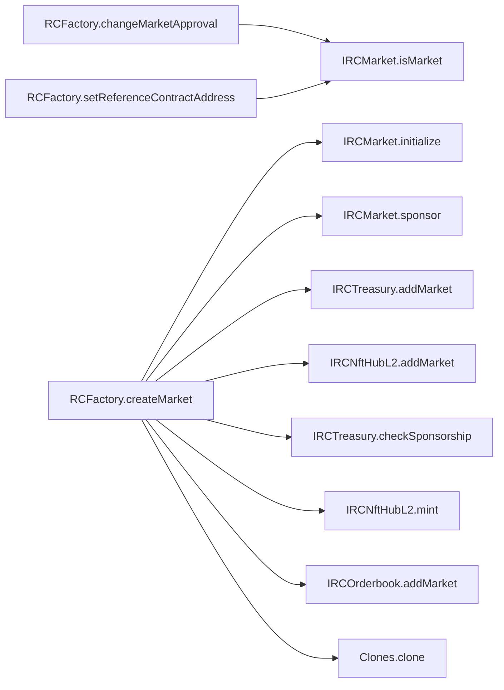
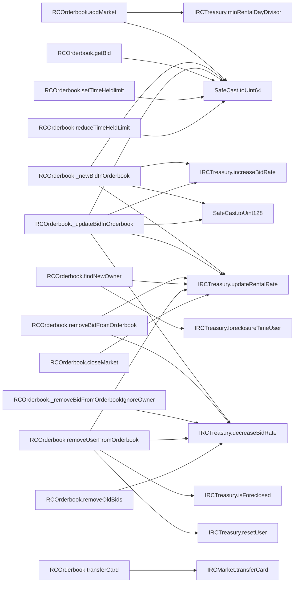
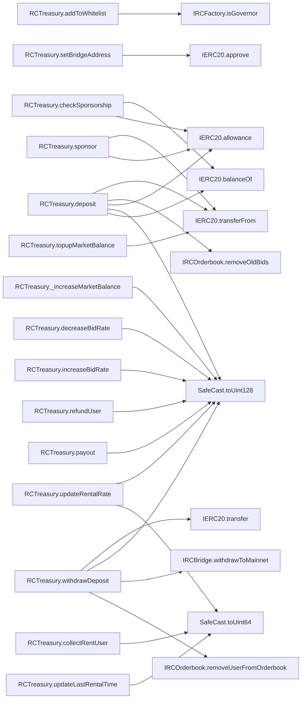
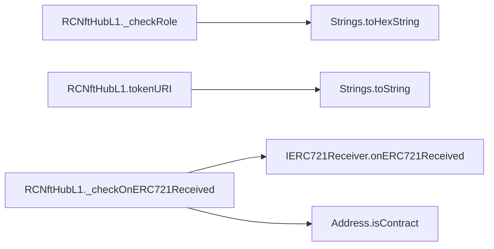
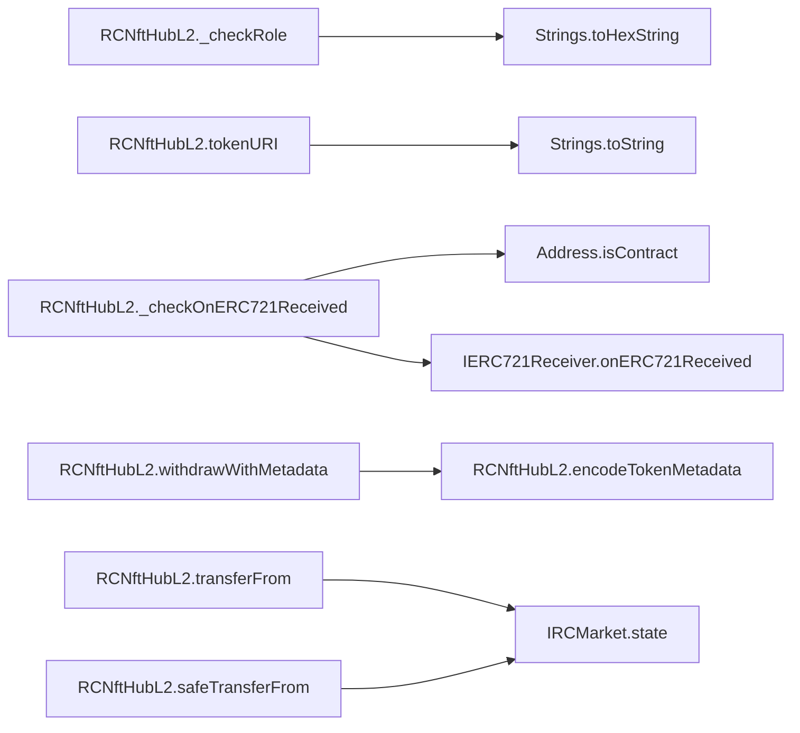

```mermaid
flowchart LR
    RCMarket.initialize --> IRCFactory.getPotDistribution
    RCMarket.initialize --> IRCFactory.treasury
    RCMarket.initialize --> IRCFactory.nfthub
    RCMarket.initialize --> IRCTreasury.minRentalDayDivisor
    RCMarket.initialize --> IRCFactory.minimumPriceIncreasePercent
    RCMarket.initialize --> IRCFactory.getOracleSettings
    RCMarket.initialize --> IRCFactory.orderbook
    RCMarket.initialize --> IRCFactory.maxRentIterations
    RCMarket.upgradeCard --> IRCFactory.trapIfUnapproved
    RCMarket.upgradeCard --> IRCFactory.isMarketApproved
    RCMarket.upgradeCard --> IRCNftHubL2.withdrawWithMetadata
    RCMarket.ownerOf --> IRCNftHubL2.ownerOf
    RCMarket.tokenURI --> IRCNftHubL2.tokenURI
    RCMarket._transferCard --> IRCNftHubL2.transferNft
    RCMarket._postQuestionToOracle --> IRealitio.askQuestion
    RCMarket.isFinalized --> IRealitio.isFinalized
    RCMarket.getWinnerFromOracle --> IRealitio.resultFor
    RCMarket.setAmicableResolution --> IRCFactory.owner
    RCMarket.lockMarket --> IRCOrderbook.closeMarket
    RCMarket.setWinner --> SafeCast.toUint32
    RCMarket._payout --> IRCTreasury.payout
    RCMarket.newRental --> IRCOrderbook.getBidValue
    RCMarket.newRental --> IRCOrderbook.removeOldBids
    RCMarket.newRental --> IRCTreasury.isForeclosed
    RCMarket.newRental --> IRCTreasury.userDeposit
    RCMarket.newRental --> IRCOrderbook.removeUserFromOrderbook
    RCMarket.newRental --> IRCOrderbook.addBidToOrderbook
    RCMarket.newRental --> IRCTreasury.marketPaused
    RCMarket.newRental --> IRCTreasury.userTotalBids
    RCMarket.newRental --> IRCTreasury.updateLastRentalTime
    RCMarket.newRental --> IRCTreasury.globalPause
    RCMarket.updateTimeHeldLimit --> IRCOrderbook.setTimeHeldlimit
    RCMarket.exit --> IRCOrderbook.findNewOwner
    RCMarket.exit --> IRCOrderbook.bidExists
    RCMarket.exit --> IRCOrderbook.removeBidFromOrderbook
    RCMarket.sponsor --> IRCTreasury.checkSponsorship
    RCMarket._sponsor --> IRCTreasury.sponsor
    RCMarket._collectRentAction --> IRCOrderbook.findNewOwner
    RCMarket._collectRentAction --> IRCTreasury.collectRentUser
    RCMarket._collectRentAction --> IRCTreasury.refundUser
    RCMarket._processRentCollection --> IRCTreasury.payRent
    RCMarket._processRentCollection --> IRCOrderbook.reduceTimeHeldLimit
    RCMarket.circuitBreaker --> IRCOrderbook.closeMarket
```

# 🧬 Flow Graphs, Constructor Sequences & SSA Representations

## Contract: Clones
### Linearised Constructor Execution sequence
- No constructors configured in hierarchy.

### Inter-Contract & Function Call Graph (Mermaid)
```mermaid
flowchart LR
```

### Functions Intermediate Code Operations (SlithIR & SSA)

---

## Contract: IERC721Receiver
### Linearised Constructor Execution sequence
- No constructors configured in hierarchy.

### Inter-Contract & Function Call Graph (Mermaid)
```mermaid
flowchart LR
```

### Functions Intermediate Code Operations (SlithIR & SSA)
#### Function: `onERC721Received`
<details><summary>View SlithIR Operations</summary>

```
No SlithIR operations.
```
</details>
<details><summary>View SSA Operations</summary>

```
No SSA operations.
```
</details>


---

## Contract: Address
### Linearised Constructor Execution sequence
- No constructors configured in hierarchy.

### Inter-Contract & Function Call Graph (Mermaid)
```mermaid
flowchart LR
```

### Functions Intermediate Code Operations (SlithIR & SSA)

---

## Contract: Strings
### Linearised Constructor Execution sequence
- No constructors configured in hierarchy.

### Inter-Contract & Function Call Graph (Mermaid)
```mermaid
flowchart LR
```

### Functions Intermediate Code Operations (SlithIR & SSA)

---

## Contract: SafeCast
### Linearised Constructor Execution sequence
- No constructors configured in hierarchy.

### Inter-Contract & Function Call Graph (Mermaid)
```mermaid
flowchart LR
```

### Functions Intermediate Code Operations (SlithIR & SSA)

---

## Contract: Migrations
### Linearised Constructor Execution sequence
- No constructors configured in hierarchy.

### Inter-Contract & Function Call Graph (Mermaid)


### Functions Intermediate Code Operations (SlithIR & SSA)
#### Function: `setCompleted`
<details><summary>View SlithIR Operations</summary>

```
last_completed_migration(uint256) := completed(uint256)
MODIFIER_CALL, Migrations.restricted()()
```
</details>
<details><summary>View SSA Operations</summary>

```
No SSA operations.
```
</details>

#### Function: `upgrade`
<details><summary>View SlithIR Operations</summary>

```
TMP_647 = CONVERT new_address to Migrations
upgraded(Migrations) := TMP_647(Migrations)
HIGH_LEVEL_CALL, dest:upgraded(Migrations), function:setCompleted, arguments:['last_completed_migration']  
MODIFIER_CALL, Migrations.restricted()()
```
</details>
<details><summary>View SSA Operations</summary>

```
No SSA operations.
```
</details>


---

## Contract: RCFactory
### Linearised Constructor Execution sequence
1. `Ownable.constructor()`

### Inter-Contract & Function Call Graph (Mermaid)


### Functions Intermediate Code Operations (SlithIR & SSA)
#### Function: `nfthub`
<details><summary>View SlithIR Operations</summary>

```
No SlithIR operations.
```
</details>
<details><summary>View SSA Operations</summary>

```
No SSA operations.
```
</details>

#### Function: `treasury`
<details><summary>View SlithIR Operations</summary>

```
No SlithIR operations.
```
</details>
<details><summary>View SSA Operations</summary>

```
No SSA operations.
```
</details>

#### Function: `orderbook`
<details><summary>View SlithIR Operations</summary>

```
No SlithIR operations.
```
</details>
<details><summary>View SSA Operations</summary>

```
No SSA operations.
```
</details>

#### Function: `getPotDistribution`
<details><summary>View SlithIR Operations</summary>

```
No SlithIR operations.
```
</details>
<details><summary>View SSA Operations</summary>

```
No SSA operations.
```
</details>

#### Function: `minimumPriceIncreasePercent`
<details><summary>View SlithIR Operations</summary>

```
No SlithIR operations.
```
</details>
<details><summary>View SSA Operations</summary>

```
No SSA operations.
```
</details>

#### Function: `trapIfUnapproved`
<details><summary>View SlithIR Operations</summary>

```
No SlithIR operations.
```
</details>
<details><summary>View SSA Operations</summary>

```
No SSA operations.
```
</details>

#### Function: `isMarketApproved`
<details><summary>View SlithIR Operations</summary>

```
No SlithIR operations.
```
</details>
<details><summary>View SSA Operations</summary>

```
No SSA operations.
```
</details>

#### Function: `maxRentIterations`
<details><summary>View SlithIR Operations</summary>

```
No SlithIR operations.
```
</details>
<details><summary>View SSA Operations</summary>

```
No SSA operations.
```
</details>

#### Function: `setminimumPriceIncreasePercent`
<details><summary>View SlithIR Operations</summary>

```
No SlithIR operations.
```
</details>
<details><summary>View SSA Operations</summary>

```
No SSA operations.
```
</details>

#### Function: `setNFTMintingLimit`
<details><summary>View SlithIR Operations</summary>

```
No SlithIR operations.
```
</details>
<details><summary>View SSA Operations</summary>

```
No SSA operations.
```
</details>

#### Function: `setMaxRentIterations`
<details><summary>View SlithIR Operations</summary>

```
No SlithIR operations.
```
</details>
<details><summary>View SSA Operations</summary>

```
No SSA operations.
```
</details>

#### Function: `getOracleSettings`
<details><summary>View SlithIR Operations</summary>

```
No SlithIR operations.
```
</details>
<details><summary>View SSA Operations</summary>

```
No SSA operations.
```
</details>

#### Function: `owner`
<details><summary>View SlithIR Operations</summary>

```
No SlithIR operations.
```
</details>
<details><summary>View SSA Operations</summary>

```
No SSA operations.
```
</details>

#### Function: `isGovernor`
<details><summary>View SlithIR Operations</summary>

```
No SlithIR operations.
```
</details>
<details><summary>View SSA Operations</summary>

```
No SSA operations.
```
</details>

#### Function: `getNonce`
<details><summary>View SlithIR Operations</summary>

```
REF_154(uint256) -> _nonces[user]
RETURN REF_154
```
</details>
<details><summary>View SSA Operations</summary>

```
No SSA operations.
```
</details>

#### Function: `executeMetaTransaction`
<details><summary>View SlithIR Operations</summary>

```
No SlithIR operations.
```
</details>
<details><summary>View SSA Operations</summary>

```
No SSA operations.
```
</details>

#### Function: `owner`
<details><summary>View SlithIR Operations</summary>

```
RETURN _owner
```
</details>
<details><summary>View SSA Operations</summary>

```
No SSA operations.
```
</details>

#### Function: `renounceOwnership`
<details><summary>View SlithIR Operations</summary>

```
TMP_654 = CONVERT 0 to address
Emit OwnershipTransferred(_owner,TMP_654)
TMP_656 = CONVERT 0 to address
_owner(address) := TMP_656(address)
MODIFIER_CALL, Ownable.onlyOwner()()
```
</details>
<details><summary>View SSA Operations</summary>

```
No SSA operations.
```
</details>

#### Function: `transferOwnership`
<details><summary>View SlithIR Operations</summary>

```
TMP_658 = CONVERT 0 to address
TMP_659(bool) = newOwner != TMP_658
TMP_660(None) = SOLIDITY_CALL require(bool,string)(TMP_659,Ownable: new owner is the zero address)
Emit OwnershipTransferred(_owner,newOwner)
_owner(address) := newOwner(address)
MODIFIER_CALL, Ownable.onlyOwner()()
```
</details>
<details><summary>View SSA Operations</summary>

```
No SSA operations.
```
</details>

#### Function: `getMostRecentMarket`
<details><summary>View SlithIR Operations</summary>

```
REF_155(address[]) -> marketAddresses[_mode]
REF_156(address[]) -> marketAddresses[_mode]
REF_157 -> LENGTH REF_156
TMP_676(uint256) = REF_157 (c)- 1
REF_158(address) -> REF_155[TMP_676]
RETURN REF_158
```
</details>
<details><summary>View SSA Operations</summary>

```
No SSA operations.
```
</details>

#### Function: `getAllMarkets`
<details><summary>View SlithIR Operations</summary>

```
REF_159(address[]) -> marketAddresses[_mode]
RETURN REF_159
```
</details>
<details><summary>View SSA Operations</summary>

```
No SSA operations.
```
</details>

#### Function: `getPotDistribution`
<details><summary>View SlithIR Operations</summary>

```
RETURN potDistribution
```
</details>
<details><summary>View SSA Operations</summary>

```
No SSA operations.
```
</details>

#### Function: `setNftHubAddress`
<details><summary>View SlithIR Operations</summary>

```
TMP_677 = CONVERT _newAddress to address
TMP_678 = CONVERT 0 to address
TMP_679(bool) = TMP_677 != TMP_678
TMP_680(None) = SOLIDITY_CALL require(bool)(TMP_679)
nfthub(IRCNftHubL2) := _newAddress(IRCNftHubL2)
totalNftMintCount(uint256) := _newNftMintCount(uint256)
MODIFIER_CALL, Ownable.onlyOwner()()
```
</details>
<details><summary>View SSA Operations</summary>

```
No SSA operations.
```
</details>

#### Function: `setOrderbookAddress`
<details><summary>View SlithIR Operations</summary>

```
TMP_682 = CONVERT _newAddress to address
TMP_683 = CONVERT 0 to address
TMP_684(bool) = TMP_682 != TMP_683
TMP_685(None) = SOLIDITY_CALL require(bool)(TMP_684)
orderbook(IRCOrderbook) := _newAddress(IRCOrderbook)
MODIFIER_CALL, Ownable.onlyOwner()()
```
</details>
<details><summary>View SSA Operations</summary>

```
No SSA operations.
```
</details>

#### Function: `setPotDistribution`
<details><summary>View SlithIR Operations</summary>

```
TMP_687(uint256) = _artistCut (c)+ _winnerCut
TMP_688(uint256) = TMP_687 (c)+ _creatorCut
TMP_689(uint256) = TMP_688 (c)+ _affiliateCut
TMP_690(uint256) = TMP_689 (c)+ _cardAffiliateCut
TMP_691(bool) = TMP_690 <= 1000
TMP_692(None) = SOLIDITY_CALL require(bool,string)(TMP_691,Cuts too big)
REF_160(uint256) -> potDistribution[0]
REF_160(uint256) (->potDistribution) := _artistCut(uint256)
REF_161(uint256) -> potDistribution[1]
REF_161(uint256) (->potDistribution) := _winnerCut(uint256)
REF_162(uint256) -> potDistribution[2]
REF_162(uint256) (->potDistribution) := _creatorCut(uint256)
REF_163(uint256) -> potDistribution[3]
REF_163(uint256) (->potDistribution) := _affiliateCut(uint256)
REF_164(uint256) -> potDistribution[4]
REF_164(uint256) (->potDistribution) := _cardAffiliateCut(uint256)
MODIFIER_CALL, Ownable.onlyOwner()()
```
</details>
<details><summary>View SSA Operations</summary>

```
No SSA operations.
```
</details>

#### Function: `setminimumPriceIncreasePercent`
<details><summary>View SlithIR Operations</summary>

```
minimumPriceIncreasePercent(uint256) := _percentIncrease(uint256)
MODIFIER_CALL, Ownable.onlyOwner()()
```
</details>
<details><summary>View SSA Operations</summary>

```
No SSA operations.
```
</details>

#### Function: `setNFTMintingLimit`
<details><summary>View SlithIR Operations</summary>

```
nftMintingLimit(uint256) := _mintLimit(uint256)
MODIFIER_CALL, Ownable.onlyOwner()()
```
</details>
<details><summary>View SSA Operations</summary>

```
No SSA operations.
```
</details>

#### Function: `setMaxRentIterations`
<details><summary>View SlithIR Operations</summary>

```
maxRentIterations(uint256) := _rentLimit(uint256)
MODIFIER_CALL, Ownable.onlyOwner()()
```
</details>
<details><summary>View SSA Operations</summary>

```
No SSA operations.
```
</details>

#### Function: `setRealitioAddress`
<details><summary>View SlithIR Operations</summary>

```
TMP_697 = CONVERT 0 to address
TMP_698(bool) = _newAddress != TMP_697
TMP_699(None) = SOLIDITY_CALL require(bool,string)(TMP_698,Must set an address)
TMP_700 = CONVERT _newAddress to IRealitio
realitio(IRealitio) := TMP_700(IRealitio)
MODIFIER_CALL, Ownable.onlyOwner()()
```
</details>
<details><summary>View SSA Operations</summary>

```
No SSA operations.
```
</details>

#### Function: `setArbitrator`
<details><summary>View SlithIR Operations</summary>

```
TMP_702 = CONVERT 0 to address
TMP_703(bool) = _newAddress != TMP_702
TMP_704(None) = SOLIDITY_CALL require(bool,string)(TMP_703,Must set an address)
arbitrator(address) := _newAddress(address)
MODIFIER_CALL, Ownable.onlyOwner()()
```
</details>
<details><summary>View SSA Operations</summary>

```
No SSA operations.
```
</details>

#### Function: `setTimeout`
<details><summary>View SlithIR Operations</summary>

```
timeout(uint32) := _newTimeout(uint32)
MODIFIER_CALL, Ownable.onlyOwner()()
```
</details>
<details><summary>View SSA Operations</summary>

```
No SSA operations.
```
</details>

#### Function: `changeMarketCreationGovernorsOnly`
<details><summary>View SlithIR Operations</summary>

```
TMP_707 = UnaryType.BANG marketCreationGovernorsOnly 
marketCreationGovernorsOnly(bool) := TMP_707(bool)
MODIFIER_CALL, Ownable.onlyOwner()()
```
</details>
<details><summary>View SSA Operations</summary>

```
No SSA operations.
```
</details>

#### Function: `changeApprovedArtistsOnly`
<details><summary>View SlithIR Operations</summary>

```
TMP_709 = UnaryType.BANG approvedArtistsOnly 
approvedArtistsOnly(bool) := TMP_709(bool)
MODIFIER_CALL, Ownable.onlyOwner()()
```
</details>
<details><summary>View SSA Operations</summary>

```
No SSA operations.
```
</details>

#### Function: `changeApprovedAffilliatesOnly`
<details><summary>View SlithIR Operations</summary>

```
TMP_711 = UnaryType.BANG approvedAffilliatesOnly 
approvedAffilliatesOnly(bool) := TMP_711(bool)
MODIFIER_CALL, Ownable.onlyOwner()()
```
</details>
<details><summary>View SSA Operations</summary>

```
No SSA operations.
```
</details>

#### Function: `setSponsorshipRequired`
<details><summary>View SlithIR Operations</summary>

```
sponsorshipRequired(uint256) := _amount(uint256)
MODIFIER_CALL, Ownable.onlyOwner()()
```
</details>
<details><summary>View SSA Operations</summary>

```
No SSA operations.
```
</details>

#### Function: `changeTrapCardsIfUnapproved`
<details><summary>View SlithIR Operations</summary>

```
TMP_714 = UnaryType.BANG trapIfUnapproved 
trapIfUnapproved(bool) := TMP_714(bool)
MODIFIER_CALL, Ownable.onlyOwner()()
```
</details>
<details><summary>View SSA Operations</summary>

```
No SSA operations.
```
</details>

#### Function: `setAdvancedWarning`
<details><summary>View SlithIR Operations</summary>

```
advancedWarning(uint32) := _newAdvancedWarning(uint32)
Emit LogAdvancedWarning(_newAdvancedWarning)
MODIFIER_CALL, Ownable.onlyOwner()()
```
</details>
<details><summary>View SSA Operations</summary>

```
No SSA operations.
```
</details>

#### Function: `setMaximumDuration`
<details><summary>View SlithIR Operations</summary>

```
maximumDuration(uint32) := _newMaximumDuration(uint32)
Emit LogMaximumDuration(_newMaximumDuration)
MODIFIER_CALL, Ownable.onlyOwner()()
```
</details>
<details><summary>View SSA Operations</summary>

```
No SSA operations.
```
</details>

#### Function: `owner`
<details><summary>View SlithIR Operations</summary>

```
TMP_720(address) = INTERNAL_CALL, Ownable.owner()()
RETURN TMP_720
```
</details>
<details><summary>View SSA Operations</summary>

```
No SSA operations.
```
</details>

#### Function: `isGovernor`
<details><summary>View SlithIR Operations</summary>

```
REF_166(bool) -> governors[_user]
RETURN REF_166
```
</details>
<details><summary>View SSA Operations</summary>

```
No SSA operations.
```
</details>

#### Function: `changeGovernorApproval`
<details><summary>View SlithIR Operations</summary>

```
TMP_721 = CONVERT 0 to address
TMP_722(bool) = _governor != TMP_721
TMP_723(None) = SOLIDITY_CALL require(bool)(TMP_722)
REF_167(bool) -> governors[_governor]
REF_168(bool) -> governors[_governor]
TMP_724 = UnaryType.BANG REF_168 
REF_167(bool) (->governors) := TMP_724(bool)
MODIFIER_CALL, Ownable.onlyOwner()()
```
</details>
<details><summary>View SSA Operations</summary>

```
No SSA operations.
```
</details>

#### Function: `changeMarketApproval`
<details><summary>View SlithIR Operations</summary>

```
TMP_726 = CONVERT 0 to address
TMP_727(bool) = _market != TMP_726
TMP_728(None) = SOLIDITY_CALL require(bool)(TMP_727)
TMP_729 = CONVERT _market to IRCMarket
_marketToApprove(IRCMarket) := TMP_729(IRCMarket)
TMP_730(bool) = HIGH_LEVEL_CALL, dest:_marketToApprove(IRCMarket), function:isMarket, arguments:[]  
TMP_731(None) = SOLIDITY_CALL assert(bool)(TMP_730)
REF_170(bool) -> isMarketApproved[_market]
REF_171(bool) -> isMarketApproved[_market]
TMP_732 = UnaryType.BANG REF_171 
REF_170(bool) (->isMarketApproved) := TMP_732(bool)
REF_172(bool) -> isMarketApproved[_market]
Emit LogMarketApproved(_market,REF_172)
MODIFIER_CALL, RCFactory.onlyGovernors()()
```
</details>
<details><summary>View SSA Operations</summary>

```
No SSA operations.
```
</details>

#### Function: `changeArtistApproval`
<details><summary>View SlithIR Operations</summary>

```
TMP_735 = CONVERT 0 to address
TMP_736(bool) = _artist != TMP_735
TMP_737(None) = SOLIDITY_CALL require(bool)(TMP_736)
REF_173(bool) -> isArtistApproved[_artist]
REF_174(bool) -> isArtistApproved[_artist]
TMP_738 = UnaryType.BANG REF_174 
REF_173(bool) (->isArtistApproved) := TMP_738(bool)
MODIFIER_CALL, RCFactory.onlyGovernors()()
```
</details>
<details><summary>View SSA Operations</summary>

```
No SSA operations.
```
</details>

#### Function: `changeAffiliateApproval`
<details><summary>View SlithIR Operations</summary>

```
TMP_740 = CONVERT 0 to address
TMP_741(bool) = _affiliate != TMP_740
TMP_742(None) = SOLIDITY_CALL require(bool)(TMP_741)
REF_175(bool) -> isAffiliateApproved[_affiliate]
REF_176(bool) -> isAffiliateApproved[_affiliate]
TMP_743 = UnaryType.BANG REF_176 
REF_175(bool) (->isAffiliateApproved) := TMP_743(bool)
MODIFIER_CALL, RCFactory.onlyGovernors()()
```
</details>
<details><summary>View SSA Operations</summary>

```
No SSA operations.
```
</details>

#### Function: `changeCardAffiliateApproval`
<details><summary>View SlithIR Operations</summary>

```
TMP_745 = CONVERT 0 to address
TMP_746(bool) = _affiliate != TMP_745
TMP_747(None) = SOLIDITY_CALL require(bool)(TMP_746)
REF_177(bool) -> isCardAffiliateApproved[_affiliate]
REF_178(bool) -> isCardAffiliateApproved[_affiliate]
TMP_748 = UnaryType.BANG REF_178 
REF_177(bool) (->isCardAffiliateApproved) := TMP_748(bool)
MODIFIER_CALL, RCFactory.onlyGovernors()()
```
</details>
<details><summary>View SSA Operations</summary>

```
No SSA operations.
```
</details>

#### Function: `setReferenceContractAddress`
<details><summary>View SlithIR Operations</summary>

```
TMP_750(address) = INTERNAL_CALL, NativeMetaTransaction.msgSender()()
TMP_751(bool) = TMP_750 == uberOwner
TMP_752(None) = SOLIDITY_CALL require(bool,string)(TMP_751,Extremely Verboten)
TMP_753 = CONVERT 0 to address
TMP_754(bool) = _newAddress != TMP_753
TMP_755(None) = SOLIDITY_CALL require(bool)(TMP_754)
TMP_756 = CONVERT _newAddress to IRCMarket
newContractVariable(IRCMarket) := TMP_756(IRCMarket)
TMP_757(bool) = HIGH_LEVEL_CALL, dest:newContractVariable(IRCMarket), function:isMarket, arguments:[]  
TMP_758(None) = SOLIDITY_CALL assert(bool)(TMP_757)
referenceContractAddress(address) := _newAddress(address)
referenceContractVersion(uint256) = referenceContractVersion (c)+ 1
```
</details>
<details><summary>View SSA Operations</summary>

```
No SSA operations.
```
</details>

#### Function: `changeUberOwner`
<details><summary>View SlithIR Operations</summary>

```
TMP_759(address) = INTERNAL_CALL, NativeMetaTransaction.msgSender()()
TMP_760(bool) = TMP_759 == uberOwner
TMP_761(None) = SOLIDITY_CALL require(bool,string)(TMP_760,Extremely Verboten)
TMP_762 = CONVERT 0 to address
TMP_763(bool) = _newUberOwner != TMP_762
TMP_764(None) = SOLIDITY_CALL require(bool)(TMP_763)
uberOwner(address) := _newUberOwner(address)
```
</details>
<details><summary>View SSA Operations</summary>

```
No SSA operations.
```
</details>

#### Function: `createMarket`
<details><summary>View SlithIR Operations</summary>

```
TMP_765(address) = INTERNAL_CALL, NativeMetaTransaction.msgSender()()
_creator(address) := TMP_765(address)
TMP_766(bool) = _sponsorship >= sponsorshipRequired
TMP_767(None) = SOLIDITY_CALL require(bool,string)(TMP_766,Insufficient sponsorship)
HIGH_LEVEL_CALL, dest:treasury(IRCTreasury), function:checkSponsorship, arguments:['_creator', '_sponsorship']  
CONDITION approvedArtistsOnly
REF_181(bool) -> isArtistApproved[_artistAddress]
TMP_769 = CONVERT 0 to address
TMP_770(bool) = _artistAddress == TMP_769
TMP_771(bool) = REF_181 || TMP_770
TMP_772(None) = SOLIDITY_CALL require(bool,string)(TMP_771,Artist not approved)
CONDITION approvedAffilliatesOnly
REF_182(bool) -> isAffiliateApproved[_affiliateAddress]
TMP_773 = CONVERT 0 to address
TMP_774(bool) = _affiliateAddress == TMP_773
TMP_775(bool) = REF_182 || TMP_774
TMP_776(None) = SOLIDITY_CALL require(bool,string)(TMP_775,Affiliate not approved)
i(uint256) := 0(uint256)
REF_183 -> LENGTH _cardAffiliateAddresses
TMP_777(bool) = i < REF_183
CONDITION TMP_777
REF_184(address) -> _cardAffiliateAddresses[i]
REF_185(bool) -> isCardAffiliateApproved[REF_184]
REF_186(address) -> _cardAffiliateAddresses[i]
TMP_778 = CONVERT 0 to address
TMP_779(bool) = REF_186 == TMP_778
TMP_780(bool) = REF_185 || TMP_779
TMP_781(None) = SOLIDITY_CALL require(bool,string)(TMP_780,Card affiliate not approved)
TMP_782(uint256) := i(uint256)
i(uint256) = i (c)+ 1
CONDITION marketCreationGovernorsOnly
REF_187(bool) -> governors[_creator]
TMP_783(address) = INTERNAL_CALL, RCFactory.owner()()
TMP_784(bool) = TMP_783 == _creator
TMP_785(bool) = REF_187 || TMP_784
TMP_786(None) = SOLIDITY_CALL require(bool,string)(TMP_785,Not approved)
REF_188 -> LENGTH _timestamps
TMP_787(bool) = REF_188 == 3
TMP_788(None) = SOLIDITY_CALL require(bool,string)(TMP_787,Incorrect number of array elements)
TMP_789(bool) = advancedWarning != 0
CONDITION TMP_789
REF_189(uint32) -> _timestamps[0]
TMP_790(bool) = REF_189 >= block.timestamp
TMP_791(None) = SOLIDITY_CALL require(bool,string)(TMP_790,Market opening time not set)
REF_190(uint32) -> _timestamps[0]
TMP_792(uint32) = REF_190 (c)- advancedWarning
TMP_793(bool) = TMP_792 > block.timestamp
TMP_794(None) = SOLIDITY_CALL require(bool,string)(TMP_793,Market opens too soon)
TMP_795(bool) = maximumDuration != 0
CONDITION TMP_795
REF_191(uint32) -> _timestamps[1]
TMP_796(uint256) = block.timestamp (c)+ maximumDuration
TMP_797(bool) = REF_191 < TMP_796
TMP_798(None) = SOLIDITY_CALL require(bool,string)(TMP_797,Market locks too late)
REF_192(uint32) -> _timestamps[1]
TMP_799(uint32) = REF_192 (c)+ 604800
REF_193(uint32) -> _timestamps[2]
TMP_800(bool) = TMP_799 > REF_193
REF_194(uint32) -> _timestamps[1]
REF_195(uint32) -> _timestamps[2]
TMP_801(bool) = REF_194 <= REF_195
TMP_802(bool) = TMP_800 && TMP_801
TMP_803(None) = SOLIDITY_CALL require(bool,string)(TMP_802,Oracle resolution time error)
REF_196 -> LENGTH _tokenURIs
TMP_804(bool) = REF_196 <= nftMintingLimit
TMP_805(None) = SOLIDITY_CALL require(bool,string)(TMP_804,Too many tokens to mint)
TMP_806(address) = LIBRARY_CALL, dest:Clones, function:Clones.clone(address), arguments:['referenceContractAddress'] 
_newAddress(address) := TMP_806(address)
TMP_807 = CONVERT treasury to address
TMP_808 = CONVERT nfthub to address
Emit LogMarketCreated1(_newAddress,TMP_807,TMP_808,referenceContractVersion)
Emit LogMarketCreated2(_newAddress,_mode,_tokenURIs,_ipfsHash,_timestamps,totalNftMintCount)
HIGH_LEVEL_CALL, dest:treasury(IRCTreasury), function:addMarket, arguments:['_newAddress']  
HIGH_LEVEL_CALL, dest:nfthub(IRCNftHubL2), function:addMarket, arguments:['_newAddress']  
REF_201 -> LENGTH _tokenURIs
HIGH_LEVEL_CALL, dest:orderbook(IRCOrderbook), function:addMarket, arguments:['_newAddress', 'REF_201', 'minimumPriceIncreasePercent']  
REF_202(address[]) -> marketAddresses[_mode]
REF_204 -> LENGTH REF_202
TMP_815(uint256) := REF_204(uint256)
TMP_816(uint256) = TMP_815 (c)+ 1
REF_204(uint256) (->marketAddresses) := TMP_816(uint256)
REF_205(address) -> REF_202[TMP_815]
REF_205(address) (->marketAddresses) := _newAddress(address)
REF_206(bool) -> mappingOfMarkets[_newAddress]
REF_206(bool) (->mappingOfMarkets) := True(bool)
TMP_817 = CONVERT _newAddress to IRCMarket
REF_208 -> LENGTH _tokenURIs
HIGH_LEVEL_CALL, dest:TMP_817(IRCMarket), function:initialize, arguments:['_mode', '_timestamps', 'REF_208', 'totalNftMintCount', '_artistAddress', '_affiliateAddress', '_cardAffiliateAddresses', '_creator', '_realitioQuestion']  
TMP_819 = CONVERT nfthub to address
TMP_820 = CONVERT 0 to address
TMP_821(bool) = TMP_819 != TMP_820
TMP_822(None) = SOLIDITY_CALL require(bool,string)(TMP_821,Nfthub not set)
i_scope_0(uint256) := 0(uint256)
REF_209 -> LENGTH _tokenURIs
TMP_823(bool) = i_scope_0 < REF_209
CONDITION TMP_823
TMP_824(uint256) = i_scope_0 (c)+ totalNftMintCount
_tokenId(uint256) := TMP_824(uint256)
REF_211(string) -> _tokenURIs[i_scope_0]
TMP_825(bool) = HIGH_LEVEL_CALL, dest:nfthub(IRCNftHubL2), function:mint, arguments:['_newAddress', '_tokenId', 'REF_211']  
TMP_826(None) = SOLIDITY_CALL require(bool,string)(TMP_825,Nft Minting Failed)
TMP_827(uint256) := i_scope_0(uint256)
i_scope_0(uint256) = i_scope_0 (c)+ 1
REF_212 -> LENGTH _tokenURIs
TMP_828(uint256) = totalNftMintCount (c)+ REF_212
totalNftMintCount(uint256) := TMP_828(uint256)
TMP_829(bool) = _sponsorship > 0
CONDITION TMP_829
TMP_830 = CONVERT _newAddress to IRCMarket
HIGH_LEVEL_CALL, dest:TMP_830(IRCMarket), function:sponsor, arguments:['_creator', '_sponsorship']  
RETURN _newAddress
```
</details>
<details><summary>View SSA Operations</summary>

```
No SSA operations.
```
</details>

#### Function: `getOracleSettings`
<details><summary>View SlithIR Operations</summary>

```
RETURN realitio,arbitrator,timeout
```
</details>
<details><summary>View SSA Operations</summary>

```
No SSA operations.
```
</details>


---

## Contract: RCMarket
### Linearised Constructor Execution sequence
- No constructors configured in hierarchy.

### Inter-Contract & Function Call Graph (Mermaid)


### Functions Intermediate Code Operations (SlithIR & SSA)
#### Function: `isMarket`
<details><summary>View SlithIR Operations</summary>

```
No SlithIR operations.
```
</details>
<details><summary>View SSA Operations</summary>

```
No SSA operations.
```
</details>

#### Function: `sponsor`
<details><summary>View SlithIR Operations</summary>

```
No SlithIR operations.
```
</details>
<details><summary>View SSA Operations</summary>

```
No SSA operations.
```
</details>

#### Function: `sponsor`
<details><summary>View SlithIR Operations</summary>

```
No SlithIR operations.
```
</details>
<details><summary>View SSA Operations</summary>

```
No SSA operations.
```
</details>

#### Function: `initialize`
<details><summary>View SlithIR Operations</summary>

```
No SlithIR operations.
```
</details>
<details><summary>View SSA Operations</summary>

```
No SSA operations.
```
</details>

#### Function: `tokenURI`
<details><summary>View SlithIR Operations</summary>

```
No SlithIR operations.
```
</details>
<details><summary>View SSA Operations</summary>

```
No SSA operations.
```
</details>

#### Function: `ownerOf`
<details><summary>View SlithIR Operations</summary>

```
No SlithIR operations.
```
</details>
<details><summary>View SSA Operations</summary>

```
No SSA operations.
```
</details>

#### Function: `state`
<details><summary>View SlithIR Operations</summary>

```
No SlithIR operations.
```
</details>
<details><summary>View SSA Operations</summary>

```
No SSA operations.
```
</details>

#### Function: `collectRentAllCards`
<details><summary>View SlithIR Operations</summary>

```
No SlithIR operations.
```
</details>
<details><summary>View SSA Operations</summary>

```
No SSA operations.
```
</details>

#### Function: `exitAll`
<details><summary>View SlithIR Operations</summary>

```
No SlithIR operations.
```
</details>
<details><summary>View SSA Operations</summary>

```
No SSA operations.
```
</details>

#### Function: `exit`
<details><summary>View SlithIR Operations</summary>

```
No SlithIR operations.
```
</details>
<details><summary>View SSA Operations</summary>

```
No SSA operations.
```
</details>

#### Function: `marketLockingTime`
<details><summary>View SlithIR Operations</summary>

```
No SlithIR operations.
```
</details>
<details><summary>View SSA Operations</summary>

```
No SSA operations.
```
</details>

#### Function: `transferCard`
<details><summary>View SlithIR Operations</summary>

```
No SlithIR operations.
```
</details>
<details><summary>View SSA Operations</summary>

```
No SSA operations.
```
</details>

#### Function: `getNonce`
<details><summary>View SlithIR Operations</summary>

```
REF_215(uint256) -> _nonces[user]
RETURN REF_215
```
</details>
<details><summary>View SSA Operations</summary>

```
No SSA operations.
```
</details>

#### Function: `executeMetaTransaction`
<details><summary>View SlithIR Operations</summary>

```
No SlithIR operations.
```
</details>
<details><summary>View SSA Operations</summary>

```
No SSA operations.
```
</details>

#### Function: `initialize`
<details><summary>View SlithIR Operations</summary>

```
TMP_842(bool) = _mode <= 2
TMP_843(None) = SOLIDITY_CALL assert(bool)(TMP_842)
INTERNAL_CALL, NativeMetaTransaction._initializeEIP712(string,string)(RealityCardsMarket,1)
TMP_845(address) = INTERNAL_CALL, NativeMetaTransaction.msgSender()()
TMP_846 = CONVERT TMP_845 to IRCFactory
factory(IRCFactory) := TMP_846(IRCFactory)
TMP_847(IRCTreasury) = HIGH_LEVEL_CALL, dest:factory(IRCFactory), function:treasury, arguments:[]  
treasury(IRCTreasury) := TMP_847(IRCTreasury)
TMP_848(IRCNftHubL2) = HIGH_LEVEL_CALL, dest:factory(IRCFactory), function:nfthub, arguments:[]  
nfthub(IRCNftHubL2) := TMP_848(IRCNftHubL2)
TMP_849(IRCOrderbook) = HIGH_LEVEL_CALL, dest:factory(IRCFactory), function:orderbook, arguments:[]  
orderbook(IRCOrderbook) := TMP_849(IRCOrderbook)
TMP_850(uint256[5]) = HIGH_LEVEL_CALL, dest:factory(IRCFactory), function:getPotDistribution, arguments:[]  
_potDistribution(uint256[5]) = ['TMP_850(uint256[5])']
TMP_851(uint256) = HIGH_LEVEL_CALL, dest:treasury(IRCTreasury), function:minRentalDayDivisor, arguments:[]  
minRentalDayDivisor(uint256) := TMP_851(uint256)
TMP_852(uint256) = HIGH_LEVEL_CALL, dest:factory(IRCFactory), function:minimumPriceIncreasePercent, arguments:[]  
minimumPriceIncreasePercent(uint256) := TMP_852(uint256)
TMP_853(uint256) = HIGH_LEVEL_CALL, dest:factory(IRCFactory), function:maxRentIterations, arguments:[]  
maxRentIterations(uint256) := TMP_853(uint256)
winningOutcome(uint256) := MAX_UINT256(uint256)
TMP_854 = CONVERT _mode to RCMarket.Mode
mode(RCMarket.Mode) := TMP_854(RCMarket.Mode)
numberOfCards(uint256) := _numberOfCards(uint256)
totalNftMintCount(uint256) := _totalNftMintCount(uint256)
REF_223(uint32) -> _timestamps[0]
marketOpeningTime(uint32) := REF_223(uint32)
REF_224(uint32) -> _timestamps[1]
marketLockingTime(uint32) := REF_224(uint32)
REF_225(uint32) -> _timestamps[2]
oracleResolutionTime(uint32) := REF_225(uint32)
artistAddress(address) := _artistAddress(address)
marketCreatorAddress(address) := _marketCreatorAddress(address)
affiliateAddress(address) := _affiliateAddress(address)
cardAffiliateAddresses(address[]) := _cardAffiliateAddresses(address[])
REF_226(uint256) -> _potDistribution[0]
artistCut(uint256) := REF_226(uint256)
REF_227(uint256) -> _potDistribution[1]
winnerCut(uint256) := REF_227(uint256)
REF_228(uint256) -> _potDistribution[2]
creatorCut(uint256) := REF_228(uint256)
REF_229(uint256) -> _potDistribution[3]
affiliateCut(uint256) := REF_229(uint256)
REF_230(uint256) -> _potDistribution[4]
cardAffiliateCut(uint256) := REF_230(uint256)
TUPLE_4(IRealitio,address,uint32) = HIGH_LEVEL_CALL, dest:factory(IRCFactory), function:getOracleSettings, arguments:[]  
realitio(IRealitio)= UNPACK TUPLE_4 index: 0 
arbitrator(address)= UNPACK TUPLE_4 index: 1 
timeout(uint32)= UNPACK TUPLE_4 index: 2 
TMP_855 = CONVERT 0 to address
TMP_856(bool) = _artistAddress == TMP_855
CONDITION TMP_856
artistCut(uint256) := 0(uint256)
TMP_857 = CONVERT 0 to address
TMP_858(bool) = _affiliateAddress == TMP_857
CONDITION TMP_858
affiliateCut(uint256) := 0(uint256)
REF_232 -> LENGTH _cardAffiliateAddresses
TMP_859(bool) = REF_232 == _numberOfCards
CONDITION TMP_859
i(uint256) := 0(uint256)
TMP_860(bool) = i < _numberOfCards
CONDITION TMP_860
REF_233(address) -> _cardAffiliateAddresses[i]
TMP_861 = CONVERT 0 to address
TMP_862(bool) = REF_233 == TMP_861
CONDITION TMP_862
cardAffiliateCut(uint256) := 0(uint256)
TMP_863(uint256) := i(uint256)
i(uint256) = i (c)+ 1
cardAffiliateCut(uint256) := 0(uint256)
REF_234(RCMarket.Mode) -> Mode.WINNER_TAKES_ALL
TMP_864 = CONVERT REF_234 to uint8
TMP_865(bool) = _mode == TMP_864
CONDITION TMP_865
TMP_866 = CONVERT 1000 to uint256
TMP_867(uint256) = TMP_866 (c)- artistCut
TMP_868(uint256) = TMP_867 (c)- creatorCut
TMP_869(uint256) = TMP_868 (c)- affiliateCut
TMP_870(uint256) = TMP_869 (c)- cardAffiliateCut
winnerCut(uint256) := TMP_870(uint256)
questionFinalised(bool) := False(bool)
REF_235(uint32) -> _timestamps[2]
INTERNAL_CALL, RCMarket._postQuestionToOracle(string,uint32)(_realitioQuestion,REF_235)
TMP_872(bool) = marketOpeningTime <= block.timestamp
CONDITION TMP_872
INTERNAL_CALL, RCMarket._incrementState()()
Emit LogPayoutDetails(_artistAddress,_marketCreatorAddress,_affiliateAddress,cardAffiliateAddresses,artistCut,winnerCut,creatorCut,affiliateCut,cardAffiliateCut)
Emit LogSettings(minRentalDayDivisor,minimumPriceIncreasePercent)
MODIFIER_CALL, Initializable.initializer()()
```
</details>
<details><summary>View SSA Operations</summary>

```
No SSA operations.
```
</details>

#### Function: `upgradeCard`
<details><summary>View SlithIR Operations</summary>

```
REF_236(IRCMarket.States) -> States.WITHDRAW
INTERNAL_CALL, RCMarket._checkState(IRCMarket.States)(REF_236)
TMP_878(bool) = HIGH_LEVEL_CALL, dest:factory(IRCFactory), function:trapIfUnapproved, arguments:[]  
TMP_879 = UnaryType.BANG TMP_878 
TMP_880 = CONVERT this to address
TMP_881(bool) = HIGH_LEVEL_CALL, dest:factory(IRCFactory), function:isMarketApproved, arguments:['TMP_880']  
TMP_882(bool) = TMP_879 || TMP_881
TMP_883(None) = SOLIDITY_CALL require(bool,string)(TMP_882,Upgrade blocked)
TMP_884(uint256) = _card (c)+ totalNftMintCount
_tokenId(uint256) := TMP_884(uint256)
TMP_885(address) = INTERNAL_CALL, RCMarket.ownerOf(uint256)(_card)
TMP_886 = CONVERT this to address
INTERNAL_CALL, RCMarket._transferCard(address,address,uint256)(TMP_885,TMP_886,_card)
HIGH_LEVEL_CALL, dest:nfthub(IRCNftHubL2), function:withdrawWithMetadata, arguments:['_tokenId']  
Emit LogNftUpgraded(_card,_tokenId)
MODIFIER_CALL, RCMarket.onlyTokenOwner(uint256)(_card)
```
</details>
<details><summary>View SSA Operations</summary>

```
No SSA operations.
```
</details>

#### Function: `ownerOf`
<details><summary>View SlithIR Operations</summary>

```
TMP_891(uint256) = _cardId (c)+ totalNftMintCount
_tokenId(uint256) := TMP_891(uint256)
TMP_892(address) = HIGH_LEVEL_CALL, dest:nfthub(IRCNftHubL2), function:ownerOf, arguments:['_tokenId']  
RETURN TMP_892
```
</details>
<details><summary>View SSA Operations</summary>

```
No SSA operations.
```
</details>

#### Function: `tokenURI`
<details><summary>View SlithIR Operations</summary>

```
TMP_893(uint256) = _cardId (c)+ totalNftMintCount
_tokenId(uint256) := TMP_893(uint256)
TMP_894(string) = HIGH_LEVEL_CALL, dest:nfthub(IRCNftHubL2), function:tokenURI, arguments:['_tokenId']  
RETURN TMP_894
```
</details>
<details><summary>View SSA Operations</summary>

```
No SSA operations.
```
</details>

#### Function: `transferCard`
<details><summary>View SlithIR Operations</summary>

```
TMP_905(address) = INTERNAL_CALL, NativeMetaTransaction.msgSender()()
TMP_906 = CONVERT orderbook to address
TMP_907(bool) = TMP_905 == TMP_906
TMP_908(None) = SOLIDITY_CALL require(bool,string)(TMP_907,Not orderbook)
REF_243(IRCMarket.States) -> States.OPEN
INTERNAL_CALL, RCMarket._checkState(IRCMarket.States)(REF_243)
TMP_910(bool) = _to != _from
CONDITION TMP_910
INTERNAL_CALL, RCMarket._transferCard(address,address,uint256)(_from,_to,_cardId)
REF_244(uint256) -> cardTimeLimit[_cardId]
REF_244(uint256) (->cardTimeLimit) := _timeLimit(uint256)
REF_245(uint256) -> cardPrice[_cardId]
REF_245(uint256) (->cardPrice) := _price(uint256)
```
</details>
<details><summary>View SSA Operations</summary>

```
No SSA operations.
```
</details>

#### Function: `isFinalized`
<details><summary>View SlithIR Operations</summary>

```
TMP_915(bool) = HIGH_LEVEL_CALL, dest:realitio(IRealitio), function:isFinalized, arguments:['questionId']  
_isFinalized(bool) := TMP_915(bool)
RETURN _isFinalized
```
</details>
<details><summary>View SSA Operations</summary>

```
No SSA operations.
```
</details>

#### Function: `getWinnerFromOracle`
<details><summary>View SlithIR Operations</summary>

```
TMP_916(bool) = INTERNAL_CALL, RCMarket.isFinalized()()
TMP_917(None) = SOLIDITY_CALL require(bool,string)(TMP_916,Oracle not finalised)
TMP_918(bool) = marketLockingTime <= block.timestamp
TMP_919(None) = SOLIDITY_CALL require(bool,string)(TMP_918,Market not finished)
questionFinalised(bool) := True(bool)
TMP_920(bytes32) = HIGH_LEVEL_CALL, dest:realitio(IRealitio), function:resultFor, arguments:['questionId']  
_winningOutcome(bytes32) := TMP_920(bytes32)
TMP_921 = CONVERT _winningOutcome to uint256
INTERNAL_CALL, RCMarket.setWinner(uint256)(TMP_921)
```
</details>
<details><summary>View SSA Operations</summary>

```
No SSA operations.
```
</details>

#### Function: `setAmicableResolution`
<details><summary>View SlithIR Operations</summary>

```
TMP_923(address) = INTERNAL_CALL, NativeMetaTransaction.msgSender()()
TMP_924(address) = HIGH_LEVEL_CALL, dest:factory(IRCFactory), function:owner, arguments:[]  
TMP_925(bool) = TMP_923 == TMP_924
TMP_926(None) = SOLIDITY_CALL require(bool,string)(TMP_925,Not authorised)
questionFinalised(bool) := True(bool)
INTERNAL_CALL, RCMarket.setWinner(uint256)(_winningOutcome)
```
</details>
<details><summary>View SSA Operations</summary>

```
No SSA operations.
```
</details>

#### Function: `lockMarket`
<details><summary>View SlithIR Operations</summary>

```
REF_250(IRCMarket.States) -> States.OPEN
INTERNAL_CALL, RCMarket._checkState(IRCMarket.States)(REF_250)
TMP_929(bool) = marketLockingTime <= block.timestamp
TMP_930(None) = SOLIDITY_CALL require(bool,string)(TMP_929,Market has not finished)
TMP_931(bool) = INTERNAL_CALL, RCMarket.collectRentAllCards()()
CONDITION TMP_931
HIGH_LEVEL_CALL, dest:orderbook(IRCOrderbook), function:closeMarket, arguments:[]  
INTERNAL_CALL, RCMarket._incrementState()()
TMP_934(bool) = i < numberOfCards
CONDITION TMP_934
TMP_935(address) = INTERNAL_CALL, RCMarket.ownerOf(uint256)(i)
TMP_936 = CONVERT this to address
INTERNAL_CALL, RCMarket._transferCard(address,address,uint256)(TMP_935,TMP_936,i)
REF_252(address) -> longestOwner[i]
Emit LogLongestOwner(i,REF_252)
TMP_939(uint256) := i(uint256)
i(uint256) = i (c)+ 1
Emit LogContractLocked(True)
```
</details>
<details><summary>View SSA Operations</summary>

```
No SSA operations.
```
</details>

#### Function: `withdraw`
<details><summary>View SlithIR Operations</summary>

```
REF_256(IRCMarket.States) -> States.WITHDRAW
INTERNAL_CALL, RCMarket._checkState(IRCMarket.States)(REF_256)
TMP_948(address) = INTERNAL_CALL, NativeMetaTransaction.msgSender()()
REF_257(bool) -> userAlreadyWithdrawn[TMP_948]
TMP_949 = UnaryType.BANG REF_257 
TMP_950(None) = SOLIDITY_CALL require(bool,string)(TMP_949,Already withdrawn)
TMP_951(address) = INTERNAL_CALL, NativeMetaTransaction.msgSender()()
REF_258(bool) -> userAlreadyWithdrawn[TMP_951]
REF_258(bool) (->userAlreadyWithdrawn) := True(bool)
REF_259(uint256) -> totalTimeHeld[winningOutcome]
TMP_952(bool) = REF_259 > 0
CONDITION TMP_952
INTERNAL_CALL, RCMarket._payoutWinnings()()
INTERNAL_CALL, RCMarket._returnRent()()
```
</details>
<details><summary>View SSA Operations</summary>

```
No SSA operations.
```
</details>

#### Function: `claimCard`
<details><summary>View SlithIR Operations</summary>

```
REF_260(IRCMarket.States) -> States.CLOSED
INTERNAL_CALL, RCMarket._checkNotState(IRCMarket.States)(REF_260)
REF_261(IRCMarket.States) -> States.OPEN
INTERNAL_CALL, RCMarket._checkNotState(IRCMarket.States)(REF_261)
REF_262(mapping(address => bool)) -> userAlreadyClaimed[_card]
TMP_957(address) = INTERNAL_CALL, NativeMetaTransaction.msgSender()()
REF_263(bool) -> REF_262[TMP_957]
TMP_958 = UnaryType.BANG REF_263 
TMP_959(None) = SOLIDITY_CALL require(bool,string)(TMP_958,Already claimed)
REF_264(mapping(address => bool)) -> userAlreadyClaimed[_card]
TMP_960(address) = INTERNAL_CALL, NativeMetaTransaction.msgSender()()
REF_265(bool) -> REF_264[TMP_960]
REF_265(bool) (->userAlreadyClaimed) := True(bool)
REF_266(address) -> longestOwner[_card]
TMP_961(address) = INTERNAL_CALL, NativeMetaTransaction.msgSender()()
TMP_962(bool) = REF_266 == TMP_961
TMP_963(None) = SOLIDITY_CALL require(bool,string)(TMP_962,Not longest owner)
TMP_964(address) = INTERNAL_CALL, RCMarket.ownerOf(uint256)(_card)
REF_267(address) -> longestOwner[_card]
INTERNAL_CALL, RCMarket._transferCard(address,address,uint256)(TMP_964,REF_267,_card)
```
</details>
<details><summary>View SSA Operations</summary>

```
No SSA operations.
```
</details>

#### Function: `payArtist`
<details><summary>View SlithIR Operations</summary>

```
REF_278(IRCMarket.States) -> States.WITHDRAW
INTERNAL_CALL, RCMarket._checkState(IRCMarket.States)(REF_278)
TMP_1011 = UnaryType.BANG artistPaid 
TMP_1012(None) = SOLIDITY_CALL require(bool,string)(TMP_1011,Artist already paid)
artistPaid(bool) := True(bool)
INTERNAL_CALL, RCMarket._processStakeholderPayment(uint256,address)(artistCut,artistAddress)
```
</details>
<details><summary>View SSA Operations</summary>

```
No SSA operations.
```
</details>

#### Function: `payMarketCreator`
<details><summary>View SlithIR Operations</summary>

```
REF_279(IRCMarket.States) -> States.WITHDRAW
INTERNAL_CALL, RCMarket._checkState(IRCMarket.States)(REF_279)
REF_280(uint256) -> totalTimeHeld[winningOutcome]
TMP_1015(bool) = REF_280 > 0
TMP_1016(None) = SOLIDITY_CALL require(bool,string)(TMP_1015,No winner)
TMP_1017 = UnaryType.BANG creatorPaid 
TMP_1018(None) = SOLIDITY_CALL require(bool,string)(TMP_1017,Creator already paid)
creatorPaid(bool) := True(bool)
INTERNAL_CALL, RCMarket._processStakeholderPayment(uint256,address)(creatorCut,marketCreatorAddress)
```
</details>
<details><summary>View SSA Operations</summary>

```
No SSA operations.
```
</details>

#### Function: `payAffiliate`
<details><summary>View SlithIR Operations</summary>

```
REF_281(IRCMarket.States) -> States.WITHDRAW
INTERNAL_CALL, RCMarket._checkState(IRCMarket.States)(REF_281)
TMP_1021 = UnaryType.BANG affiliatePaid 
TMP_1022(None) = SOLIDITY_CALL require(bool,string)(TMP_1021,Affiliate already paid)
affiliatePaid(bool) := True(bool)
INTERNAL_CALL, RCMarket._processStakeholderPayment(uint256,address)(affiliateCut,affiliateAddress)
```
</details>
<details><summary>View SSA Operations</summary>

```
No SSA operations.
```
</details>

#### Function: `payCardAffiliate`
<details><summary>View SlithIR Operations</summary>

```
REF_282(IRCMarket.States) -> States.WITHDRAW
INTERNAL_CALL, RCMarket._checkState(IRCMarket.States)(REF_282)
REF_283(bool) -> cardAffiliatePaid[_card]
TMP_1025 = UnaryType.BANG REF_283 
TMP_1026(None) = SOLIDITY_CALL require(bool,string)(TMP_1025,Card affiliate already paid)
REF_284(bool) -> cardAffiliatePaid[_card]
REF_284(bool) (->cardAffiliatePaid) := True(bool)
REF_285(uint256) -> rentCollectedPerCard[_card]
TMP_1027(uint256) = REF_285 (c)* cardAffiliateCut
TMP_1028(uint256) = TMP_1027 (c)/ 1000
_cardAffiliatePayment(uint256) := TMP_1028(uint256)
TMP_1029(bool) = _cardAffiliatePayment > 0
CONDITION TMP_1029
REF_286(address) -> cardAffiliateAddresses[_card]
INTERNAL_CALL, RCMarket._payout(address,uint256)(REF_286,_cardAffiliatePayment)
REF_287(address) -> cardAffiliateAddresses[_card]
Emit LogStakeholderPaid(REF_287,_cardAffiliatePayment)
```
</details>
<details><summary>View SSA Operations</summary>

```
No SSA operations.
```
</details>

#### Function: `collectRentAllCards`
<details><summary>View SlithIR Operations</summary>

```
REF_288(IRCMarket.States) -> States.OPEN
INTERNAL_CALL, RCMarket._checkState(IRCMarket.States)(REF_288)
_success(bool) := True(bool)
i(uint256) := 0(uint256)
TMP_1038(bool) = i < numberOfCards
CONDITION TMP_1038
TMP_1039(address) = INTERNAL_CALL, RCMarket.ownerOf(uint256)(i)
TMP_1040 = CONVERT this to address
TMP_1041(bool) = TMP_1039 != TMP_1040
CONDITION TMP_1041
TMP_1042(bool) = INTERNAL_CALL, RCMarket._collectRent(uint256)(i)
_success(bool) := TMP_1042(bool)
TMP_1043 = UnaryType.BANG _success 
CONDITION TMP_1043
RETURN False
TMP_1044(uint256) := i(uint256)
i(uint256) = i (c)+ 1
RETURN True
```
</details>
<details><summary>View SSA Operations</summary>

```
No SSA operations.
```
</details>

#### Function: `rentAllCards`
<details><summary>View SlithIR Operations</summary>

```
i(uint256) := 0(uint256)
TMP_1045(bool) = i < numberOfCards
CONDITION TMP_1045
REF_289(uint256) -> cardPrice[i]
TMP_1046(uint256) = _actualSumOfPrices (c)+ REF_289
_actualSumOfPrices(uint256) := TMP_1046(uint256)
TMP_1047(uint256) := i(uint256)
i(uint256) = i (c)+ 1
TMP_1048(bool) = _actualSumOfPrices <= _maxSumOfPrices
TMP_1049(None) = SOLIDITY_CALL require(bool,string)(TMP_1048,Prices too high)
i_scope_0(uint256) := 0(uint256)
TMP_1050(bool) = i_scope_0 < numberOfCards
CONDITION TMP_1050
TMP_1051(address) = INTERNAL_CALL, RCMarket.ownerOf(uint256)(i_scope_0)
TMP_1052(address) = INTERNAL_CALL, NativeMetaTransaction.msgSender()()
TMP_1053(bool) = TMP_1051 != TMP_1052
CONDITION TMP_1053
REF_290(uint256) -> cardPrice[i_scope_0]
TMP_1054(bool) = REF_290 > 0
CONDITION TMP_1054
REF_291(uint256) -> cardPrice[i_scope_0]
TMP_1055(uint256) = minimumPriceIncreasePercent (c)+ 100
TMP_1056(uint256) = REF_291 (c)* TMP_1055
TMP_1057(uint256) = TMP_1056 (c)/ 100
_newPrice(uint256) := TMP_1057(uint256)
_newPrice(uint256) := MIN_RENTAL_VALUE(uint256)
TMP_1058 = CONVERT 0 to address
INTERNAL_CALL, RCMarket.newRental(uint256,uint256,address,uint256)(_newPrice,0,TMP_1058,i_scope_0)
TMP_1060(uint256) := i_scope_0(uint256)
i_scope_0(uint256) = i_scope_0 (c)+ 1
```
</details>
<details><summary>View SSA Operations</summary>

```
No SSA operations.
```
</details>

#### Function: `newRental`
<details><summary>View SlithIR Operations</summary>

```
REF_292(IRCMarket.States) -> States.OPEN
TMP_1061(bool) = state == REF_292
CONDITION TMP_1061
TMP_1062(bool) = _newPrice >= MIN_RENTAL_VALUE
TMP_1063(None) = SOLIDITY_CALL require(bool,string)(TMP_1062,Price below min)
TMP_1064(bool) = _card < numberOfCards
TMP_1065(None) = SOLIDITY_CALL require(bool,string)(TMP_1064,Card does not exist)
TMP_1066(address) = INTERNAL_CALL, NativeMetaTransaction.msgSender()()
_user(address) := TMP_1066(address)
REF_293(uint256) -> exitedTimestamp[_user]
TMP_1067(bool) = REF_293 != block.timestamp
TMP_1068(None) = SOLIDITY_CALL require(bool,string)(TMP_1067,Cannot lose and re-rent in same block)
TMP_1069 = CONVERT this to address
TMP_1070(bool) = HIGH_LEVEL_CALL, dest:treasury(IRCTreasury), function:marketPaused, arguments:['TMP_1069']  
TMP_1071 = UnaryType.BANG TMP_1070 
TMP_1072(bool) = HIGH_LEVEL_CALL, dest:treasury(IRCTreasury), function:globalPause, arguments:[]  
TMP_1073 = UnaryType.BANG TMP_1072 
TMP_1074(bool) = TMP_1071 && TMP_1073
TMP_1075(None) = SOLIDITY_CALL require(bool,string)(TMP_1074,Rentals are disabled)
TMP_1076(bool) = HIGH_LEVEL_CALL, dest:treasury(IRCTreasury), function:isForeclosed, arguments:['_user']  
_userStillForeclosed(bool) := TMP_1076(bool)
CONDITION _userStillForeclosed
TMP_1077(bool) = HIGH_LEVEL_CALL, dest:orderbook(IRCOrderbook), function:removeUserFromOrderbook, arguments:['_user']  
_userStillForeclosed(bool) := TMP_1077(bool)
TMP_1078 = UnaryType.BANG _userStillForeclosed 
CONDITION TMP_1078
TMP_1079(address) = INTERNAL_CALL, RCMarket.ownerOf(uint256)(_card)
TMP_1080(bool) = TMP_1079 == _user
CONDITION TMP_1080
REF_298(uint256) -> cardPrice[_card]
TMP_1081(uint256) = minimumPriceIncreasePercent (c)+ 100
TMP_1082(uint256) = REF_298 (c)* TMP_1081
TMP_1083(uint256) = TMP_1082 (c)/ 100
_requiredPrice(uint256) := TMP_1083(uint256)
TMP_1084(bool) = _newPrice >= _requiredPrice
REF_299(uint256) -> cardPrice[_card]
TMP_1085(bool) = _newPrice < REF_299
TMP_1086(bool) = TMP_1084 || TMP_1085
TMP_1087(None) = SOLIDITY_CALL require(bool,string)(TMP_1086,Invalid price)
HIGH_LEVEL_CALL, dest:orderbook(IRCOrderbook), function:removeOldBids, arguments:['_user']  
TMP_1089(bool) = INTERNAL_CALL, RCMarket._collectRent(uint256)(_card)
TMP_1090(uint256) = HIGH_LEVEL_CALL, dest:treasury(IRCTreasury), function:userTotalBids, arguments:['_user']  
TMP_1091(uint256) = HIGH_LEVEL_CALL, dest:orderbook(IRCOrderbook), function:getBidValue, arguments:['_user', '_card']  
TMP_1092(uint256) = TMP_1090 (c)- TMP_1091
TMP_1093(uint256) = TMP_1092 (c)+ _newPrice
_userTotalBidRate(uint256) := TMP_1093(uint256)
TMP_1094(uint256) = HIGH_LEVEL_CALL, dest:treasury(IRCTreasury), function:userDeposit, arguments:['_user']  
TMP_1095(uint256) = _userTotalBidRate (c)/ minRentalDayDivisor
TMP_1096(bool) = TMP_1094 >= TMP_1095
TMP_1097(None) = SOLIDITY_CALL require(bool,string)(TMP_1096,Insufficient deposit)
TMP_1098(uint256) = INTERNAL_CALL, RCMarket._checkTimeHeldLimit(uint256)(_timeHeldLimit)
_timeHeldLimit(uint256) := TMP_1098(uint256)
HIGH_LEVEL_CALL, dest:orderbook(IRCOrderbook), function:addBidToOrderbook, arguments:['_user', '_card', '_newPrice', '_timeHeldLimit', '_startingPosition']  
TMP_1100(bool) = HIGH_LEVEL_CALL, dest:treasury(IRCTreasury), function:updateLastRentalTime, arguments:['_user']  
TMP_1101(None) = SOLIDITY_CALL assert(bool)(TMP_1100)
MODIFIER_CALL, RCMarket.autoUnlock()()
MODIFIER_CALL, RCMarket.autoLock()()
```
</details>
<details><summary>View SSA Operations</summary>

```
No SSA operations.
```
</details>

#### Function: `updateTimeHeldLimit`
<details><summary>View SlithIR Operations</summary>

```
REF_306(IRCMarket.States) -> States.OPEN
INTERNAL_CALL, RCMarket._checkState(IRCMarket.States)(REF_306)
TMP_1110(address) = INTERNAL_CALL, NativeMetaTransaction.msgSender()()
_user(address) := TMP_1110(address)
TMP_1111(bool) = INTERNAL_CALL, RCMarket._collectRent(uint256)(_card)
CONDITION TMP_1111
TMP_1112(uint256) = INTERNAL_CALL, RCMarket._checkTimeHeldLimit(uint256)(_timeHeldLimit)
_timeHeldLimit(uint256) := TMP_1112(uint256)
HIGH_LEVEL_CALL, dest:orderbook(IRCOrderbook), function:setTimeHeldlimit, arguments:['_user', '_card', '_timeHeldLimit']  
TMP_1114(address) = INTERNAL_CALL, RCMarket.ownerOf(uint256)(_card)
TMP_1115(bool) = TMP_1114 == _user
CONDITION TMP_1115
REF_308(uint256) -> cardTimeLimit[_card]
REF_308(uint256) (->cardTimeLimit) := _timeHeldLimit(uint256)
Emit LogUpdateTimeHeldLimit(_user,_timeHeldLimit,_card)
```
</details>
<details><summary>View SSA Operations</summary>

```
No SSA operations.
```
</details>

#### Function: `exitAll`
<details><summary>View SlithIR Operations</summary>

```
i(uint256) := 0(uint256)
TMP_1117(bool) = i < numberOfCards
CONDITION TMP_1117
INTERNAL_CALL, RCMarket.exit(uint256)(i)
TMP_1119(uint256) := i(uint256)
i(uint256) = i (c)+ 1
```
</details>
<details><summary>View SSA Operations</summary>

```
No SSA operations.
```
</details>

#### Function: `exit`
<details><summary>View SlithIR Operations</summary>

```
REF_309(IRCMarket.States) -> States.OPEN
INTERNAL_CALL, RCMarket._checkState(IRCMarket.States)(REF_309)
TMP_1121(address) = INTERNAL_CALL, NativeMetaTransaction.msgSender()()
_msgSender(address) := TMP_1121(address)
REF_310(uint256) -> exitedTimestamp[_msgSender]
REF_310(uint256) (->exitedTimestamp) := block.timestamp(uint256)
TMP_1122(bool) = INTERNAL_CALL, RCMarket._collectRent(uint256)(_card)
TMP_1123(address) = INTERNAL_CALL, RCMarket.ownerOf(uint256)(_card)
TMP_1124(bool) = TMP_1123 == _msgSender
CONDITION TMP_1124
TMP_1125(address) = HIGH_LEVEL_CALL, dest:orderbook(IRCOrderbook), function:findNewOwner, arguments:['_card', 'block.timestamp']  
TMP_1126 = CONVERT this to address
TMP_1127(bool) = HIGH_LEVEL_CALL, dest:orderbook(IRCOrderbook), function:bidExists, arguments:['_msgSender', 'TMP_1126', '_card']  
TMP_1128 = UnaryType.BANG TMP_1127 
TMP_1129(None) = SOLIDITY_CALL assert(bool)(TMP_1128)
TMP_1130 = CONVERT this to address
TMP_1131(bool) = HIGH_LEVEL_CALL, dest:orderbook(IRCOrderbook), function:bidExists, arguments:['_msgSender', 'TMP_1130', '_card']  
CONDITION TMP_1131
HIGH_LEVEL_CALL, dest:orderbook(IRCOrderbook), function:removeBidFromOrderbook, arguments:['_msgSender', '_card']  
```
</details>
<details><summary>View SSA Operations</summary>

```
No SSA operations.
```
</details>

#### Function: `sponsor`
<details><summary>View SlithIR Operations</summary>

```
TMP_1133(address) = INTERNAL_CALL, NativeMetaTransaction.msgSender()()
_creator(address) := TMP_1133(address)
HIGH_LEVEL_CALL, dest:treasury(IRCTreasury), function:checkSponsorship, arguments:['_creator', '_amount']  
INTERNAL_CALL, RCMarket._sponsor(address,uint256)(_creator,_amount)
```
</details>
<details><summary>View SSA Operations</summary>

```
No SSA operations.
```
</details>

#### Function: `sponsor`
<details><summary>View SlithIR Operations</summary>

```
INTERNAL_CALL, RCMarket._sponsor(address,uint256)(_sponsorAddress,_amount)
```
</details>
<details><summary>View SSA Operations</summary>

```
No SSA operations.
```
</details>

#### Function: `circuitBreaker`
<details><summary>View SlithIR Operations</summary>

```
TMP_1238 = CONVERT oracleResolutionTime to uint256
TMP_1239(uint256) = TMP_1238 (c)+ 7257600
TMP_1240(bool) = block.timestamp > TMP_1239
TMP_1241(None) = SOLIDITY_CALL require(bool,string)(TMP_1240,Too early)
INTERNAL_CALL, RCMarket._incrementState()()
HIGH_LEVEL_CALL, dest:orderbook(IRCOrderbook), function:closeMarket, arguments:[]  
REF_357(IRCMarket.States) -> States.WITHDRAW
state(IRCMarket.States) := REF_357(IRCMarket.States)
```
</details>
<details><summary>View SSA Operations</summary>

```
No SSA operations.
```
</details>


---

## Contract: RCOrderbook
### Linearised Constructor Execution sequence
1. `Ownable.constructor()`

### Inter-Contract & Function Call Graph (Mermaid)


### Functions Intermediate Code Operations (SlithIR & SSA)
#### Function: `changeUberOwner`
<details><summary>View SlithIR Operations</summary>

```
No SlithIR operations.
```
</details>
<details><summary>View SSA Operations</summary>

```
No SSA operations.
```
</details>

#### Function: `setFactoryAddress`
<details><summary>View SlithIR Operations</summary>

```
No SlithIR operations.
```
</details>
<details><summary>View SSA Operations</summary>

```
No SSA operations.
```
</details>

#### Function: `addMarket`
<details><summary>View SlithIR Operations</summary>

```
No SlithIR operations.
```
</details>
<details><summary>View SSA Operations</summary>

```
No SSA operations.
```
</details>

#### Function: `setLimits`
<details><summary>View SlithIR Operations</summary>

```
No SlithIR operations.
```
</details>
<details><summary>View SSA Operations</summary>

```
No SSA operations.
```
</details>

#### Function: `addBidToOrderbook`
<details><summary>View SlithIR Operations</summary>

```
No SlithIR operations.
```
</details>
<details><summary>View SSA Operations</summary>

```
No SSA operations.
```
</details>

#### Function: `removeBidFromOrderbook`
<details><summary>View SlithIR Operations</summary>

```
No SlithIR operations.
```
</details>
<details><summary>View SSA Operations</summary>

```
No SSA operations.
```
</details>

#### Function: `closeMarket`
<details><summary>View SlithIR Operations</summary>

```
No SlithIR operations.
```
</details>
<details><summary>View SSA Operations</summary>

```
No SSA operations.
```
</details>

#### Function: `findNewOwner`
<details><summary>View SlithIR Operations</summary>

```
No SlithIR operations.
```
</details>
<details><summary>View SSA Operations</summary>

```
No SSA operations.
```
</details>

#### Function: `getBidValue`
<details><summary>View SlithIR Operations</summary>

```
No SlithIR operations.
```
</details>
<details><summary>View SSA Operations</summary>

```
No SSA operations.
```
</details>

#### Function: `getTimeHeldlimit`
<details><summary>View SlithIR Operations</summary>

```
No SlithIR operations.
```
</details>
<details><summary>View SSA Operations</summary>

```
No SSA operations.
```
</details>

#### Function: `bidExists`
<details><summary>View SlithIR Operations</summary>

```
No SlithIR operations.
```
</details>
<details><summary>View SSA Operations</summary>

```
No SSA operations.
```
</details>

#### Function: `setTimeHeldlimit`
<details><summary>View SlithIR Operations</summary>

```
No SlithIR operations.
```
</details>
<details><summary>View SSA Operations</summary>

```
No SSA operations.
```
</details>

#### Function: `removeUserFromOrderbook`
<details><summary>View SlithIR Operations</summary>

```
No SlithIR operations.
```
</details>
<details><summary>View SSA Operations</summary>

```
No SSA operations.
```
</details>

#### Function: `removeOldBids`
<details><summary>View SlithIR Operations</summary>

```
No SlithIR operations.
```
</details>
<details><summary>View SSA Operations</summary>

```
No SSA operations.
```
</details>

#### Function: `reduceTimeHeldLimit`
<details><summary>View SlithIR Operations</summary>

```
No SlithIR operations.
```
</details>
<details><summary>View SSA Operations</summary>

```
No SSA operations.
```
</details>

#### Function: `getNonce`
<details><summary>View SlithIR Operations</summary>

```
REF_359(uint256) -> _nonces[user]
RETURN REF_359
```
</details>
<details><summary>View SSA Operations</summary>

```
No SSA operations.
```
</details>

#### Function: `executeMetaTransaction`
<details><summary>View SlithIR Operations</summary>

```
No SlithIR operations.
```
</details>
<details><summary>View SSA Operations</summary>

```
No SSA operations.
```
</details>

#### Function: `owner`
<details><summary>View SlithIR Operations</summary>

```
RETURN _owner
```
</details>
<details><summary>View SSA Operations</summary>

```
No SSA operations.
```
</details>

#### Function: `renounceOwnership`
<details><summary>View SlithIR Operations</summary>

```
TMP_1263 = CONVERT 0 to address
Emit OwnershipTransferred(_owner,TMP_1263)
TMP_1265 = CONVERT 0 to address
_owner(address) := TMP_1265(address)
MODIFIER_CALL, Ownable.onlyOwner()()
```
</details>
<details><summary>View SSA Operations</summary>

```
No SSA operations.
```
</details>

#### Function: `transferOwnership`
<details><summary>View SlithIR Operations</summary>

```
TMP_1267 = CONVERT 0 to address
TMP_1268(bool) = newOwner != TMP_1267
TMP_1269(None) = SOLIDITY_CALL require(bool,string)(TMP_1268,Ownable: new owner is the zero address)
Emit OwnershipTransferred(_owner,newOwner)
_owner(address) := newOwner(address)
MODIFIER_CALL, Ownable.onlyOwner()()
```
</details>
<details><summary>View SSA Operations</summary>

```
No SSA operations.
```
</details>

#### Function: `changeUberOwner`
<details><summary>View SlithIR Operations</summary>

```
TMP_1274(address) = INTERNAL_CALL, NativeMetaTransaction.msgSender()()
TMP_1275(bool) = TMP_1274 == uberOwner
TMP_1276(None) = SOLIDITY_CALL require(bool,string)(TMP_1275,Extremely Verboten)
TMP_1277 = CONVERT 0 to address
TMP_1278(bool) = _newUberOwner != TMP_1277
TMP_1279(None) = SOLIDITY_CALL require(bool)(TMP_1278)
uberOwner(address) := _newUberOwner(address)
```
</details>
<details><summary>View SSA Operations</summary>

```
No SSA operations.
```
</details>

#### Function: `setFactoryAddress`
<details><summary>View SlithIR Operations</summary>

```
TMP_1280(address) = INTERNAL_CALL, NativeMetaTransaction.msgSender()()
TMP_1281(bool) = TMP_1280 == uberOwner
TMP_1282(None) = SOLIDITY_CALL require(bool,string)(TMP_1281,Extremely Verboten)
TMP_1283 = CONVERT 0 to address
TMP_1284(bool) = _newFactory != TMP_1283
TMP_1285(None) = SOLIDITY_CALL require(bool)(TMP_1284)
factoryAddress(address) := _newFactory(address)
```
</details>
<details><summary>View SSA Operations</summary>

```
No SSA operations.
```
</details>

#### Function: `setLimits`
<details><summary>View SlithIR Operations</summary>

```
TMP_1286(address) = INTERNAL_CALL, NativeMetaTransaction.msgSender()()
TMP_1287(bool) = TMP_1286 == uberOwner
TMP_1288(None) = SOLIDITY_CALL require(bool,string)(TMP_1287,Extremely Verboten)
TMP_1289(bool) = _deletionLimit != 0
CONDITION TMP_1289
maxDeletions(uint256) := _deletionLimit(uint256)
TMP_1290(bool) = _cleaningLimit != 0
CONDITION TMP_1290
cleaningLoops(uint256) := _cleaningLimit(uint256)
TMP_1291(bool) = _searchLimit != 0
CONDITION TMP_1291
maxSearchIterations(uint256) := _searchLimit(uint256)
```
</details>
<details><summary>View SSA Operations</summary>

```
No SSA operations.
```
</details>

#### Function: `addMarket`
<details><summary>View SlithIR Operations</summary>

```
TMP_1292(address) = INTERNAL_CALL, NativeMetaTransaction.msgSender()()
TMP_1293(bool) = TMP_1292 == factoryAddress
TMP_1294(None) = SOLIDITY_CALL require(bool)(TMP_1293)
REF_360(bool) -> isMarket[_market]
REF_360(bool) (->isMarket) := True(bool)
REF_361(RCOrderbook.Market) -> market[_market]
REF_362(uint64) -> REF_361.tokenCount
TMP_1295(uint64) = LIBRARY_CALL, dest:SafeCast, function:SafeCast.toUint64(uint256), arguments:['_cardCount'] 
REF_362(uint64) (->market) := TMP_1295(uint64)
REF_364(RCOrderbook.Market) -> market[_market]
REF_365(uint64) -> REF_364.minimumPriceIncreasePercent
TMP_1296(uint64) = LIBRARY_CALL, dest:SafeCast, function:SafeCast.toUint64(uint256), arguments:['_minIncrease'] 
REF_365(uint64) (->market) := TMP_1296(uint64)
REF_367(RCOrderbook.Market) -> market[_market]
REF_368(uint64) -> REF_367.minimumRentalDuration
TMP_1297(uint256) = HIGH_LEVEL_CALL, dest:treasury(IRCTreasury), function:minRentalDayDivisor, arguments:[]  
TMP_1298(uint256) = 86400 (c)/ TMP_1297
TMP_1299(uint64) = LIBRARY_CALL, dest:SafeCast, function:SafeCast.toUint64(uint256), arguments:['TMP_1298'] 
REF_368(uint64) (->market) := TMP_1299(uint64)
TMP_1300(bool) = i < _cardCount
CONDITION TMP_1300
REF_371(address) -> _newBid.market
REF_371(address) (->_newBid) := _market(address)
REF_372(uint64) -> _newBid.token
REF_372(uint64) (->_newBid) := i(uint64)
REF_373(address) -> _newBid.prev
REF_373(address) (->_newBid) := _market(address)
REF_374(address) -> _newBid.next
REF_374(address) (->_newBid) := _market(address)
REF_375(uint128) -> _newBid.price
REF_375(uint128) (->_newBid) := 0(uint256)
REF_376(uint64) -> _newBid.timeHeldLimit
TMP_1302(uint64) := 18446744073709551615(uint64)
REF_376(uint64) (->_newBid) := TMP_1302(uint64)
REF_377(mapping(address => mapping(uint256 => uint256))) -> index[_market]
REF_378(mapping(uint256 => uint256)) -> REF_377[_market]
REF_379(uint256) -> REF_378[i]
REF_380(RCOrderbook.Bid[]) -> user[_market]
REF_381 -> LENGTH REF_380
REF_379(uint256) (->index) := REF_381(uint256)
REF_382(RCOrderbook.Bid[]) -> user[_market]
REF_384 -> LENGTH REF_382
TMP_1304(uint256) := REF_384(uint256)
TMP_1305(uint256) = TMP_1304 (c)+ 1
REF_384(uint256) (->user) := TMP_1305(uint256)
REF_385(RCOrderbook.Bid) -> REF_382[TMP_1304]
REF_385(RCOrderbook.Bid) (->user) := _newBid(RCOrderbook.Bid)
TMP_1306(uint64) := i(uint64)
i(uint64) = i (c)+ 1
```
</details>
<details><summary>View SSA Operations</summary>

```
No SSA operations.
```
</details>

#### Function: `addBidToOrderbook`
<details><summary>View SlithIR Operations</summary>

```
INTERNAL_CALL, RCOrderbook.cleanWastePile()()
REF_386(RCOrderbook.Bid[]) -> user[_user]
REF_387 -> LENGTH REF_386
TMP_1308(bool) = REF_387 == 0
REF_388 -> LENGTH closedMarkets
TMP_1309(bool) = REF_388 > 0
TMP_1310(bool) = TMP_1308 && TMP_1309
CONDITION TMP_1310
REF_389(uint256) -> userClosedMarketIndex[_user]
REF_390 -> LENGTH closedMarkets
TMP_1311(uint256) = REF_390 (c)- 1
REF_389(uint256) (->userClosedMarketIndex) := TMP_1311(uint256)
TMP_1312(address) = INTERNAL_CALL, NativeMetaTransaction.msgSender()()
_market(address) := TMP_1312(address)
TMP_1313 = CONVERT 0 to address
TMP_1314(bool) = _prevUserAddress == TMP_1313
CONDITION TMP_1314
_prevUserAddress(address) := _market(address)
REF_391(RCOrderbook.Bid[]) -> user[_prevUserAddress]
REF_392(mapping(address => mapping(uint256 => uint256))) -> index[_prevUserAddress]
REF_393(mapping(uint256 => uint256)) -> REF_392[_market]
REF_394(uint256) -> REF_393[_card]
REF_395(RCOrderbook.Bid) -> REF_391[REF_394]
REF_396(uint128) -> REF_395.price
TMP_1315(bool) = REF_396 >= _price
TMP_1316(None) = SOLIDITY_CALL require(bool,string)(TMP_1315,Location too low)
REF_397(RCOrderbook.Bid[]) -> user[_prevUserAddress]
REF_398(mapping(address => mapping(uint256 => uint256))) -> index[_prevUserAddress]
REF_399(mapping(uint256 => uint256)) -> REF_398[_market]
REF_400(uint256) -> REF_399[_card]
REF_401(RCOrderbook.Bid) -> REF_397[REF_400]
_prevUser(RCOrderbook.Bid) := REF_401(RCOrderbook.Bid)
TMP_1317(bool) = INTERNAL_CALL, RCOrderbook.bidExists(address,address,uint256)(_user,_market,_card)
CONDITION TMP_1317
INTERNAL_CALL, RCOrderbook._updateBidInOrderbook(address,address,uint256,uint256,uint256,RCOrderbook.Bid)(_user,_market,_card,_price,_timeHeldLimit,_prevUser)
INTERNAL_CALL, RCOrderbook._newBidInOrderbook(address,address,uint256,uint256,uint256,RCOrderbook.Bid)(_user,_market,_card,_price,_timeHeldLimit,_prevUser)
MODIFIER_CALL, RCOrderbook.onlyMarkets()()
```
</details>
<details><summary>View SSA Operations</summary>

```
No SSA operations.
```
</details>

#### Function: `removeBidFromOrderbook`
<details><summary>View SlithIR Operations</summary>

```
TMP_1375(address) = INTERNAL_CALL, NativeMetaTransaction.msgSender()()
_market(address) := TMP_1375(address)
REF_551(RCOrderbook.Bid[]) -> user[_user]
REF_552(mapping(address => mapping(uint256 => uint256))) -> index[_user]
REF_553(mapping(uint256 => uint256)) -> REF_552[_market]
REF_554(uint256) -> REF_553[_card]
REF_555(RCOrderbook.Bid) -> REF_551[REF_554]
_currUser(RCOrderbook.Bid) := REF_555(RCOrderbook.Bid)
REF_557(uint128) -> _currUser.price
HIGH_LEVEL_CALL, dest:treasury(IRCTreasury), function:decreaseBidRate, arguments:['_user', 'REF_557']  
REF_558(address) -> _currUser.prev
TMP_1377(bool) = REF_558 == _market
CONDITION TMP_1377
REF_559(address) -> _currUser.next
REF_560(RCOrderbook.Bid[]) -> user[REF_559]
REF_561(address) -> _currUser.next
REF_562(mapping(address => mapping(uint256 => uint256))) -> index[REF_561]
REF_563(mapping(uint256 => uint256)) -> REF_562[_market]
REF_564(uint256) -> REF_563[_card]
REF_565(RCOrderbook.Bid) -> REF_560[REF_564]
REF_566(uint128) -> REF_565.price
_price(uint256) := REF_566(uint128)
REF_567(address) -> _currUser.next
INTERNAL_CALL, RCOrderbook.transferCard(address,uint256,address,address,uint256)(_market,_card,_user,REF_567,_price)
REF_569(address) -> _currUser.next
REF_570(uint128) -> _currUser.price
HIGH_LEVEL_CALL, dest:treasury(IRCTreasury), function:updateRentalRate, arguments:['_user', 'REF_569', 'REF_570', '_price', 'block.timestamp']  
REF_571(address) -> _currUser.next
_tempNext(address) := REF_571(address)
REF_572(address) -> _currUser.prev
_tempPrev(address) := REF_572(address)
REF_573(RCOrderbook.Bid[]) -> user[_tempNext]
REF_574(mapping(address => mapping(uint256 => uint256))) -> index[_tempNext]
REF_575(mapping(uint256 => uint256)) -> REF_574[_market]
REF_576(uint256) -> REF_575[_card]
REF_577(RCOrderbook.Bid) -> REF_573[REF_576]
REF_578(address) -> REF_577.prev
REF_578(address) (->user) := _tempPrev(address)
REF_579(RCOrderbook.Bid[]) -> user[_tempPrev]
REF_580(mapping(address => mapping(uint256 => uint256))) -> index[_tempPrev]
REF_581(mapping(uint256 => uint256)) -> REF_580[_market]
REF_582(uint256) -> REF_581[_card]
REF_583(RCOrderbook.Bid) -> REF_579[REF_582]
REF_584(address) -> REF_583.next
REF_584(address) (->user) := _tempNext(address)
REF_585(mapping(address => mapping(uint256 => uint256))) -> index[_user]
REF_586(mapping(uint256 => uint256)) -> REF_585[_market]
REF_587(uint256) -> REF_586[_card]
_index(uint256) := REF_587(uint256)
REF_588(RCOrderbook.Bid[]) -> user[_user]
REF_589 -> LENGTH REF_588
TMP_1380(uint256) = REF_589 (c)- 1
_lastRecord(uint256) := TMP_1380(uint256)
TMP_1381(bool) = _index != _lastRecord
CONDITION TMP_1381
REF_590(RCOrderbook.Bid[]) -> user[_user]
REF_591(RCOrderbook.Bid) -> REF_590[_index]
REF_592(RCOrderbook.Bid[]) -> user[_user]
REF_593(RCOrderbook.Bid) -> REF_592[_lastRecord]
REF_591(RCOrderbook.Bid) (->user) := REF_593(RCOrderbook.Bid)
REF_594(RCOrderbook.Bid[]) -> user[_user]
REF_596 -> LENGTH REF_594
TMP_1383(uint256) = REF_596 (c)- 1
REF_597(RCOrderbook.Bid) -> REF_594[TMP_1383]
REF_594 = delete REF_597 
REF_598 -> LENGTH REF_594
REF_598(uint256) (->user) := TMP_1383(uint256)
REF_599(mapping(address => mapping(uint256 => uint256))) -> index[_user]
REF_600(mapping(uint256 => uint256)) -> REF_599[_market]
REF_601(uint256) -> REF_600[_card]
REF_601(uint256) (->index) := 0(uint256)
REF_602(RCOrderbook.Bid[]) -> user[_user]
REF_603 -> LENGTH REF_602
TMP_1384(bool) = REF_603 != 0
TMP_1385(bool) = _index != _lastRecord
TMP_1386(bool) = TMP_1384 && TMP_1385
CONDITION TMP_1386
REF_604(mapping(address => mapping(uint256 => uint256))) -> index[_user]
REF_605(RCOrderbook.Bid[]) -> user[_user]
REF_606(RCOrderbook.Bid) -> REF_605[_index]
REF_607(address) -> REF_606.market
REF_608(mapping(uint256 => uint256)) -> REF_604[REF_607]
REF_609(RCOrderbook.Bid[]) -> user[_user]
REF_610(RCOrderbook.Bid) -> REF_609[_index]
REF_611(uint64) -> REF_610.token
REF_612(uint256) -> REF_608[REF_611]
REF_612(uint256) (->index) := _index(uint256)
Emit LogRemoveFromOrderbook(_user,_market,_card)
MODIFIER_CALL, RCOrderbook.onlyMarkets()()
```
</details>
<details><summary>View SSA Operations</summary>

```
No SSA operations.
```
</details>

#### Function: `findNewOwner`
<details><summary>View SlithIR Operations</summary>

```
TMP_1399(address) = INTERNAL_CALL, NativeMetaTransaction.msgSender()()
_market(address) := TMP_1399(address)
REF_668(RCOrderbook.Bid[]) -> user[_market]
REF_669(mapping(address => mapping(uint256 => uint256))) -> index[_market]
REF_670(mapping(uint256 => uint256)) -> REF_669[_market]
REF_671(uint256) -> REF_670[_card]
REF_672(RCOrderbook.Bid) -> REF_668[REF_671]
_head(RCOrderbook.Bid) := REF_672(RCOrderbook.Bid)
REF_673(address) -> _head.next
_oldOwner(address) := REF_673(address)
REF_674(RCOrderbook.Bid[]) -> user[_oldOwner]
REF_675(mapping(address => mapping(uint256 => uint256))) -> index[_oldOwner]
REF_676(mapping(uint256 => uint256)) -> REF_675[_market]
REF_677(uint256) -> REF_676[_card]
REF_678(RCOrderbook.Bid) -> REF_674[REF_677]
REF_679(uint128) -> REF_678.price
_oldPrice(uint256) := REF_679(uint128)
REF_680(RCOrderbook.Market) -> market[_market]
REF_681(uint64) -> REF_680.minimumRentalDuration
TMP_1400(uint256) = _timeOwnershipChanged (c)+ REF_681
minimumTimeToOwnTo(uint256) := TMP_1400(uint256)
REF_683(address) -> _head.next
TMP_1401(uint256) = HIGH_LEVEL_CALL, dest:treasury(IRCTreasury), function:foreclosureTimeUser, arguments:['REF_683', '_newPrice', '_timeOwnershipChanged']  
TMP_1402(bool) = TMP_1401 < minimumTimeToOwnTo
CONDITION TMP_1402
REF_684(address) -> _head.next
TMP_1403(uint256) = INTERNAL_CALL, RCOrderbook._removeBidFromOrderbookIgnoreOwner(address,uint256)(REF_684,_card)
_newPrice(uint256) := TMP_1403(uint256)
REF_685(RCOrderbook.Bid[]) -> user[_market]
REF_686(mapping(address => mapping(uint256 => uint256))) -> index[_market]
REF_687(mapping(uint256 => uint256)) -> REF_686[_market]
REF_688(uint256) -> REF_687[_card]
REF_689(RCOrderbook.Bid) -> REF_685[REF_688]
REF_690(address) -> REF_689.next
_newOwner(address) := REF_690(address)
HIGH_LEVEL_CALL, dest:treasury(IRCTreasury), function:updateRentalRate, arguments:['_oldOwner', '_newOwner', '_oldPrice', '_newPrice', '_timeOwnershipChanged']  
INTERNAL_CALL, RCOrderbook.transferCard(address,uint256,address,address,uint256)(_market,_card,_oldOwner,_newOwner,_newPrice)
MODIFIER_CALL, RCOrderbook.onlyMarkets()()
RETURN _newOwner
```
</details>
<details><summary>View SSA Operations</summary>

```
No SSA operations.
```
</details>

#### Function: `removeUserFromOrderbook`
<details><summary>View SlithIR Operations</summary>

```
TMP_1407(bool) = HIGH_LEVEL_CALL, dest:treasury(IRCTreasury), function:isForeclosed, arguments:['_user']  
TMP_1408(None) = SOLIDITY_CALL require(bool,string)(TMP_1407,User must be foreclosed)
REF_693(RCOrderbook.Bid[]) -> user[_user]
REF_694 -> LENGTH REF_693
i(uint256) := REF_694(uint256)
_limit(uint256) := 0(uint256)
TMP_1409(bool) = i > maxDeletions
CONDITION TMP_1409
TMP_1410(uint256) = i (c)- maxDeletions
_limit(uint256) := TMP_1410(uint256)
REF_695(RCOrderbook.Bid[]) -> user[_user]
TMP_1411(uint256) = i (c)- 1
REF_696(RCOrderbook.Bid) -> REF_695[TMP_1411]
REF_697(address) -> REF_696.market
_market(address) := REF_697(address)
REF_698(RCOrderbook.Bid[]) -> user[_user]
TMP_1412(uint256) = i (c)- 1
REF_699(RCOrderbook.Bid) -> REF_698[TMP_1412]
REF_700(uint64) -> REF_699.token
_card(uint256) := REF_700(uint64)
REF_701(RCOrderbook.Bid[]) -> user[_user]
REF_702 -> LENGTH REF_701
TMP_1413(bool) = REF_702 > _limit
CONDITION TMP_1413
TMP_1414(uint256) := i(uint256)
i(uint256) = i (c)- 1
REF_703(mapping(address => mapping(uint256 => uint256))) -> index[_user]
REF_704(RCOrderbook.Bid[]) -> user[_user]
REF_705(RCOrderbook.Bid) -> REF_704[i]
REF_706(address) -> REF_705.market
REF_707(mapping(uint256 => uint256)) -> REF_703[REF_706]
REF_708(RCOrderbook.Bid[]) -> user[_user]
REF_709(RCOrderbook.Bid) -> REF_708[i]
REF_710(uint64) -> REF_709.token
REF_711(uint256) -> REF_707[REF_710]
REF_711(uint256) (->index) := 0(uint256)
REF_712(RCOrderbook.Bid[]) -> user[_user]
REF_713(RCOrderbook.Bid) -> REF_712[i]
REF_714(address) -> REF_713.prev
_tempPrev(address) := REF_714(address)
REF_715(RCOrderbook.Bid[]) -> user[_user]
REF_716(RCOrderbook.Bid) -> REF_715[i]
REF_717(address) -> REF_716.next
_tempNext(address) := REF_717(address)
REF_718(RCOrderbook.Bid[]) -> user[_user]
REF_719(RCOrderbook.Bid) -> REF_718[i]
REF_720(address) -> REF_719.market
TMP_1415(bool) = _tempPrev == REF_720
CONDITION TMP_1415
REF_721(RCOrderbook.Bid[]) -> user[_user]
REF_722(RCOrderbook.Bid) -> REF_721[i]
REF_723(address) -> REF_722.market
_market(address) := REF_723(address)
REF_724(RCOrderbook.Bid[]) -> user[_user]
REF_725(RCOrderbook.Bid) -> REF_724[i]
REF_726(uint64) -> REF_725.token
_card(uint256) := REF_726(uint64)
REF_727(RCOrderbook.Bid[]) -> user[_tempNext]
REF_728(mapping(address => mapping(uint256 => uint256))) -> index[_tempNext]
REF_729(mapping(uint256 => uint256)) -> REF_728[_market]
REF_730(uint256) -> REF_729[_card]
REF_731(RCOrderbook.Bid) -> REF_727[REF_730]
REF_732(uint128) -> REF_731.price
_price(uint256) := REF_732(uint128)
REF_734(RCOrderbook.Bid[]) -> user[_user]
REF_735(RCOrderbook.Bid) -> REF_734[i]
REF_736(uint128) -> REF_735.price
HIGH_LEVEL_CALL, dest:treasury(IRCTreasury), function:updateRentalRate, arguments:['_user', '_tempNext', 'REF_736', '_price', 'block.timestamp']  
INTERNAL_CALL, RCOrderbook.transferCard(address,uint256,address,address,uint256)(_market,_card,_user,_tempNext,_price)
REF_738(RCOrderbook.Bid[]) -> user[_user]
REF_739(RCOrderbook.Bid) -> REF_738[i]
REF_740(uint128) -> REF_739.price
HIGH_LEVEL_CALL, dest:treasury(IRCTreasury), function:decreaseBidRate, arguments:['_user', 'REF_740']  
REF_741(RCOrderbook.Bid[]) -> user[_tempNext]
REF_742(mapping(address => mapping(uint256 => uint256))) -> index[_tempNext]
REF_743(RCOrderbook.Bid[]) -> user[_user]
REF_744(RCOrderbook.Bid) -> REF_743[i]
REF_745(address) -> REF_744.market
REF_746(mapping(uint256 => uint256)) -> REF_742[REF_745]
REF_747(RCOrderbook.Bid[]) -> user[_user]
REF_748(RCOrderbook.Bid) -> REF_747[i]
REF_749(uint64) -> REF_748.token
REF_750(uint256) -> REF_746[REF_749]
REF_751(RCOrderbook.Bid) -> REF_741[REF_750]
REF_752(address) -> REF_751.prev
REF_752(address) (->user) := _tempPrev(address)
REF_753(RCOrderbook.Bid[]) -> user[_tempPrev]
REF_754(mapping(address => mapping(uint256 => uint256))) -> index[_tempPrev]
REF_755(RCOrderbook.Bid[]) -> user[_user]
REF_756(RCOrderbook.Bid) -> REF_755[i]
REF_757(address) -> REF_756.market
REF_758(mapping(uint256 => uint256)) -> REF_754[REF_757]
REF_759(RCOrderbook.Bid[]) -> user[_user]
REF_760(RCOrderbook.Bid) -> REF_759[i]
REF_761(uint64) -> REF_760.token
REF_762(uint256) -> REF_758[REF_761]
REF_763(RCOrderbook.Bid) -> REF_753[REF_762]
REF_764(address) -> REF_763.next
REF_764(address) (->user) := _tempNext(address)
REF_765(RCOrderbook.Bid[]) -> user[_user]
REF_767 -> LENGTH REF_765
TMP_1420(uint256) = REF_767 (c)- 1
REF_768(RCOrderbook.Bid) -> REF_765[TMP_1420]
REF_765 = delete REF_768 
REF_769 -> LENGTH REF_765
REF_769(uint256) (->user) := TMP_1420(uint256)
REF_770(RCOrderbook.Bid[]) -> user[_user]
REF_771 -> LENGTH REF_770
TMP_1421(bool) = REF_771 == 0
CONDITION TMP_1421
HIGH_LEVEL_CALL, dest:treasury(IRCTreasury), function:resetUser, arguments:['_user']  
_userForeclosed(bool) := False(bool)
_userForeclosed(bool) := True(bool)
RETURN _userForeclosed
```
</details>
<details><summary>View SSA Operations</summary>

```
No SSA operations.
```
</details>

#### Function: `closeMarket`
<details><summary>View SlithIR Operations</summary>

```
TMP_1423(address) = INTERNAL_CALL, NativeMetaTransaction.msgSender()()
_market(address) := TMP_1423(address)
REF_774 -> LENGTH closedMarkets
TMP_1425(uint256) := REF_774(uint256)
TMP_1426(uint256) = TMP_1425 (c)+ 1
REF_774(uint256) (->closedMarkets) := TMP_1426(uint256)
REF_775(address) -> closedMarkets[TMP_1425]
REF_775(address) (->closedMarkets) := _market(address)
i(uint64) := 0(uint256)
REF_776(RCOrderbook.Market) -> market[_market]
REF_777(uint64) -> REF_776.tokenCount
TMP_1427(bool) = i < REF_777
CONDITION TMP_1427
REF_778(RCOrderbook.Bid[]) -> user[_market]
REF_779(mapping(address => mapping(uint256 => uint256))) -> index[_market]
REF_780(mapping(uint256 => uint256)) -> REF_779[_market]
REF_781(uint256) -> REF_780[i]
REF_782(RCOrderbook.Bid) -> REF_778[REF_781]
REF_783(address) -> REF_782.next
_owner(address) := REF_783(address)
REF_784(RCOrderbook.Bid[]) -> user[_owner]
REF_785(mapping(address => mapping(uint256 => uint256))) -> index[_owner]
REF_786(mapping(uint256 => uint256)) -> REF_785[_market]
REF_787(uint256) -> REF_786[i]
REF_788(RCOrderbook.Bid) -> REF_784[REF_787]
REF_789(uint128) -> REF_788.price
_price(uint256) := REF_789(uint128)
HIGH_LEVEL_CALL, dest:treasury(IRCTreasury), function:updateRentalRate, arguments:['_owner', '_market', '_price', '0', 'block.timestamp']  
_firstBid(address) := _owner(address)
REF_791(RCOrderbook.Bid[]) -> user[_market]
REF_792(mapping(address => mapping(uint256 => uint256))) -> index[_market]
REF_793(mapping(uint256 => uint256)) -> REF_792[_market]
REF_794(uint256) -> REF_793[i]
REF_795(RCOrderbook.Bid) -> REF_791[REF_794]
REF_796(address) -> REF_795.prev
_lastBid(address) := REF_796(address)
REF_797(RCOrderbook.Bid[]) -> user[_market]
REF_798(mapping(address => mapping(uint256 => uint256))) -> index[_market]
REF_799(mapping(uint256 => uint256)) -> REF_798[_market]
REF_800(uint256) -> REF_799[i]
REF_801(RCOrderbook.Bid) -> REF_797[REF_800]
REF_802(address) -> REF_801.prev
REF_802(address) (->user) := _market(address)
REF_803(RCOrderbook.Bid[]) -> user[_market]
REF_804(mapping(address => mapping(uint256 => uint256))) -> index[_market]
REF_805(mapping(uint256 => uint256)) -> REF_804[_market]
REF_806(uint256) -> REF_805[i]
REF_807(RCOrderbook.Bid) -> REF_803[REF_806]
REF_808(address) -> REF_807.next
REF_808(address) (->user) := _market(address)
REF_809(RCOrderbook.Bid[]) -> user[_firstBid]
REF_810(mapping(address => mapping(uint256 => uint256))) -> index[_market]
REF_811(mapping(uint256 => uint256)) -> REF_810[_firstBid]
REF_812(uint256) -> REF_811[i]
REF_813(RCOrderbook.Bid) -> REF_809[REF_812]
REF_814(address) -> REF_813.prev
TMP_1429 = CONVERT this to address
REF_814(address) (->user) := TMP_1429(address)
REF_815(RCOrderbook.Bid[]) -> user[_lastBid]
REF_816(mapping(address => mapping(uint256 => uint256))) -> index[_market]
REF_817(mapping(uint256 => uint256)) -> REF_816[_lastBid]
REF_818(uint256) -> REF_817[i]
REF_819(RCOrderbook.Bid) -> REF_815[REF_818]
REF_820(address) -> REF_819.next
TMP_1430 = CONVERT this to address
REF_820(address) (->user) := TMP_1430(address)
REF_821(address) -> _newBid.market
REF_821(address) (->_newBid) := _market(address)
REF_822(uint64) -> _newBid.token
REF_822(uint64) (->_newBid) := i(uint64)
REF_823(address) -> _newBid.prev
REF_823(address) (->_newBid) := _lastBid(address)
REF_824(address) -> _newBid.next
REF_824(address) (->_newBid) := _firstBid(address)
REF_825(uint128) -> _newBid.price
REF_825(uint128) (->_newBid) := 0(uint256)
REF_826(uint64) -> _newBid.timeHeldLimit
REF_826(uint64) (->_newBid) := 0(uint256)
TMP_1431 = CONVERT this to address
REF_827(RCOrderbook.Bid[]) -> user[TMP_1431]
REF_829 -> LENGTH REF_827
TMP_1433(uint256) := REF_829(uint256)
TMP_1434(uint256) = TMP_1433 (c)+ 1
REF_829(uint256) (->user) := TMP_1434(uint256)
REF_830(RCOrderbook.Bid) -> REF_827[TMP_1433]
REF_830(RCOrderbook.Bid) (->user) := _newBid(RCOrderbook.Bid)
TMP_1435(uint64) := i(uint64)
i(uint64) = i (c)+ 1
MODIFIER_CALL, RCOrderbook.onlyMarkets()()
```
</details>
<details><summary>View SSA Operations</summary>

```
No SSA operations.
```
</details>

#### Function: `removeOldBids`
<details><summary>View SlithIR Operations</summary>

```
REF_831(uint256) -> userClosedMarketIndex[_user]
REF_832 -> LENGTH closedMarkets
TMP_1437(bool) = REF_831 < REF_832
TMP_1438(uint256) = _loopCounter (c)+ _cardCount
TMP_1439(bool) = TMP_1438 < maxDeletions
TMP_1440(bool) = TMP_1437 && TMP_1439
CONDITION TMP_1440
REF_833(uint256) -> userClosedMarketIndex[_user]
REF_834(address) -> closedMarkets[REF_833]
_market(address) := REF_834(address)
REF_835(RCOrderbook.Market) -> market[_market]
REF_836(uint64) -> REF_835.tokenCount
_cardCount(uint256) := REF_836(uint64)
REF_837(RCOrderbook.Market) -> market[_market]
REF_838(uint64) -> REF_837.tokenCount
i(uint256) := REF_838(uint64)
TMP_1441(bool) = i != 0
CONDITION TMP_1441
TMP_1442(uint256) := i(uint256)
i(uint256) = i (c)- 1
TMP_1443(bool) = INTERNAL_CALL, RCOrderbook.bidExists(address,address,uint256)(_user,_market,i)
CONDITION TMP_1443
REF_839(RCOrderbook.Bid[]) -> user[_user]
REF_840(mapping(address => mapping(uint256 => uint256))) -> index[_user]
REF_841(mapping(uint256 => uint256)) -> REF_840[_market]
REF_842(uint256) -> REF_841[i]
REF_843(RCOrderbook.Bid) -> REF_839[REF_842]
REF_844(uint128) -> REF_843.price
_price(uint256) := REF_844(uint128)
HIGH_LEVEL_CALL, dest:treasury(IRCTreasury), function:decreaseBidRate, arguments:['_user', '_price']  
REF_846(RCOrderbook.Bid[]) -> user[_user]
REF_847(mapping(address => mapping(uint256 => uint256))) -> index[_user]
REF_848(mapping(uint256 => uint256)) -> REF_847[_market]
REF_849(uint256) -> REF_848[i]
REF_850(RCOrderbook.Bid) -> REF_846[REF_849]
REF_851(address) -> REF_850.prev
_tempPrev(address) := REF_851(address)
REF_852(RCOrderbook.Bid[]) -> user[_user]
REF_853(mapping(address => mapping(uint256 => uint256))) -> index[_user]
REF_854(mapping(uint256 => uint256)) -> REF_853[_market]
REF_855(uint256) -> REF_854[i]
REF_856(RCOrderbook.Bid) -> REF_852[REF_855]
REF_857(address) -> REF_856.next
_tempNext(address) := REF_857(address)
REF_858(RCOrderbook.Bid[]) -> user[_tempNext]
REF_859(mapping(address => mapping(uint256 => uint256))) -> index[_tempNext]
REF_860(mapping(uint256 => uint256)) -> REF_859[_market]
REF_861(uint256) -> REF_860[i]
REF_862(RCOrderbook.Bid) -> REF_858[REF_861]
REF_863(address) -> REF_862.prev
REF_863(address) (->user) := _tempPrev(address)
REF_864(RCOrderbook.Bid[]) -> user[_tempPrev]
REF_865(mapping(address => mapping(uint256 => uint256))) -> index[_tempPrev]
REF_866(mapping(uint256 => uint256)) -> REF_865[_market]
REF_867(uint256) -> REF_866[i]
REF_868(RCOrderbook.Bid) -> REF_864[REF_867]
REF_869(address) -> REF_868.next
REF_869(address) (->user) := _tempNext(address)
REF_870(RCOrderbook.Bid[]) -> user[_user]
REF_872 -> LENGTH REF_870
TMP_1446(uint256) = REF_872 (c)- 1
REF_873(RCOrderbook.Bid) -> REF_870[TMP_1446]
REF_870 = delete REF_873 
REF_874 -> LENGTH REF_870
REF_874(uint256) (->user) := TMP_1446(uint256)
REF_875(mapping(address => mapping(uint256 => uint256))) -> index[_user]
REF_876(mapping(uint256 => uint256)) -> REF_875[_market]
REF_877(uint256) -> REF_876[i]
REF_877(uint256) (->index) := 0(uint256)
TMP_1447(uint256) := _loopCounter(uint256)
_loopCounter(uint256) = _loopCounter (c)+ 1
REF_878(uint256) -> userClosedMarketIndex[_user]
TMP_1448(uint256) := REF_878(uint256)
REF_878(-> userClosedMarketIndex) = REF_878 (c)+ 1
```
</details>
<details><summary>View SSA Operations</summary>

```
No SSA operations.
```
</details>

#### Function: `bidExists`
<details><summary>View SlithIR Operations</summary>

```
REF_950(RCOrderbook.Bid[]) -> user[_user]
REF_951 -> LENGTH REF_950
TMP_1473(bool) = REF_951 != 0
CONDITION TMP_1473
REF_952(mapping(address => mapping(uint256 => uint256))) -> index[_user]
REF_953(mapping(uint256 => uint256)) -> REF_952[_market]
REF_954(uint256) -> REF_953[_card]
TMP_1474(bool) = REF_954 != 0
CONDITION TMP_1474
RETURN True
REF_955(RCOrderbook.Bid[]) -> user[_user]
REF_956(RCOrderbook.Bid) -> REF_955[0]
REF_957(address) -> REF_956.market
TMP_1475(bool) = REF_957 == _market
REF_958(RCOrderbook.Bid[]) -> user[_user]
REF_959(RCOrderbook.Bid) -> REF_958[0]
REF_960(uint64) -> REF_959.token
TMP_1476(bool) = REF_960 == _card
TMP_1477(bool) = TMP_1475 && TMP_1476
CONDITION TMP_1477
RETURN True
RETURN False
```
</details>
<details><summary>View SSA Operations</summary>

```
No SSA operations.
```
</details>

#### Function: `getBidValue`
<details><summary>View SlithIR Operations</summary>

```
TMP_1478(address) = INTERNAL_CALL, NativeMetaTransaction.msgSender()()
_market(address) := TMP_1478(address)
TMP_1479(bool) = INTERNAL_CALL, RCOrderbook.bidExists(address,address,uint256)(_user,_market,_card)
CONDITION TMP_1479
REF_961(RCOrderbook.Bid[]) -> user[_user]
REF_962(mapping(address => mapping(uint256 => uint256))) -> index[_user]
REF_963(mapping(uint256 => uint256)) -> REF_962[_market]
REF_964(uint256) -> REF_963[_card]
REF_965(RCOrderbook.Bid) -> REF_961[REF_964]
REF_966(uint128) -> REF_965.price
RETURN REF_966
RETURN 0
```
</details>
<details><summary>View SSA Operations</summary>

```
No SSA operations.
```
</details>

#### Function: `getBid`
<details><summary>View SlithIR Operations</summary>

```
TMP_1480(bool) = INTERNAL_CALL, RCOrderbook.bidExists(address,address,uint256)(_user,_market,_card)
CONDITION TMP_1480
REF_967(RCOrderbook.Bid[]) -> user[_user]
REF_968(mapping(address => mapping(uint256 => uint256))) -> index[_user]
REF_969(mapping(uint256 => uint256)) -> REF_968[_market]
REF_970(uint256) -> REF_969[_card]
REF_971(RCOrderbook.Bid) -> REF_967[REF_970]
_bid(RCOrderbook.Bid) := REF_971(RCOrderbook.Bid)
RETURN _bid
REF_972(address) -> _newBid.market
TMP_1481 = CONVERT 0 to address
REF_972(address) (->_newBid) := TMP_1481(address)
REF_973(uint64) -> _newBid.token
TMP_1482(uint64) = LIBRARY_CALL, dest:SafeCast, function:SafeCast.toUint64(uint256), arguments:['_card'] 
REF_973(uint64) (->_newBid) := TMP_1482(uint64)
REF_975(address) -> _newBid.prev
TMP_1483 = CONVERT 0 to address
REF_975(address) (->_newBid) := TMP_1483(address)
REF_976(address) -> _newBid.next
TMP_1484 = CONVERT 0 to address
REF_976(address) (->_newBid) := TMP_1484(address)
REF_977(uint128) -> _newBid.price
REF_977(uint128) (->_newBid) := 0(uint256)
REF_978(uint64) -> _newBid.timeHeldLimit
REF_978(uint64) (->_newBid) := 0(uint256)
RETURN _newBid
```
</details>
<details><summary>View SSA Operations</summary>

```
No SSA operations.
```
</details>

#### Function: `getTimeHeldlimit`
<details><summary>View SlithIR Operations</summary>

```
REF_979(RCOrderbook.Bid[]) -> user[_user]
REF_980(mapping(address => mapping(uint256 => uint256))) -> index[_user]
TMP_1485(address) = INTERNAL_CALL, NativeMetaTransaction.msgSender()()
REF_981(mapping(uint256 => uint256)) -> REF_980[TMP_1485]
REF_982(uint256) -> REF_981[_card]
REF_983(RCOrderbook.Bid) -> REF_979[REF_982]
REF_984(uint64) -> REF_983.timeHeldLimit
RETURN REF_984
MODIFIER_CALL, RCOrderbook.onlyMarkets()()
```
</details>
<details><summary>View SSA Operations</summary>

```
No SSA operations.
```
</details>

#### Function: `setTimeHeldlimit`
<details><summary>View SlithIR Operations</summary>

```
TMP_1487(address) = INTERNAL_CALL, NativeMetaTransaction.msgSender()()
_market(address) := TMP_1487(address)
TMP_1488(bool) = INTERNAL_CALL, RCOrderbook.bidExists(address,address,uint256)(_user,_market,_card)
TMP_1489(None) = SOLIDITY_CALL require(bool,string)(TMP_1488,Bid doesn't exist)
REF_985(RCOrderbook.Bid[]) -> user[_user]
REF_986(mapping(address => mapping(uint256 => uint256))) -> index[_user]
REF_987(mapping(uint256 => uint256)) -> REF_986[_market]
REF_988(uint256) -> REF_987[_card]
REF_989(RCOrderbook.Bid) -> REF_985[REF_988]
REF_990(uint64) -> REF_989.timeHeldLimit
TMP_1490(uint64) = LIBRARY_CALL, dest:SafeCast, function:SafeCast.toUint64(uint256), arguments:['_timeHeldLimit'] 
REF_990(uint64) (->user) := TMP_1490(uint64)
MODIFIER_CALL, RCOrderbook.onlyMarkets()()
```
</details>
<details><summary>View SSA Operations</summary>

```
No SSA operations.
```
</details>

#### Function: `reduceTimeHeldLimit`
<details><summary>View SlithIR Operations</summary>

```
REF_992(RCOrderbook.Bid[]) -> user[_user]
REF_993(mapping(address => mapping(uint256 => uint256))) -> index[_user]
TMP_1492(address) = INTERNAL_CALL, NativeMetaTransaction.msgSender()()
REF_994(mapping(uint256 => uint256)) -> REF_993[TMP_1492]
REF_995(uint256) -> REF_994[_card]
REF_996(RCOrderbook.Bid) -> REF_992[REF_995]
REF_997(uint64) -> REF_996.timeHeldLimit
TMP_1493(uint64) = LIBRARY_CALL, dest:SafeCast, function:SafeCast.toUint64(uint256), arguments:['_timeToReduce'] 
REF_997(-> user) = REF_997 (c)- TMP_1493
MODIFIER_CALL, RCOrderbook.onlyMarkets()()
```
</details>
<details><summary>View SSA Operations</summary>

```
No SSA operations.
```
</details>


---

## Contract: RCTreasury
### Linearised Constructor Execution sequence
1. `Ownable.constructor()`

### Inter-Contract & Function Call Graph (Mermaid)


### Functions Intermediate Code Operations (SlithIR & SSA)
#### Function: `setTokenAddress`
<details><summary>View SlithIR Operations</summary>

```
No SlithIR operations.
```
</details>
<details><summary>View SSA Operations</summary>

```
No SSA operations.
```
</details>

#### Function: `foreclosureTimeUser`
<details><summary>View SlithIR Operations</summary>

```
No SlithIR operations.
```
</details>
<details><summary>View SSA Operations</summary>

```
No SSA operations.
```
</details>

#### Function: `refundUser`
<details><summary>View SlithIR Operations</summary>

```
No SlithIR operations.
```
</details>
<details><summary>View SSA Operations</summary>

```
No SSA operations.
```
</details>

#### Function: `bridgeAddress`
<details><summary>View SlithIR Operations</summary>

```
No SlithIR operations.
```
</details>
<details><summary>View SSA Operations</summary>

```
No SSA operations.
```
</details>

#### Function: `factoryAddress`
<details><summary>View SlithIR Operations</summary>

```
No SlithIR operations.
```
</details>
<details><summary>View SSA Operations</summary>

```
No SSA operations.
```
</details>

#### Function: `isMarket`
<details><summary>View SlithIR Operations</summary>

```
No SlithIR operations.
```
</details>
<details><summary>View SSA Operations</summary>

```
No SSA operations.
```
</details>

#### Function: `isForeclosed`
<details><summary>View SlithIR Operations</summary>

```
No SlithIR operations.
```
</details>
<details><summary>View SSA Operations</summary>

```
No SSA operations.
```
</details>

#### Function: `totalDeposits`
<details><summary>View SlithIR Operations</summary>

```
No SlithIR operations.
```
</details>
<details><summary>View SSA Operations</summary>

```
No SSA operations.
```
</details>

#### Function: `marketPot`
<details><summary>View SlithIR Operations</summary>

```
No SlithIR operations.
```
</details>
<details><summary>View SSA Operations</summary>

```
No SSA operations.
```
</details>

#### Function: `totalMarketPots`
<details><summary>View SlithIR Operations</summary>

```
No SlithIR operations.
```
</details>
<details><summary>View SSA Operations</summary>

```
No SSA operations.
```
</details>

#### Function: `minRentalDayDivisor`
<details><summary>View SlithIR Operations</summary>

```
No SlithIR operations.
```
</details>
<details><summary>View SSA Operations</summary>

```
No SSA operations.
```
</details>

#### Function: `maxContractBalance`
<details><summary>View SlithIR Operations</summary>

```
No SlithIR operations.
```
</details>
<details><summary>View SSA Operations</summary>

```
No SSA operations.
```
</details>

#### Function: `globalPause`
<details><summary>View SlithIR Operations</summary>

```
No SlithIR operations.
```
</details>
<details><summary>View SSA Operations</summary>

```
No SSA operations.
```
</details>

#### Function: `marketPaused`
<details><summary>View SlithIR Operations</summary>

```
No SlithIR operations.
```
</details>
<details><summary>View SSA Operations</summary>

```
No SSA operations.
```
</details>

#### Function: `uberOwner`
<details><summary>View SlithIR Operations</summary>

```
No SlithIR operations.
```
</details>
<details><summary>View SSA Operations</summary>

```
No SSA operations.
```
</details>

#### Function: `addMarket`
<details><summary>View SlithIR Operations</summary>

```
No SlithIR operations.
```
</details>
<details><summary>View SSA Operations</summary>

```
No SSA operations.
```
</details>

#### Function: `setMinRental`
<details><summary>View SlithIR Operations</summary>

```
No SlithIR operations.
```
</details>
<details><summary>View SSA Operations</summary>

```
No SSA operations.
```
</details>

#### Function: `setMaxContractBalance`
<details><summary>View SlithIR Operations</summary>

```
No SlithIR operations.
```
</details>
<details><summary>View SSA Operations</summary>

```
No SSA operations.
```
</details>

#### Function: `setBridgeAddress`
<details><summary>View SlithIR Operations</summary>

```
No SlithIR operations.
```
</details>
<details><summary>View SSA Operations</summary>

```
No SSA operations.
```
</details>

#### Function: `changeGlobalPause`
<details><summary>View SlithIR Operations</summary>

```
No SlithIR operations.
```
</details>
<details><summary>View SSA Operations</summary>

```
No SSA operations.
```
</details>

#### Function: `changePauseMarket`
<details><summary>View SlithIR Operations</summary>

```
No SlithIR operations.
```
</details>
<details><summary>View SSA Operations</summary>

```
No SSA operations.
```
</details>

#### Function: `setFactoryAddress`
<details><summary>View SlithIR Operations</summary>

```
No SlithIR operations.
```
</details>
<details><summary>View SSA Operations</summary>

```
No SSA operations.
```
</details>

#### Function: `changeUberOwner`
<details><summary>View SlithIR Operations</summary>

```
No SlithIR operations.
```
</details>
<details><summary>View SSA Operations</summary>

```
No SSA operations.
```
</details>

#### Function: `erc20`
<details><summary>View SlithIR Operations</summary>

```
No SlithIR operations.
```
</details>
<details><summary>View SSA Operations</summary>

```
No SSA operations.
```
</details>

#### Function: `deposit`
<details><summary>View SlithIR Operations</summary>

```
No SlithIR operations.
```
</details>
<details><summary>View SSA Operations</summary>

```
No SSA operations.
```
</details>

#### Function: `withdrawDeposit`
<details><summary>View SlithIR Operations</summary>

```
No SlithIR operations.
```
</details>
<details><summary>View SSA Operations</summary>

```
No SSA operations.
```
</details>

#### Function: `payRent`
<details><summary>View SlithIR Operations</summary>

```
No SlithIR operations.
```
</details>
<details><summary>View SSA Operations</summary>

```
No SSA operations.
```
</details>

#### Function: `payout`
<details><summary>View SlithIR Operations</summary>

```
No SlithIR operations.
```
</details>
<details><summary>View SSA Operations</summary>

```
No SSA operations.
```
</details>

#### Function: `sponsor`
<details><summary>View SlithIR Operations</summary>

```
No SlithIR operations.
```
</details>
<details><summary>View SSA Operations</summary>

```
No SSA operations.
```
</details>

#### Function: `updateLastRentalTime`
<details><summary>View SlithIR Operations</summary>

```
No SlithIR operations.
```
</details>
<details><summary>View SSA Operations</summary>

```
No SSA operations.
```
</details>

#### Function: `userTotalBids`
<details><summary>View SlithIR Operations</summary>

```
No SlithIR operations.
```
</details>
<details><summary>View SSA Operations</summary>

```
No SSA operations.
```
</details>

#### Function: `checkSponsorship`
<details><summary>View SlithIR Operations</summary>

```
No SlithIR operations.
```
</details>
<details><summary>View SSA Operations</summary>

```
No SSA operations.
```
</details>

#### Function: `updateRentalRate`
<details><summary>View SlithIR Operations</summary>

```
No SlithIR operations.
```
</details>
<details><summary>View SSA Operations</summary>

```
No SSA operations.
```
</details>

#### Function: `increaseBidRate`
<details><summary>View SlithIR Operations</summary>

```
No SlithIR operations.
```
</details>
<details><summary>View SSA Operations</summary>

```
No SSA operations.
```
</details>

#### Function: `decreaseBidRate`
<details><summary>View SlithIR Operations</summary>

```
No SlithIR operations.
```
</details>
<details><summary>View SSA Operations</summary>

```
No SSA operations.
```
</details>

#### Function: `resetUser`
<details><summary>View SlithIR Operations</summary>

```
No SlithIR operations.
```
</details>
<details><summary>View SSA Operations</summary>

```
No SSA operations.
```
</details>

#### Function: `collectRentUser`
<details><summary>View SlithIR Operations</summary>

```
No SlithIR operations.
```
</details>
<details><summary>View SSA Operations</summary>

```
No SSA operations.
```
</details>

#### Function: `userDeposit`
<details><summary>View SlithIR Operations</summary>

```
No SlithIR operations.
```
</details>
<details><summary>View SSA Operations</summary>

```
No SSA operations.
```
</details>

#### Function: `topupMarketBalance`
<details><summary>View SlithIR Operations</summary>

```
No SlithIR operations.
```
</details>
<details><summary>View SSA Operations</summary>

```
No SSA operations.
```
</details>

#### Function: `toggleWhitelist`
<details><summary>View SlithIR Operations</summary>

```
No SlithIR operations.
```
</details>
<details><summary>View SSA Operations</summary>

```
No SSA operations.
```
</details>

#### Function: `addToWhitelist`
<details><summary>View SlithIR Operations</summary>

```
No SlithIR operations.
```
</details>
<details><summary>View SSA Operations</summary>

```
No SSA operations.
```
</details>

#### Function: `batchAddToWhitelist`
<details><summary>View SlithIR Operations</summary>

```
No SlithIR operations.
```
</details>
<details><summary>View SSA Operations</summary>

```
No SSA operations.
```
</details>

#### Function: `getNonce`
<details><summary>View SlithIR Operations</summary>

```
REF_1009(uint256) -> _nonces[user]
RETURN REF_1009
```
</details>
<details><summary>View SSA Operations</summary>

```
No SSA operations.
```
</details>

#### Function: `executeMetaTransaction`
<details><summary>View SlithIR Operations</summary>

```
No SlithIR operations.
```
</details>
<details><summary>View SSA Operations</summary>

```
No SSA operations.
```
</details>

#### Function: `owner`
<details><summary>View SlithIR Operations</summary>

```
RETURN _owner
```
</details>
<details><summary>View SSA Operations</summary>

```
No SSA operations.
```
</details>

#### Function: `renounceOwnership`
<details><summary>View SlithIR Operations</summary>

```
TMP_1506 = CONVERT 0 to address
Emit OwnershipTransferred(_owner,TMP_1506)
TMP_1508 = CONVERT 0 to address
_owner(address) := TMP_1508(address)
MODIFIER_CALL, Ownable.onlyOwner()()
```
</details>
<details><summary>View SSA Operations</summary>

```
No SSA operations.
```
</details>

#### Function: `transferOwnership`
<details><summary>View SlithIR Operations</summary>

```
TMP_1510 = CONVERT 0 to address
TMP_1511(bool) = newOwner != TMP_1510
TMP_1512(None) = SOLIDITY_CALL require(bool,string)(TMP_1511,Ownable: new owner is the zero address)
Emit OwnershipTransferred(_owner,newOwner)
_owner(address) := newOwner(address)
MODIFIER_CALL, Ownable.onlyOwner()()
```
</details>
<details><summary>View SSA Operations</summary>

```
No SSA operations.
```
</details>

#### Function: `addMarket`
<details><summary>View SlithIR Operations</summary>

```
TMP_1521(address) = INTERNAL_CALL, NativeMetaTransaction.msgSender()()
TMP_1522(bool) = TMP_1521 == factoryAddress
TMP_1523(None) = SOLIDITY_CALL require(bool,string)(TMP_1522,Not factory)
REF_1010(bool) -> isMarket[_newMarket]
REF_1010(bool) (->isMarket) := True(bool)
```
</details>
<details><summary>View SSA Operations</summary>

```
No SSA operations.
```
</details>

#### Function: `setMinRental`
<details><summary>View SlithIR Operations</summary>

```
minRentalDayDivisor(uint256) := _newDivisor(uint256)
MODIFIER_CALL, Ownable.onlyOwner()()
```
</details>
<details><summary>View SSA Operations</summary>

```
No SSA operations.
```
</details>

#### Function: `setMaxContractBalance`
<details><summary>View SlithIR Operations</summary>

```
maxContractBalance(uint256) := _newBalanceLimit(uint256)
MODIFIER_CALL, Ownable.onlyOwner()()
```
</details>
<details><summary>View SSA Operations</summary>

```
No SSA operations.
```
</details>

#### Function: `changeGlobalPause`
<details><summary>View SlithIR Operations</summary>

```
TMP_1526 = UnaryType.BANG globalPause 
globalPause(bool) := TMP_1526(bool)
Emit LogGlobalPause(globalPause)
MODIFIER_CALL, Ownable.onlyOwner()()
```
</details>
<details><summary>View SSA Operations</summary>

```
No SSA operations.
```
</details>

#### Function: `changePauseMarket`
<details><summary>View SlithIR Operations</summary>

```
REF_1011(bool) -> isMarket[_market]
TMP_1529(None) = SOLIDITY_CALL require(bool,string)(REF_1011,This isn't a market)
REF_1012(bool) -> marketPaused[_market]
REF_1013(bool) -> marketPaused[_market]
TMP_1530 = UnaryType.BANG REF_1013 
REF_1012(bool) (->marketPaused) := TMP_1530(bool)
REF_1014(bool) -> marketPaused[_market]
Emit LogMarketPaused(_market,REF_1014)
MODIFIER_CALL, Ownable.onlyOwner()()
```
</details>
<details><summary>View SSA Operations</summary>

```
No SSA operations.
```
</details>

#### Function: `toggleWhitelist`
<details><summary>View SlithIR Operations</summary>

```
TMP_1533 = UnaryType.BANG whitelistEnabled 
whitelistEnabled(bool) := TMP_1533(bool)
MODIFIER_CALL, Ownable.onlyOwner()()
```
</details>
<details><summary>View SSA Operations</summary>

```
No SSA operations.
```
</details>

#### Function: `addToWhitelist`
<details><summary>View SlithIR Operations</summary>

```
TMP_1535 = CONVERT factoryAddress to IRCFactory
factory(IRCFactory) := TMP_1535(IRCFactory)
TMP_1536(address) = INTERNAL_CALL, NativeMetaTransaction.msgSender()()
TMP_1537(bool) = HIGH_LEVEL_CALL, dest:factory(IRCFactory), function:isGovernor, arguments:['TMP_1536']  
TMP_1538(None) = SOLIDITY_CALL require(bool,string)(TMP_1537,Not authorised)
REF_1016(bool) -> isAllowed[_user]
REF_1017(bool) -> isAllowed[_user]
TMP_1539 = UnaryType.BANG REF_1017 
REF_1016(bool) (->isAllowed) := TMP_1539(bool)
```
</details>
<details><summary>View SSA Operations</summary>

```
No SSA operations.
```
</details>

#### Function: `batchAddToWhitelist`
<details><summary>View SlithIR Operations</summary>

```
index(uint256) := 0(uint256)
REF_1018 -> LENGTH _users
TMP_1540(bool) = index < REF_1018
CONDITION TMP_1540
REF_1019(address) -> _users[index]
INTERNAL_CALL, RCTreasury.addToWhitelist(address)(REF_1019)
TMP_1542(uint256) := index(uint256)
index(uint256) = index (c)+ 1
```
</details>
<details><summary>View SSA Operations</summary>

```
No SSA operations.
```
</details>

#### Function: `setFactoryAddress`
<details><summary>View SlithIR Operations</summary>

```
TMP_1543(address) = INTERNAL_CALL, NativeMetaTransaction.msgSender()()
TMP_1544(bool) = TMP_1543 == uberOwner
TMP_1545(None) = SOLIDITY_CALL require(bool,string)(TMP_1544,Extremely Verboten)
TMP_1546 = CONVERT 0 to address
TMP_1547(bool) = _newFactory != TMP_1546
TMP_1548(None) = SOLIDITY_CALL require(bool,string)(TMP_1547,Must set an address)
factoryAddress(address) := _newFactory(address)
```
</details>
<details><summary>View SSA Operations</summary>

```
No SSA operations.
```
</details>

#### Function: `setOrderbookAddress`
<details><summary>View SlithIR Operations</summary>

```
TMP_1549(address) = INTERNAL_CALL, NativeMetaTransaction.msgSender()()
TMP_1550(bool) = TMP_1549 == uberOwner
TMP_1551(None) = SOLIDITY_CALL require(bool,string)(TMP_1550,Extremely Verboten)
TMP_1552 = CONVERT 0 to address
TMP_1553(bool) = _newOrderbook != TMP_1552
TMP_1554(None) = SOLIDITY_CALL require(bool,string)(TMP_1553,Must set an address)
TMP_1555 = CONVERT _newOrderbook to IRCOrderbook
orderbook(IRCOrderbook) := TMP_1555(IRCOrderbook)
```
</details>
<details><summary>View SSA Operations</summary>

```
No SSA operations.
```
</details>

#### Function: `setNftHubAddress`
<details><summary>View SlithIR Operations</summary>

```
TMP_1556(address) = INTERNAL_CALL, NativeMetaTransaction.msgSender()()
TMP_1557(bool) = TMP_1556 == uberOwner
TMP_1558(None) = SOLIDITY_CALL require(bool,string)(TMP_1557,Extremely Verboten)
TMP_1559 = CONVERT 0 to address
TMP_1560(bool) = _NFTHubAddress != TMP_1559
TMP_1561(None) = SOLIDITY_CALL require(bool,string)(TMP_1560,Must set an address)
TMP_1562 = CONVERT _NFTHubAddress to IRCNftHubL2
nfthub(IRCNftHubL2) := TMP_1562(IRCNftHubL2)
```
</details>
<details><summary>View SSA Operations</summary>

```
No SSA operations.
```
</details>

#### Function: `setTokenAddress`
<details><summary>View SlithIR Operations</summary>

```
TMP_1563(address) = INTERNAL_CALL, NativeMetaTransaction.msgSender()()
TMP_1564(bool) = TMP_1563 == uberOwner
TMP_1565(None) = SOLIDITY_CALL require(bool,string)(TMP_1564,Extremely Verboten)
TMP_1566 = CONVERT 0 to address
TMP_1567(bool) = _newToken != TMP_1566
TMP_1568(None) = SOLIDITY_CALL require(bool,string)(TMP_1567,Must set an address)
TMP_1569 = CONVERT _newToken to IERC20
erc20(IERC20) := TMP_1569(IERC20)
```
</details>
<details><summary>View SSA Operations</summary>

```
No SSA operations.
```
</details>

#### Function: `setBridgeAddress`
<details><summary>View SlithIR Operations</summary>

```
TMP_1570(address) = INTERNAL_CALL, NativeMetaTransaction.msgSender()()
TMP_1571(bool) = TMP_1570 == uberOwner
TMP_1572(None) = SOLIDITY_CALL require(bool,string)(TMP_1571,Extremely Verboten)
TMP_1573 = CONVERT 0 to address
TMP_1574(bool) = _newBridge != TMP_1573
TMP_1575(None) = SOLIDITY_CALL require(bool,string)(TMP_1574,Must set an address)
bridgeAddress(address) := _newBridge(address)
TMP_1577(uint256) := 115792089237316195423570985008687907853269984665640564039457584007913129639935(uint256)
TMP_1578(bool) = HIGH_LEVEL_CALL, dest:erc20(IERC20), function:approve, arguments:['_newBridge', 'TMP_1577']  
```
</details>
<details><summary>View SSA Operations</summary>

```
No SSA operations.
```
</details>

#### Function: `changeUberOwner`
<details><summary>View SlithIR Operations</summary>

```
TMP_1579(address) = INTERNAL_CALL, NativeMetaTransaction.msgSender()()
TMP_1580(bool) = TMP_1579 == uberOwner
TMP_1581(None) = SOLIDITY_CALL require(bool,string)(TMP_1580,Extremely Verboten)
TMP_1582 = CONVERT 0 to address
TMP_1583(bool) = _newUberOwner != TMP_1582
TMP_1584(None) = SOLIDITY_CALL require(bool,string)(TMP_1583,Must set an address)
uberOwner(address) := _newUberOwner(address)
```
</details>
<details><summary>View SSA Operations</summary>

```
No SSA operations.
```
</details>

#### Function: `deposit`
<details><summary>View SlithIR Operations</summary>

```
TMP_1585 = UnaryType.BANG globalPause 
TMP_1586(None) = SOLIDITY_CALL require(bool,string)(TMP_1585,Deposits are disabled)
TMP_1587(address) = INTERNAL_CALL, NativeMetaTransaction.msgSender()()
TMP_1588 = CONVERT this to address
TMP_1589(uint256) = HIGH_LEVEL_CALL, dest:erc20(IERC20), function:allowance, arguments:['TMP_1587', 'TMP_1588']  
TMP_1590(bool) = TMP_1589 >= _amount
TMP_1591(None) = SOLIDITY_CALL require(bool,string)(TMP_1590,User not approved to send this amount)
TMP_1592 = CONVERT this to address
TMP_1593(uint256) = HIGH_LEVEL_CALL, dest:erc20(IERC20), function:balanceOf, arguments:['TMP_1592']  
TMP_1594(uint256) = TMP_1593 (c)+ _amount
TMP_1595(bool) = TMP_1594 <= maxContractBalance
TMP_1596(None) = SOLIDITY_CALL require(bool,string)(TMP_1595,Limit hit)
TMP_1597(bool) = _amount > 0
TMP_1598(None) = SOLIDITY_CALL require(bool,string)(TMP_1597,Must deposit something)
CONDITION whitelistEnabled
TMP_1599(address) = INTERNAL_CALL, NativeMetaTransaction.msgSender()()
REF_1023(bool) -> isAllowed[TMP_1599]
TMP_1600(None) = SOLIDITY_CALL require(bool,string)(REF_1023,Not in whitelist)
TMP_1601(address) = INTERNAL_CALL, NativeMetaTransaction.msgSender()()
TMP_1602 = CONVERT this to address
TMP_1603(bool) = HIGH_LEVEL_CALL, dest:erc20(IERC20), function:transferFrom, arguments:['TMP_1601', 'TMP_1602', '_amount']  
HIGH_LEVEL_CALL, dest:orderbook(IRCOrderbook), function:removeOldBids, arguments:['_user']  
REF_1026(RCTreasury.User) -> user[_user]
REF_1027(uint128) -> REF_1026.deposit
TMP_1605(uint128) = LIBRARY_CALL, dest:SafeCast, function:SafeCast.toUint128(uint256), arguments:['_amount'] 
REF_1027(-> user) = REF_1027 (c)+ TMP_1605
totalDeposits(uint256) = totalDeposits (c)+ _amount
Emit LogAdjustDeposit(_user,_amount,True)
REF_1029(RCTreasury.User) -> user[_user]
REF_1030(uint128) -> REF_1029.deposit
TMP_1607(uint128) = REF_1030 (c)+ _amount
REF_1031(RCTreasury.User) -> user[_user]
REF_1032(uint128) -> REF_1031.bidRate
TMP_1608(uint128) = REF_1032 (c)/ minRentalDayDivisor
TMP_1609(bool) = TMP_1607 > TMP_1608
CONDITION TMP_1609
REF_1033(bool) -> isForeclosed[_user]
REF_1033(bool) (->isForeclosed) := False(bool)
Emit LogUserForeclosed(_user,False)
RETURN True
MODIFIER_CALL, RCTreasury.balancedBooks()()
```
</details>
<details><summary>View SSA Operations</summary>

```
No SSA operations.
```
</details>

#### Function: `withdrawDeposit`
<details><summary>View SlithIR Operations</summary>

```
TMP_1612 = UnaryType.BANG globalPause 
TMP_1613(None) = SOLIDITY_CALL require(bool,string)(TMP_1612,Withdrawals are disabled)
TMP_1614(address) = INTERNAL_CALL, NativeMetaTransaction.msgSender()()
_msgSender(address) := TMP_1614(address)
REF_1034(RCTreasury.User) -> user[_msgSender]
REF_1035(uint128) -> REF_1034.deposit
TMP_1615(bool) = REF_1035 > 0
TMP_1616(None) = SOLIDITY_CALL require(bool,string)(TMP_1615,Nothing to withdraw)
REF_1036(RCTreasury.User) -> user[_msgSender]
REF_1037(uint128) -> REF_1036.bidRate
TMP_1617(bool) = REF_1037 == 0
REF_1038(RCTreasury.User) -> user[_msgSender]
REF_1039(uint64) -> REF_1038.lastRentalTime
TMP_1618(uint256) = block.timestamp (c)- REF_1039
TMP_1619 = CONVERT 86400 to uint256
TMP_1620(uint256) = TMP_1619 (c)/ minRentalDayDivisor
TMP_1621(bool) = TMP_1618 > TMP_1620
TMP_1622(bool) = TMP_1617 || TMP_1621
TMP_1623(None) = SOLIDITY_CALL require(bool,string)(TMP_1622,Too soon)
TMP_1624(uint256) = INTERNAL_CALL, RCTreasury.collectRentUser(address,uint256)(_msgSender,block.timestamp)
REF_1040(RCTreasury.User) -> user[_msgSender]
REF_1041(uint128) -> REF_1040.deposit
TMP_1625(bool) = _amount > REF_1041
CONDITION TMP_1625
REF_1042(RCTreasury.User) -> user[_msgSender]
REF_1043(uint128) -> REF_1042.deposit
_amount(uint256) := REF_1043(uint128)
Emit LogAdjustDeposit(_msgSender,_amount,False)
REF_1044(RCTreasury.User) -> user[_msgSender]
REF_1045(uint128) -> REF_1044.deposit
TMP_1627(uint128) = LIBRARY_CALL, dest:SafeCast, function:SafeCast.toUint128(uint256), arguments:['_amount'] 
REF_1045(-> user) = REF_1045 (c)- TMP_1627
totalDeposits(uint256) = totalDeposits (c)- _amount
CONDITION _localWithdrawal
TMP_1628(bool) = HIGH_LEVEL_CALL, dest:erc20(IERC20), function:transfer, arguments:['_msgSender', '_amount']  
TMP_1629 = CONVERT bridgeAddress to IRCBridge
bridge(IRCBridge) := TMP_1629(IRCBridge)
HIGH_LEVEL_CALL, dest:bridge(IRCBridge), function:withdrawToMainnet, arguments:['_msgSender', '_amount']  
REF_1049(RCTreasury.User) -> user[_msgSender]
REF_1050(uint128) -> REF_1049.bidRate
TMP_1631(bool) = REF_1050 != 0
REF_1051(RCTreasury.User) -> user[_msgSender]
REF_1052(uint128) -> REF_1051.bidRate
TMP_1632(uint128) = REF_1052 (c)/ minRentalDayDivisor
REF_1053(RCTreasury.User) -> user[_msgSender]
REF_1054(uint128) -> REF_1053.deposit
TMP_1633(bool) = TMP_1632 > REF_1054
TMP_1634(bool) = TMP_1631 && TMP_1633
CONDITION TMP_1634
REF_1055(bool) -> isForeclosed[_msgSender]
REF_1055(bool) (->isForeclosed) := True(bool)
REF_1056(bool) -> isForeclosed[_msgSender]
TMP_1635(bool) = HIGH_LEVEL_CALL, dest:orderbook(IRCOrderbook), function:removeUserFromOrderbook, arguments:['_msgSender']  
REF_1056(bool) (->isForeclosed) := TMP_1635(bool)
REF_1058(bool) -> isForeclosed[_msgSender]
Emit LogUserForeclosed(_msgSender,REF_1058)
MODIFIER_CALL, RCTreasury.balancedBooks()()
```
</details>
<details><summary>View SSA Operations</summary>

```
No SSA operations.
```
</details>

#### Function: `topupMarketBalance`
<details><summary>View SlithIR Operations</summary>

```
TMP_1638(address) = INTERNAL_CALL, NativeMetaTransaction.msgSender()()
TMP_1639 = CONVERT this to address
TMP_1640(bool) = HIGH_LEVEL_CALL, dest:erc20(IERC20), function:transferFrom, arguments:['TMP_1638', 'TMP_1639', '_amount']  
TMP_1641(bool) = _amount > marketBalanceDiscrepancy
CONDITION TMP_1641
marketBalanceDiscrepancy(uint256) := 0(uint256)
marketBalanceDiscrepancy(uint256) = marketBalanceDiscrepancy (c)- _amount
marketBalance(uint256) = marketBalance (c)+ _amount
```
</details>
<details><summary>View SSA Operations</summary>

```
No SSA operations.
```
</details>

#### Function: `checkSponsorship`
<details><summary>View SlithIR Operations</summary>

```
TMP_1642 = CONVERT this to address
TMP_1643(uint256) = HIGH_LEVEL_CALL, dest:erc20(IERC20), function:allowance, arguments:['sender', 'TMP_1642']  
TMP_1644(bool) = TMP_1643 >= _amount
TMP_1645(None) = SOLIDITY_CALL require(bool,string)(TMP_1644,Insufficient Allowance)
TMP_1646(uint256) = HIGH_LEVEL_CALL, dest:erc20(IERC20), function:balanceOf, arguments:['sender']  
TMP_1647(bool) = TMP_1646 >= _amount
TMP_1648(None) = SOLIDITY_CALL require(bool,string)(TMP_1647,Insufficient Balance)
```
</details>
<details><summary>View SSA Operations</summary>

```
No SSA operations.
```
</details>

#### Function: `payRent`
<details><summary>View SlithIR Operations</summary>

```
TMP_1649 = UnaryType.BANG globalPause 
TMP_1650(None) = SOLIDITY_CALL require(bool,string)(TMP_1649,Rentals are disabled)
TMP_1651(bool) = marketBalance < _amount
CONDITION TMP_1651
TMP_1652(uint256) = _amount (c)- marketBalance
marketBalanceDiscrepancy(uint256) = marketBalanceDiscrepancy (c)+ TMP_1652
TMP_1653(uint256) = _amount (c)- marketBalance
_amount(uint256) = _amount (c)- TMP_1653
TMP_1654(address) = INTERNAL_CALL, NativeMetaTransaction.msgSender()()
_market(address) := TMP_1654(address)
marketBalance(uint256) = marketBalance (c)- _amount
REF_1062(uint256) -> marketPot[_market]
REF_1062(-> marketPot) = REF_1062 (c)+ _amount
totalMarketPots(uint256) = totalMarketPots (c)+ _amount
RETURN True
MODIFIER_CALL, RCTreasury.balancedBooks()()
MODIFIER_CALL, RCTreasury.onlyMarkets()()
```
</details>
<details><summary>View SSA Operations</summary>

```
No SSA operations.
```
</details>

#### Function: `payout`
<details><summary>View SlithIR Operations</summary>

```
TMP_1657 = UnaryType.BANG globalPause 
TMP_1658(None) = SOLIDITY_CALL require(bool,string)(TMP_1657,Payouts are disabled)
TMP_1659(address) = INTERNAL_CALL, NativeMetaTransaction.msgSender()()
REF_1063(uint256) -> marketPot[TMP_1659]
TMP_1660(bool) = REF_1063 >= _amount
TMP_1661(None) = SOLIDITY_CALL assert(bool)(TMP_1660)
REF_1064(RCTreasury.User) -> user[_user]
REF_1065(uint128) -> REF_1064.deposit
TMP_1662(uint128) = LIBRARY_CALL, dest:SafeCast, function:SafeCast.toUint128(uint256), arguments:['_amount'] 
REF_1065(-> user) = REF_1065 (c)+ TMP_1662
TMP_1663(address) = INTERNAL_CALL, NativeMetaTransaction.msgSender()()
REF_1067(uint256) -> marketPot[TMP_1663]
REF_1067(-> marketPot) = REF_1067 (c)- _amount
totalMarketPots(uint256) = totalMarketPots (c)- _amount
totalDeposits(uint256) = totalDeposits (c)+ _amount
Emit LogAdjustDeposit(_user,_amount,True)
RETURN True
MODIFIER_CALL, RCTreasury.balancedBooks()()
MODIFIER_CALL, RCTreasury.onlyMarkets()()
```
</details>
<details><summary>View SSA Operations</summary>

```
No SSA operations.
```
</details>

#### Function: `refundUser`
<details><summary>View SlithIR Operations</summary>

```
marketBalance(uint256) = marketBalance (c)- _refund
REF_1068(RCTreasury.User) -> user[_user]
REF_1069(uint128) -> REF_1068.deposit
TMP_1667(uint128) = LIBRARY_CALL, dest:SafeCast, function:SafeCast.toUint128(uint256), arguments:['_refund'] 
REF_1069(-> user) = REF_1069 (c)+ TMP_1667
totalDeposits(uint256) = totalDeposits (c)+ _refund
Emit LogAdjustDeposit(_user,_refund,True)
REF_1071(bool) -> isForeclosed[_user]
REF_1072(RCTreasury.User) -> user[_user]
REF_1073(uint128) -> REF_1072.deposit
REF_1074(RCTreasury.User) -> user[_user]
REF_1075(uint128) -> REF_1074.bidRate
TMP_1669(uint128) = REF_1075 (c)/ minRentalDayDivisor
TMP_1670(bool) = REF_1073 > TMP_1669
TMP_1671(bool) = REF_1071 && TMP_1670
CONDITION TMP_1671
REF_1076(bool) -> isForeclosed[_user]
REF_1076(bool) (->isForeclosed) := False(bool)
Emit LogUserForeclosed(_user,False)
MODIFIER_CALL, RCTreasury.onlyMarkets()()
```
</details>
<details><summary>View SSA Operations</summary>

```
No SSA operations.
```
</details>

#### Function: `sponsor`
<details><summary>View SlithIR Operations</summary>

```
TMP_1674 = UnaryType.BANG globalPause 
TMP_1675(None) = SOLIDITY_CALL require(bool,string)(TMP_1674,Global Pause is Enabled)
TMP_1676 = CONVERT this to address
TMP_1677(uint256) = HIGH_LEVEL_CALL, dest:erc20(IERC20), function:allowance, arguments:['_sponsor', 'TMP_1676']  
TMP_1678(bool) = TMP_1677 >= _amount
TMP_1679(None) = SOLIDITY_CALL require(bool,string)(TMP_1678,Not approved to send this amount)
TMP_1680 = CONVERT this to address
TMP_1681(bool) = HIGH_LEVEL_CALL, dest:erc20(IERC20), function:transferFrom, arguments:['_sponsor', 'TMP_1680', '_amount']  
TMP_1682(address) = INTERNAL_CALL, NativeMetaTransaction.msgSender()()
REF_1079(uint256) -> marketPot[TMP_1682]
REF_1079(-> marketPot) = REF_1079 (c)+ _amount
totalMarketPots(uint256) = totalMarketPots (c)+ _amount
RETURN True
MODIFIER_CALL, RCTreasury.balancedBooks()()
MODIFIER_CALL, RCTreasury.onlyMarkets()()
```
</details>
<details><summary>View SSA Operations</summary>

```
No SSA operations.
```
</details>

#### Function: `updateLastRentalTime`
<details><summary>View SlithIR Operations</summary>

```
REF_1080(RCTreasury.User) -> user[_user]
REF_1081(uint64) -> REF_1080.lastRentalTime
TMP_1685(uint64) = LIBRARY_CALL, dest:SafeCast, function:SafeCast.toUint64(uint256), arguments:['block.timestamp'] 
REF_1081(uint64) (->user) := TMP_1685(uint64)
REF_1083(RCTreasury.User) -> user[_user]
REF_1084(uint64) -> REF_1083.lastRentCalc
TMP_1686(bool) = REF_1084 == 0
CONDITION TMP_1686
REF_1085(RCTreasury.User) -> user[_user]
REF_1086(uint64) -> REF_1085.lastRentCalc
TMP_1687(uint64) = LIBRARY_CALL, dest:SafeCast, function:SafeCast.toUint64(uint256), arguments:['block.timestamp'] 
REF_1086(uint64) (->user) := TMP_1687(uint64)
RETURN True
MODIFIER_CALL, RCTreasury.onlyMarkets()()
```
</details>
<details><summary>View SSA Operations</summary>

```
No SSA operations.
```
</details>

#### Function: `userTotalBids`
<details><summary>View SlithIR Operations</summary>

```
REF_1088(RCTreasury.User) -> user[_user]
REF_1089(uint128) -> REF_1088.bidRate
RETURN REF_1089
```
</details>
<details><summary>View SSA Operations</summary>

```
No SSA operations.
```
</details>

#### Function: `userDeposit`
<details><summary>View SlithIR Operations</summary>

```
REF_1090(RCTreasury.User) -> user[_user]
REF_1091(uint128) -> REF_1090.deposit
TMP_1689 = CONVERT REF_1091 to uint256
RETURN TMP_1689
```
</details>
<details><summary>View SSA Operations</summary>

```
No SSA operations.
```
</details>

#### Function: `updateRentalRate`
<details><summary>View SlithIR Operations</summary>

```
REF_1092(RCTreasury.User) -> user[_newOwner]
REF_1093(uint64) -> REF_1092.lastRentCalc
TMP_1690(bool) = _timeOwnershipChanged != REF_1093
REF_1094(bool) -> isMarket[_newOwner]
TMP_1691 = UnaryType.BANG REF_1094 
TMP_1692(bool) = TMP_1690 && TMP_1691
CONDITION TMP_1692
REF_1095(RCTreasury.User) -> user[_newOwner]
REF_1096(uint64) -> REF_1095.lastRentCalc
TMP_1693(bool) = _timeOwnershipChanged < REF_1096
CONDITION TMP_1693
TMP_1694(uint256) = INTERNAL_CALL, RCTreasury.rentOwedBetweenTimestmaps(uint256,uint256,uint256)(block.timestamp,_timeOwnershipChanged,_newPrice)
_additionalRentOwed(uint256) := TMP_1694(uint256)
TMP_1695(uint256) = INTERNAL_CALL, RCTreasury.collectRentUser(address,uint256)(_newOwner,block.timestamp)
INTERNAL_CALL, RCTreasury._increaseMarketBalance(uint256,address)(_additionalRentOwed,_newOwner)
REF_1097(RCTreasury.User) -> user[_newOwner]
REF_1098(uint128) -> REF_1097.rentalRate
TMP_1697(bool) = REF_1098 != 0
CONDITION TMP_1697
TMP_1698(uint256) = INTERNAL_CALL, RCTreasury.collectRentUser(address,uint256)(_newOwner,_timeOwnershipChanged)
REF_1099(RCTreasury.User) -> user[_newOwner]
REF_1100(uint64) -> REF_1099.lastRentCalc
TMP_1699(uint64) = LIBRARY_CALL, dest:SafeCast, function:SafeCast.toUint64(uint256), arguments:['_timeOwnershipChanged'] 
REF_1100(uint64) (->user) := TMP_1699(uint64)
REF_1102(RCTreasury.User) -> user[_newOwner]
REF_1103(uint128) -> REF_1102.rentalRate
TMP_1700(uint128) = LIBRARY_CALL, dest:SafeCast, function:SafeCast.toUint128(uint256), arguments:['_newPrice'] 
REF_1103(-> user) = REF_1103 (c)+ TMP_1700
REF_1105(RCTreasury.User) -> user[_oldOwner]
REF_1106(uint128) -> REF_1105.rentalRate
TMP_1701(uint128) = LIBRARY_CALL, dest:SafeCast, function:SafeCast.toUint128(uint256), arguments:['_oldPrice'] 
REF_1106(-> user) = REF_1106 (c)- TMP_1701
MODIFIER_CALL, RCTreasury.onlyOrderbook()()
```
</details>
<details><summary>View SSA Operations</summary>

```
No SSA operations.
```
</details>

#### Function: `increaseBidRate`
<details><summary>View SlithIR Operations</summary>

```
REF_1108(RCTreasury.User) -> user[_user]
REF_1109(uint128) -> REF_1108.bidRate
TMP_1703(uint128) = LIBRARY_CALL, dest:SafeCast, function:SafeCast.toUint128(uint256), arguments:['_price'] 
REF_1109(-> user) = REF_1109 (c)+ TMP_1703
MODIFIER_CALL, RCTreasury.onlyOrderbook()()
```
</details>
<details><summary>View SSA Operations</summary>

```
No SSA operations.
```
</details>

#### Function: `decreaseBidRate`
<details><summary>View SlithIR Operations</summary>

```
REF_1111(RCTreasury.User) -> user[_user]
REF_1112(uint128) -> REF_1111.bidRate
TMP_1705(uint128) = LIBRARY_CALL, dest:SafeCast, function:SafeCast.toUint128(uint256), arguments:['_price'] 
REF_1112(-> user) = REF_1112 (c)- TMP_1705
MODIFIER_CALL, RCTreasury.onlyOrderbook()()
```
</details>
<details><summary>View SSA Operations</summary>

```
No SSA operations.
```
</details>

#### Function: `resetUser`
<details><summary>View SlithIR Operations</summary>

```
REF_1114(bool) -> isForeclosed[_user]
REF_1114(bool) (->isForeclosed) := False(bool)
MODIFIER_CALL, RCTreasury.onlyOrderbook()()
```
</details>
<details><summary>View SSA Operations</summary>

```
No SSA operations.
```
</details>

#### Function: `foreclosureTimeUser`
<details><summary>View SlithIR Operations</summary>

```
REF_1123(RCTreasury.User) -> user[_user]
REF_1124(uint128) -> REF_1123.rentalRate
totalUserDailyRent(uint256) := REF_1124(uint128)
TMP_1719(bool) = totalUserDailyRent > 0
CONDITION TMP_1719
TMP_1720(uint256) = INTERNAL_CALL, RCTreasury.depositAbleToWithdraw(address)(_user)
TMP_1721(uint256) = TMP_1720 (c)* 86400
TMP_1722(uint256) = TMP_1721 (c)/ totalUserDailyRent
timeLeftOfDeposit(uint256) := TMP_1722(uint256)
REF_1125(RCTreasury.User) -> user[_user]
REF_1126(uint64) -> REF_1125.lastRentCalc
TMP_1723(uint64) = REF_1126 (c)+ timeLeftOfDeposit
foreclosureTimeWithoutNewCard(uint256) := TMP_1723(uint64)
TMP_1724(bool) = foreclosureTimeWithoutNewCard > _timeOfNewBid
CONDITION TMP_1724
REF_1127(RCTreasury.User) -> user[_user]
REF_1128(uint64) -> REF_1127.lastRentCalc
TMP_1725(uint256) = INTERNAL_CALL, RCTreasury.rentOwedBetweenTimestmaps(uint256,uint256,uint256)(REF_1128,_timeOfNewBid,totalUserDailyRent)
_rentAlreadyOwed(uint256) := TMP_1725(uint256)
REF_1129(RCTreasury.User) -> user[_user]
REF_1130(uint128) -> REF_1129.deposit
TMP_1726(uint128) = REF_1130 (c)- _rentAlreadyOwed
_depositAtTimeOfNewBid(uint256) := TMP_1726(uint128)
TMP_1727(uint256) = _depositAtTimeOfNewBid (c)* 86400
TMP_1728(uint256) = totalUserDailyRent (c)+ _newBid
TMP_1729(uint256) = TMP_1727 (c)/ TMP_1728
_timeLeftOfDepositWithNewBid(uint256) := TMP_1729(uint256)
TMP_1730(uint256) = _timeOfNewBid (c)+ _timeLeftOfDepositWithNewBid
RETURN TMP_1730
REF_1131(RCTreasury.User) -> user[_user]
REF_1132(uint64) -> REF_1131.lastRentCalc
TMP_1731(uint64) = REF_1132 (c)+ timeLeftOfDeposit
RETURN TMP_1731
TMP_1733(uint256) := 115792089237316195423570985008687907853269984665640564039457584007913129639935(uint256)
RETURN TMP_1733
```
</details>
<details><summary>View SSA Operations</summary>

```
No SSA operations.
```
</details>

#### Function: `collectRentUser`
<details><summary>View SlithIR Operations</summary>

```
TMP_1734 = UnaryType.BANG globalPause 
TMP_1735(None) = SOLIDITY_CALL require(bool,string)(TMP_1734,Global pause is enabled)
TMP_1736(bool) = _timeToCollectTo != 0
TMP_1737(None) = SOLIDITY_CALL assert(bool)(TMP_1736)
REF_1133(RCTreasury.User) -> user[_user]
REF_1134(uint64) -> REF_1133.lastRentCalc
TMP_1738(bool) = REF_1134 < _timeToCollectTo
CONDITION TMP_1738
TMP_1739(uint256) = INTERNAL_CALL, RCTreasury.rentOwedUser(address,uint256)(_user,_timeToCollectTo)
rentOwedByUser(uint256) := TMP_1739(uint256)
TMP_1740(bool) = rentOwedByUser > 0
REF_1135(RCTreasury.User) -> user[_user]
REF_1136(uint128) -> REF_1135.deposit
TMP_1741(bool) = rentOwedByUser > REF_1136
TMP_1742(bool) = TMP_1740 && TMP_1741
CONDITION TMP_1742
REF_1137(RCTreasury.User) -> user[_user]
REF_1138(uint64) -> REF_1137.lastRentCalc
previousCollectionTime(uint256) := REF_1138(uint64)
TMP_1743(uint256) = _timeToCollectTo (c)- previousCollectionTime
REF_1139(RCTreasury.User) -> user[_user]
REF_1140(uint128) -> REF_1139.deposit
TMP_1744 = CONVERT REF_1140 to uint256
TMP_1745(uint256) = TMP_1743 (c)* TMP_1744
TMP_1746(uint256) = TMP_1745 (c)/ rentOwedByUser
timeUsersDepositLasts(uint256) := TMP_1746(uint256)
REF_1141(RCTreasury.User) -> user[_user]
REF_1142(uint128) -> REF_1141.deposit
TMP_1747 = CONVERT REF_1142 to uint256
rentOwedByUser(uint256) := TMP_1747(uint256)
TMP_1748(uint256) = previousCollectionTime (c)+ timeUsersDepositLasts
newTimeLastCollectedOnForeclosure(uint256) := TMP_1748(uint256)
INTERNAL_CALL, RCTreasury._increaseMarketBalance(uint256,address)(rentOwedByUser,_user)
REF_1143(RCTreasury.User) -> user[_user]
REF_1144(uint64) -> REF_1143.lastRentCalc
TMP_1750(uint64) = LIBRARY_CALL, dest:SafeCast, function:SafeCast.toUint64(uint256), arguments:['newTimeLastCollectedOnForeclosure'] 
REF_1144(uint64) (->user) := TMP_1750(uint64)
REF_1146(RCTreasury.User) -> user[_user]
REF_1147(uint128) -> REF_1146.deposit
TMP_1751(bool) = REF_1147 == 0
TMP_1752(None) = SOLIDITY_CALL assert(bool)(TMP_1751)
REF_1148(bool) -> isForeclosed[_user]
REF_1148(bool) (->isForeclosed) := True(bool)
Emit LogUserForeclosed(_user,True)
INTERNAL_CALL, RCTreasury._increaseMarketBalance(uint256,address)(rentOwedByUser,_user)
REF_1149(RCTreasury.User) -> user[_user]
REF_1150(uint64) -> REF_1149.lastRentCalc
TMP_1755(uint64) = LIBRARY_CALL, dest:SafeCast, function:SafeCast.toUint64(uint256), arguments:['_timeToCollectTo'] 
REF_1150(uint64) (->user) := TMP_1755(uint64)
Emit LogAdjustDeposit(_user,rentOwedByUser,False)
RETURN newTimeLastCollectedOnForeclosure
```
</details>
<details><summary>View SSA Operations</summary>

```
No SSA operations.
```
</details>


---

## Contract: IERC20Dai
### Linearised Constructor Execution sequence
- No constructors configured in hierarchy.

### Inter-Contract & Function Call Graph (Mermaid)
```mermaid
flowchart LR
```

### Functions Intermediate Code Operations (SlithIR & SSA)
#### Function: `totalSupply`
<details><summary>View SlithIR Operations</summary>

```
No SlithIR operations.
```
</details>
<details><summary>View SSA Operations</summary>

```
No SSA operations.
```
</details>

#### Function: `balanceOf`
<details><summary>View SlithIR Operations</summary>

```
No SlithIR operations.
```
</details>
<details><summary>View SSA Operations</summary>

```
No SSA operations.
```
</details>

#### Function: `transfer`
<details><summary>View SlithIR Operations</summary>

```
No SlithIR operations.
```
</details>
<details><summary>View SSA Operations</summary>

```
No SSA operations.
```
</details>

#### Function: `allowance`
<details><summary>View SlithIR Operations</summary>

```
No SlithIR operations.
```
</details>
<details><summary>View SSA Operations</summary>

```
No SSA operations.
```
</details>

#### Function: `approve`
<details><summary>View SlithIR Operations</summary>

```
No SlithIR operations.
```
</details>
<details><summary>View SSA Operations</summary>

```
No SSA operations.
```
</details>

#### Function: `transferFrom`
<details><summary>View SlithIR Operations</summary>

```
No SlithIR operations.
```
</details>
<details><summary>View SSA Operations</summary>

```
No SSA operations.
```
</details>

#### Function: `permit`
<details><summary>View SlithIR Operations</summary>

```
No SlithIR operations.
```
</details>
<details><summary>View SSA Operations</summary>

```
No SSA operations.
```
</details>


---

## Contract: IRCBridge
### Linearised Constructor Execution sequence
- No constructors configured in hierarchy.

### Inter-Contract & Function Call Graph (Mermaid)
```mermaid
flowchart LR
```

### Functions Intermediate Code Operations (SlithIR & SSA)
#### Function: `withdrawToMainnet`
<details><summary>View SlithIR Operations</summary>

```
No SlithIR operations.
```
</details>
<details><summary>View SSA Operations</summary>

```
No SSA operations.
```
</details>


---

## Contract: IRealitio
### Linearised Constructor Execution sequence
- No constructors configured in hierarchy.

### Inter-Contract & Function Call Graph (Mermaid)
```mermaid
flowchart LR
```

### Functions Intermediate Code Operations (SlithIR & SSA)
#### Function: `askQuestion`
<details><summary>View SlithIR Operations</summary>

```
No SlithIR operations.
```
</details>
<details><summary>View SSA Operations</summary>

```
No SSA operations.
```
</details>

#### Function: `resultFor`
<details><summary>View SlithIR Operations</summary>

```
No SlithIR operations.
```
</details>
<details><summary>View SSA Operations</summary>

```
No SSA operations.
```
</details>

#### Function: `isFinalized`
<details><summary>View SlithIR Operations</summary>

```
No SlithIR operations.
```
</details>
<details><summary>View SSA Operations</summary>

```
No SSA operations.
```
</details>

#### Function: `getContentHash`
<details><summary>View SlithIR Operations</summary>

```
No SlithIR operations.
```
</details>
<details><summary>View SSA Operations</summary>

```
No SSA operations.
```
</details>


---

## Contract: BridgeMockup
### Linearised Constructor Execution sequence
- No constructors configured in hierarchy.

### Inter-Contract & Function Call Graph (Mermaid)
```mermaid
flowchart LR
```

### Functions Intermediate Code Operations (SlithIR & SSA)
#### Function: `requireToPassMessage`
<details><summary>View SlithIR Operations</summary>

```
TUPLE_7(bool,bytes) = LOW_LEVEL_CALL, dest:_RCProxyAddress, function:call, arguments:['_data'] value:0 
_success(bool)= UNPACK TUPLE_7 index: 0 
TMP_1774(bool) = 1390849295786071768276380950238675083608645509734 != oracleProxyMainnetAddress
CONDITION TMP_1774
TMP_1775(None) = SOLIDITY_CALL require(bool,string)(_success,Bridge failed)
```
</details>
<details><summary>View SSA Operations</summary>

```
No SSA operations.
```
</details>

#### Function: `messageSender`
<details><summary>View SlithIR Operations</summary>

```
TMP_1776(bool) = msg.sender == oracleProxyMainnetAddress
CONDITION TMP_1776
RETURN oracleProxyXdaiAddress
RETURN oracleProxyMainnetAddress
```
</details>
<details><summary>View SSA Operations</summary>

```
No SSA operations.
```
</details>

#### Function: `setProxyL1Address`
<details><summary>View SlithIR Operations</summary>

```
oracleProxyMainnetAddress(address) := _newAddress(address)
```
</details>
<details><summary>View SSA Operations</summary>

```
No SSA operations.
```
</details>

#### Function: `setProxyL2Address`
<details><summary>View SlithIR Operations</summary>

```
oracleProxyXdaiAddress(address) := _newAddress(address)
```
</details>
<details><summary>View SSA Operations</summary>

```
No SSA operations.
```
</details>


---

## Contract: DaiMockup
### Linearised Constructor Execution sequence
- No constructors configured in hierarchy.

### Inter-Contract & Function Call Graph (Mermaid)
```mermaid
flowchart LR
```

### Functions Intermediate Code Operations (SlithIR & SSA)
#### Function: `approve`
<details><summary>View SlithIR Operations</summary>

```
RETURN True
```
</details>
<details><summary>View SSA Operations</summary>

```
No SSA operations.
```
</details>

#### Function: `transferFrom`
<details><summary>View SlithIR Operations</summary>

```
RETURN True
```
</details>
<details><summary>View SSA Operations</summary>

```
No SSA operations.
```
</details>


---

## Contract: RealitioMockup
### Linearised Constructor Execution sequence
- No constructors configured in hierarchy.

### Inter-Contract & Function Call Graph (Mermaid)
```mermaid
flowchart LR
```

### Functions Intermediate Code Operations (SlithIR & SSA)
#### Function: `setResult`
<details><summary>View SlithIR Operations</summary>

```
TMP_1777(bool) = _result == 69
CONDITION TMP_1777
TMP_1779(uint256) := 115792089237316195423570985008687907853269984665640564039457584007913129639935(uint256)
result(uint256) := TMP_1779(uint256)
result(uint256) := _result(uint256)
```
</details>
<details><summary>View SSA Operations</summary>

```
No SSA operations.
```
</details>

#### Function: `askQuestion`
<details><summary>View SlithIR Operations</summary>

```
TMP_1780(bytes) = SOLIDITY_CALL abi.encodePacked()(template_id,opening_ts,question)
TMP_1781(bytes32) = SOLIDITY_CALL keccak256(bytes)(TMP_1780)
content_hash(bytes32) := TMP_1781(bytes32)
TMP_1782(bytes) = SOLIDITY_CALL abi.encodePacked()(content_hash,arbitrator,timeout,msg.sender,nonce)
TMP_1783(bytes32) = SOLIDITY_CALL keccak256(bytes)(TMP_1782)
question_id(bytes32) := TMP_1783(bytes32)
actualContentHash(bytes32) := content_hash(bytes32)
actualQuestionId(bytes32) := question_id(bytes32)
RETURN question_id
```
</details>
<details><summary>View SSA Operations</summary>

```
No SSA operations.
```
</details>

#### Function: `resultFor`
<details><summary>View SlithIR Operations</summary>

```
TMP_1784(bool) = result != 420
TMP_1785(None) = SOLIDITY_CALL require(bool)(TMP_1784)
TMP_1786 = CONVERT result to bytes32
RETURN TMP_1786
```
</details>
<details><summary>View SSA Operations</summary>

```
No SSA operations.
```
</details>

#### Function: `isFinalized`
<details><summary>View SlithIR Operations</summary>

```
TMP_1787(bool) = result == 420
CONDITION TMP_1787
RETURN False
RETURN True
```
</details>
<details><summary>View SSA Operations</summary>

```
No SSA operations.
```
</details>

#### Function: `getContentHash`
<details><summary>View SlithIR Operations</summary>

```
TMP_1788(bool) = question_id == actualQuestionId
CONDITION TMP_1788
RETURN actualContentHash
RETURN 0
```
</details>
<details><summary>View SSA Operations</summary>

```
No SSA operations.
```
</details>


---

## Contract: SelfDestructMockup
### Linearised Constructor Execution sequence
- No constructors configured in hierarchy.

### Inter-Contract & Function Call Graph (Mermaid)
```mermaid
flowchart LR
```

### Functions Intermediate Code Operations (SlithIR & SSA)
#### Function: `killme`
<details><summary>View SlithIR Operations</summary>

```
TMP_1789(None) = SOLIDITY_CALL selfdestruct(address)(_address)
```
</details>
<details><summary>View SSA Operations</summary>

```
No SSA operations.
```
</details>

#### Function: `receive`
<details><summary>View SlithIR Operations</summary>

```
No SlithIR operations.
```
</details>
<details><summary>View SSA Operations</summary>

```
No SSA operations.
```
</details>


---

## Contract: tokenMockup
### Linearised Constructor Execution sequence
1. `ERC20.constructor(string, string)`
2. `ERC20Burnable.constructor(string, string)`
3. `ERC20PresetFixedSupply.constructor(string, string)`
4. `ERC20PresetFixedSupply.constructor(string, string, uint256, address)`

### Inter-Contract & Function Call Graph (Mermaid)
```mermaid
flowchart LR
```

### Functions Intermediate Code Operations (SlithIR & SSA)
#### Function: `burn`
<details><summary>View SlithIR Operations</summary>

```
TMP_1792(address) = INTERNAL_CALL, Context._msgSender()()
INTERNAL_CALL, ERC20._burn(address,uint256)(TMP_1792,amount)
```
</details>
<details><summary>View SSA Operations</summary>

```
No SSA operations.
```
</details>

#### Function: `burnFrom`
<details><summary>View SlithIR Operations</summary>

```
TMP_1794(address) = INTERNAL_CALL, Context._msgSender()()
TMP_1795(uint256) = INTERNAL_CALL, ERC20.allowance(address,address)(account,TMP_1794)
currentAllowance(uint256) := TMP_1795(uint256)
TMP_1796(bool) = currentAllowance >= amount
TMP_1797(None) = SOLIDITY_CALL require(bool,string)(TMP_1796,ERC20: burn amount exceeds allowance)
TMP_1798(address) = INTERNAL_CALL, Context._msgSender()()
TMP_1799(uint256) = currentAllowance (c)- amount
INTERNAL_CALL, ERC20._approve(address,address,uint256)(account,TMP_1798,TMP_1799)
INTERNAL_CALL, ERC20._burn(address,uint256)(account,amount)
```
</details>
<details><summary>View SSA Operations</summary>

```
No SSA operations.
```
</details>

#### Function: `name`
<details><summary>View SlithIR Operations</summary>

```
RETURN _name
```
</details>
<details><summary>View SSA Operations</summary>

```
No SSA operations.
```
</details>

#### Function: `symbol`
<details><summary>View SlithIR Operations</summary>

```
RETURN _symbol
```
</details>
<details><summary>View SSA Operations</summary>

```
No SSA operations.
```
</details>

#### Function: `decimals`
<details><summary>View SlithIR Operations</summary>

```
RETURN 18
```
</details>
<details><summary>View SSA Operations</summary>

```
No SSA operations.
```
</details>

#### Function: `totalSupply`
<details><summary>View SlithIR Operations</summary>

```
RETURN _totalSupply
```
</details>
<details><summary>View SSA Operations</summary>

```
No SSA operations.
```
</details>

#### Function: `balanceOf`
<details><summary>View SlithIR Operations</summary>

```
REF_1161(uint256) -> _balances[account]
RETURN REF_1161
```
</details>
<details><summary>View SSA Operations</summary>

```
No SSA operations.
```
</details>

#### Function: `transfer`
<details><summary>View SlithIR Operations</summary>

```
TMP_1802(address) = INTERNAL_CALL, Context._msgSender()()
INTERNAL_CALL, ERC20._transfer(address,address,uint256)(TMP_1802,recipient,amount)
RETURN True
```
</details>
<details><summary>View SSA Operations</summary>

```
No SSA operations.
```
</details>

#### Function: `allowance`
<details><summary>View SlithIR Operations</summary>

```
REF_1162(mapping(address => uint256)) -> _allowances[owner]
REF_1163(uint256) -> REF_1162[spender]
RETURN REF_1163
```
</details>
<details><summary>View SSA Operations</summary>

```
No SSA operations.
```
</details>

#### Function: `approve`
<details><summary>View SlithIR Operations</summary>

```
TMP_1804(address) = INTERNAL_CALL, Context._msgSender()()
INTERNAL_CALL, ERC20._approve(address,address,uint256)(TMP_1804,spender,amount)
RETURN True
```
</details>
<details><summary>View SSA Operations</summary>

```
No SSA operations.
```
</details>

#### Function: `transferFrom`
<details><summary>View SlithIR Operations</summary>

```
INTERNAL_CALL, ERC20._transfer(address,address,uint256)(sender,recipient,amount)
REF_1164(mapping(address => uint256)) -> _allowances[sender]
TMP_1807(address) = INTERNAL_CALL, Context._msgSender()()
REF_1165(uint256) -> REF_1164[TMP_1807]
currentAllowance(uint256) := REF_1165(uint256)
TMP_1808(bool) = currentAllowance >= amount
TMP_1809(None) = SOLIDITY_CALL require(bool,string)(TMP_1808,ERC20: transfer amount exceeds allowance)
TMP_1810(address) = INTERNAL_CALL, Context._msgSender()()
TMP_1811(uint256) = currentAllowance (c)- amount
INTERNAL_CALL, ERC20._approve(address,address,uint256)(sender,TMP_1810,TMP_1811)
RETURN True
```
</details>
<details><summary>View SSA Operations</summary>

```
No SSA operations.
```
</details>

#### Function: `increaseAllowance`
<details><summary>View SlithIR Operations</summary>

```
TMP_1813(address) = INTERNAL_CALL, Context._msgSender()()
TMP_1814(address) = INTERNAL_CALL, Context._msgSender()()
REF_1166(mapping(address => uint256)) -> _allowances[TMP_1814]
REF_1167(uint256) -> REF_1166[spender]
TMP_1815(uint256) = REF_1167 (c)+ addedValue
INTERNAL_CALL, ERC20._approve(address,address,uint256)(TMP_1813,spender,TMP_1815)
RETURN True
```
</details>
<details><summary>View SSA Operations</summary>

```
No SSA operations.
```
</details>

#### Function: `decreaseAllowance`
<details><summary>View SlithIR Operations</summary>

```
TMP_1817(address) = INTERNAL_CALL, Context._msgSender()()
REF_1168(mapping(address => uint256)) -> _allowances[TMP_1817]
REF_1169(uint256) -> REF_1168[spender]
currentAllowance(uint256) := REF_1169(uint256)
TMP_1818(bool) = currentAllowance >= subtractedValue
TMP_1819(None) = SOLIDITY_CALL require(bool,string)(TMP_1818,ERC20: decreased allowance below zero)
TMP_1820(address) = INTERNAL_CALL, Context._msgSender()()
TMP_1821(uint256) = currentAllowance (c)- subtractedValue
INTERNAL_CALL, ERC20._approve(address,address,uint256)(TMP_1820,spender,TMP_1821)
RETURN True
```
</details>
<details><summary>View SSA Operations</summary>

```
No SSA operations.
```
</details>

#### Function: `name`
<details><summary>View SlithIR Operations</summary>

```
No SlithIR operations.
```
</details>
<details><summary>View SSA Operations</summary>

```
No SSA operations.
```
</details>

#### Function: `symbol`
<details><summary>View SlithIR Operations</summary>

```
No SlithIR operations.
```
</details>
<details><summary>View SSA Operations</summary>

```
No SSA operations.
```
</details>

#### Function: `decimals`
<details><summary>View SlithIR Operations</summary>

```
No SlithIR operations.
```
</details>
<details><summary>View SSA Operations</summary>

```
No SSA operations.
```
</details>

#### Function: `totalSupply`
<details><summary>View SlithIR Operations</summary>

```
No SlithIR operations.
```
</details>
<details><summary>View SSA Operations</summary>

```
No SSA operations.
```
</details>

#### Function: `balanceOf`
<details><summary>View SlithIR Operations</summary>

```
No SlithIR operations.
```
</details>
<details><summary>View SSA Operations</summary>

```
No SSA operations.
```
</details>

#### Function: `transfer`
<details><summary>View SlithIR Operations</summary>

```
No SlithIR operations.
```
</details>
<details><summary>View SSA Operations</summary>

```
No SSA operations.
```
</details>

#### Function: `allowance`
<details><summary>View SlithIR Operations</summary>

```
No SlithIR operations.
```
</details>
<details><summary>View SSA Operations</summary>

```
No SSA operations.
```
</details>

#### Function: `approve`
<details><summary>View SlithIR Operations</summary>

```
No SlithIR operations.
```
</details>
<details><summary>View SSA Operations</summary>

```
No SSA operations.
```
</details>

#### Function: `transferFrom`
<details><summary>View SlithIR Operations</summary>

```
No SlithIR operations.
```
</details>
<details><summary>View SSA Operations</summary>

```
No SSA operations.
```
</details>


---

## Contract: RCNftHubL1
### Linearised Constructor Execution sequence
1. `Ownable.constructor()`
2. `ERC721.constructor(string, string)`
3. `ERC721URIStorage.constructor(string, string)`

### Inter-Contract & Function Call Graph (Mermaid)


### Functions Intermediate Code Operations (SlithIR & SSA)
#### Function: `mint`
<details><summary>View SlithIR Operations</summary>

```
No SlithIR operations.
```
</details>
<details><summary>View SSA Operations</summary>

```
No SSA operations.
```
</details>

#### Function: `mint`
<details><summary>View SlithIR Operations</summary>

```
No SlithIR operations.
```
</details>
<details><summary>View SSA Operations</summary>

```
No SSA operations.
```
</details>

#### Function: `exists`
<details><summary>View SlithIR Operations</summary>

```
No SlithIR operations.
```
</details>
<details><summary>View SSA Operations</summary>

```
No SSA operations.
```
</details>

#### Function: `getNonce`
<details><summary>View SlithIR Operations</summary>

```
REF_1178(uint256) -> _nonces[user]
RETURN REF_1178
```
</details>
<details><summary>View SSA Operations</summary>

```
No SSA operations.
```
</details>

#### Function: `executeMetaTransaction`
<details><summary>View SlithIR Operations</summary>

```
No SlithIR operations.
```
</details>
<details><summary>View SSA Operations</summary>

```
No SSA operations.
```
</details>

#### Function: `supportsInterface`
<details><summary>View SlithIR Operations</summary>

```
TMP_1859(type(IAccessControl)) = SOLIDITY_CALL type()(IAccessControl)
REF_1179(bytes4) (->None) := 2036718347(bytes4)
TMP_1860(bool) = interfaceId == REF_1179
TMP_1861(bool) = INTERNAL_CALL, ERC721.supportsInterface(bytes4)(interfaceId)
TMP_1862(bool) = TMP_1860 || TMP_1861
RETURN TMP_1862
```
</details>
<details><summary>View SSA Operations</summary>

```
No SSA operations.
```
</details>

#### Function: `hasRole`
<details><summary>View SlithIR Operations</summary>

```
REF_1180(AccessControl.RoleData) -> _roles[role]
REF_1181(mapping(address => bool)) -> REF_1180.members
REF_1182(bool) -> REF_1181[account]
RETURN REF_1182
```
</details>
<details><summary>View SSA Operations</summary>

```
No SSA operations.
```
</details>

#### Function: `getRoleAdmin`
<details><summary>View SlithIR Operations</summary>

```
REF_1186(AccessControl.RoleData) -> _roles[role]
REF_1187(bytes32) -> REF_1186.adminRole
RETURN REF_1187
```
</details>
<details><summary>View SSA Operations</summary>

```
No SSA operations.
```
</details>

#### Function: `grantRole`
<details><summary>View SlithIR Operations</summary>

```
INTERNAL_CALL, AccessControl._grantRole(bytes32,address)(role,account)
TMP_1873(bytes32) = INTERNAL_CALL, AccessControl.getRoleAdmin(bytes32)(role)
MODIFIER_CALL, AccessControl.onlyRole(bytes32)(TMP_1873)
```
</details>
<details><summary>View SSA Operations</summary>

```
No SSA operations.
```
</details>

#### Function: `revokeRole`
<details><summary>View SlithIR Operations</summary>

```
INTERNAL_CALL, AccessControl._revokeRole(bytes32,address)(role,account)
TMP_1876(bytes32) = INTERNAL_CALL, AccessControl.getRoleAdmin(bytes32)(role)
MODIFIER_CALL, AccessControl.onlyRole(bytes32)(TMP_1876)
```
</details>
<details><summary>View SSA Operations</summary>

```
No SSA operations.
```
</details>

#### Function: `renounceRole`
<details><summary>View SlithIR Operations</summary>

```
TMP_1878(address) = INTERNAL_CALL, Context._msgSender()()
TMP_1879(bool) = account == TMP_1878
TMP_1880(None) = SOLIDITY_CALL require(bool,string)(TMP_1879,AccessControl: can only renounce roles for self)
INTERNAL_CALL, AccessControl._revokeRole(bytes32,address)(role,account)
```
</details>
<details><summary>View SSA Operations</summary>

```
No SSA operations.
```
</details>

#### Function: `supportsInterface`
<details><summary>View SlithIR Operations</summary>

```
TMP_1892(type(IERC165)) = SOLIDITY_CALL type()(IERC165)
REF_1196(bytes4) (->None) := 33540519(bytes4)
TMP_1893(bool) = interfaceId == REF_1196
RETURN TMP_1893
```
</details>
<details><summary>View SSA Operations</summary>

```
No SSA operations.
```
</details>

#### Function: `supportsInterface`
<details><summary>View SlithIR Operations</summary>

```
No SlithIR operations.
```
</details>
<details><summary>View SSA Operations</summary>

```
No SSA operations.
```
</details>

#### Function: `hasRole`
<details><summary>View SlithIR Operations</summary>

```
No SlithIR operations.
```
</details>
<details><summary>View SSA Operations</summary>

```
No SSA operations.
```
</details>

#### Function: `getRoleAdmin`
<details><summary>View SlithIR Operations</summary>

```
No SlithIR operations.
```
</details>
<details><summary>View SSA Operations</summary>

```
No SSA operations.
```
</details>

#### Function: `grantRole`
<details><summary>View SlithIR Operations</summary>

```
No SlithIR operations.
```
</details>
<details><summary>View SSA Operations</summary>

```
No SSA operations.
```
</details>

#### Function: `revokeRole`
<details><summary>View SlithIR Operations</summary>

```
No SlithIR operations.
```
</details>
<details><summary>View SSA Operations</summary>

```
No SSA operations.
```
</details>

#### Function: `renounceRole`
<details><summary>View SlithIR Operations</summary>

```
No SlithIR operations.
```
</details>
<details><summary>View SSA Operations</summary>

```
No SSA operations.
```
</details>

#### Function: `tokenURI`
<details><summary>View SlithIR Operations</summary>

```
TMP_1894(bool) = INTERNAL_CALL, ERC721._exists(uint256)(tokenId)
TMP_1895(None) = SOLIDITY_CALL require(bool,string)(TMP_1894,ERC721URIStorage: URI query for nonexistent token)
REF_1197(string) -> _tokenURIs[tokenId]
_tokenURI(string) := REF_1197(string)
TMP_1896(string) = INTERNAL_CALL, ERC721._baseURI()()
base(string) := TMP_1896(string)
TMP_1897 = CONVERT base to bytes
REF_1198 -> LENGTH TMP_1897
TMP_1898(bool) = REF_1198 == 0
CONDITION TMP_1898
RETURN _tokenURI
TMP_1899 = CONVERT _tokenURI to bytes
REF_1199 -> LENGTH TMP_1899
TMP_1900(bool) = REF_1199 > 0
CONDITION TMP_1900
TMP_1901(bytes) = SOLIDITY_CALL abi.encodePacked()(base,_tokenURI)
TMP_1902 = CONVERT TMP_1901 to string
RETURN TMP_1902
TMP_1903(string) = INTERNAL_CALL, ERC721.tokenURI(uint256)(tokenId)
RETURN TMP_1903
```
</details>
<details><summary>View SSA Operations</summary>

```
No SSA operations.
```
</details>

#### Function: `supportsInterface`
<details><summary>View SlithIR Operations</summary>

```
TMP_1909(type(IERC721)) = SOLIDITY_CALL type()(IERC721)
REF_1205(bytes4) (->None) := 2169737578(bytes4)
TMP_1910(bool) = interfaceId == REF_1205
TMP_1911(type(IERC721Metadata)) = SOLIDITY_CALL type()(IERC721Metadata)
REF_1206(bytes4) (->None) := 3658318581(bytes4)
TMP_1912(bool) = interfaceId == REF_1206
TMP_1913(bool) = TMP_1910 || TMP_1912
TMP_1914(bool) = INTERNAL_CALL, ERC165.supportsInterface(bytes4)(interfaceId)
TMP_1915(bool) = TMP_1913 || TMP_1914
RETURN TMP_1915
```
</details>
<details><summary>View SSA Operations</summary>

```
No SSA operations.
```
</details>

#### Function: `balanceOf`
<details><summary>View SlithIR Operations</summary>

```
TMP_1916 = CONVERT 0 to address
TMP_1917(bool) = owner != TMP_1916
TMP_1918(None) = SOLIDITY_CALL require(bool,string)(TMP_1917,ERC721: balance query for the zero address)
REF_1207(uint256) -> _balances[owner]
RETURN REF_1207
```
</details>
<details><summary>View SSA Operations</summary>

```
No SSA operations.
```
</details>

#### Function: `ownerOf`
<details><summary>View SlithIR Operations</summary>

```
REF_1208(address) -> _owners[tokenId]
owner(address) := REF_1208(address)
TMP_1919 = CONVERT 0 to address
TMP_1920(bool) = owner != TMP_1919
TMP_1921(None) = SOLIDITY_CALL require(bool,string)(TMP_1920,ERC721: owner query for nonexistent token)
RETURN owner
```
</details>
<details><summary>View SSA Operations</summary>

```
No SSA operations.
```
</details>

#### Function: `name`
<details><summary>View SlithIR Operations</summary>

```
RETURN _name
```
</details>
<details><summary>View SSA Operations</summary>

```
No SSA operations.
```
</details>

#### Function: `symbol`
<details><summary>View SlithIR Operations</summary>

```
RETURN _symbol
```
</details>
<details><summary>View SSA Operations</summary>

```
No SSA operations.
```
</details>

#### Function: `tokenURI`
<details><summary>View SlithIR Operations</summary>

```
TMP_1922(bool) = INTERNAL_CALL, ERC721._exists(uint256)(tokenId)
TMP_1923(None) = SOLIDITY_CALL require(bool,string)(TMP_1922,ERC721Metadata: URI query for nonexistent token)
TMP_1924(string) = INTERNAL_CALL, ERC721._baseURI()()
baseURI(string) := TMP_1924(string)
TMP_1925 = CONVERT baseURI to bytes
REF_1209 -> LENGTH TMP_1925
TMP_1926(bool) = REF_1209 > 0
CONDITION TMP_1926
TMP_1927(string) = LIBRARY_CALL, dest:Strings, function:Strings.toString(uint256), arguments:['tokenId'] 
TMP_1928(bytes) = SOLIDITY_CALL abi.encodePacked()(baseURI,TMP_1927)
TMP_1929 = CONVERT TMP_1928 to string
RETURN TMP_1929
RETURN 
```
</details>
<details><summary>View SSA Operations</summary>

```
No SSA operations.
```
</details>

#### Function: `approve`
<details><summary>View SlithIR Operations</summary>

```
TMP_1930(address) = INTERNAL_CALL, ERC721.ownerOf(uint256)(tokenId)
owner(address) := TMP_1930(address)
TMP_1931(bool) = to != owner
TMP_1932(None) = SOLIDITY_CALL require(bool,string)(TMP_1931,ERC721: approval to current owner)
TMP_1933(address) = INTERNAL_CALL, Context._msgSender()()
TMP_1934(bool) = TMP_1933 == owner
TMP_1935(address) = INTERNAL_CALL, Context._msgSender()()
TMP_1936(bool) = INTERNAL_CALL, ERC721.isApprovedForAll(address,address)(owner,TMP_1935)
TMP_1937(bool) = TMP_1934 || TMP_1936
TMP_1938(None) = SOLIDITY_CALL require(bool,string)(TMP_1937,ERC721: approve caller is not owner nor approved for all)
INTERNAL_CALL, ERC721._approve(address,uint256)(to,tokenId)
```
</details>
<details><summary>View SSA Operations</summary>

```
No SSA operations.
```
</details>

#### Function: `getApproved`
<details><summary>View SlithIR Operations</summary>

```
TMP_1940(bool) = INTERNAL_CALL, ERC721._exists(uint256)(tokenId)
TMP_1941(None) = SOLIDITY_CALL require(bool,string)(TMP_1940,ERC721: approved query for nonexistent token)
REF_1213(address) -> _tokenApprovals[tokenId]
RETURN REF_1213
```
</details>
<details><summary>View SSA Operations</summary>

```
No SSA operations.
```
</details>

#### Function: `setApprovalForAll`
<details><summary>View SlithIR Operations</summary>

```
TMP_1942(address) = INTERNAL_CALL, Context._msgSender()()
TMP_1943(bool) = operator != TMP_1942
TMP_1944(None) = SOLIDITY_CALL require(bool,string)(TMP_1943,ERC721: approve to caller)
TMP_1945(address) = INTERNAL_CALL, Context._msgSender()()
REF_1214(mapping(address => bool)) -> _operatorApprovals[TMP_1945]
REF_1215(bool) -> REF_1214[operator]
REF_1215(bool) (->_operatorApprovals) := approved(bool)
TMP_1946(address) = INTERNAL_CALL, Context._msgSender()()
Emit ApprovalForAll(TMP_1946,operator,approved)
```
</details>
<details><summary>View SSA Operations</summary>

```
No SSA operations.
```
</details>

#### Function: `isApprovedForAll`
<details><summary>View SlithIR Operations</summary>

```
REF_1216(mapping(address => bool)) -> _operatorApprovals[owner]
REF_1217(bool) -> REF_1216[operator]
RETURN REF_1217
```
</details>
<details><summary>View SSA Operations</summary>

```
No SSA operations.
```
</details>

#### Function: `transferFrom`
<details><summary>View SlithIR Operations</summary>

```
TMP_1948(address) = INTERNAL_CALL, Context._msgSender()()
TMP_1949(bool) = INTERNAL_CALL, ERC721._isApprovedOrOwner(address,uint256)(TMP_1948,tokenId)
TMP_1950(None) = SOLIDITY_CALL require(bool,string)(TMP_1949,ERC721: transfer caller is not owner nor approved)
INTERNAL_CALL, ERC721._transfer(address,address,uint256)(from,to,tokenId)
```
</details>
<details><summary>View SSA Operations</summary>

```
No SSA operations.
```
</details>

#### Function: `safeTransferFrom`
<details><summary>View SlithIR Operations</summary>

```
INTERNAL_CALL, ERC721.safeTransferFrom(address,address,uint256,bytes)(from,to,tokenId,)
```
</details>
<details><summary>View SSA Operations</summary>

```
No SSA operations.
```
</details>

#### Function: `safeTransferFrom`
<details><summary>View SlithIR Operations</summary>

```
TMP_1953(address) = INTERNAL_CALL, Context._msgSender()()
TMP_1954(bool) = INTERNAL_CALL, ERC721._isApprovedOrOwner(address,uint256)(TMP_1953,tokenId)
TMP_1955(None) = SOLIDITY_CALL require(bool,string)(TMP_1954,ERC721: transfer caller is not owner nor approved)
INTERNAL_CALL, ERC721._safeTransfer(address,address,uint256,bytes)(from,to,tokenId,_data)
```
</details>
<details><summary>View SSA Operations</summary>

```
No SSA operations.
```
</details>

#### Function: `name`
<details><summary>View SlithIR Operations</summary>

```
No SlithIR operations.
```
</details>
<details><summary>View SSA Operations</summary>

```
No SSA operations.
```
</details>

#### Function: `symbol`
<details><summary>View SlithIR Operations</summary>

```
No SlithIR operations.
```
</details>
<details><summary>View SSA Operations</summary>

```
No SSA operations.
```
</details>

#### Function: `tokenURI`
<details><summary>View SlithIR Operations</summary>

```
No SlithIR operations.
```
</details>
<details><summary>View SSA Operations</summary>

```
No SSA operations.
```
</details>

#### Function: `balanceOf`
<details><summary>View SlithIR Operations</summary>

```
No SlithIR operations.
```
</details>
<details><summary>View SSA Operations</summary>

```
No SSA operations.
```
</details>

#### Function: `ownerOf`
<details><summary>View SlithIR Operations</summary>

```
No SlithIR operations.
```
</details>
<details><summary>View SSA Operations</summary>

```
No SSA operations.
```
</details>

#### Function: `safeTransferFrom`
<details><summary>View SlithIR Operations</summary>

```
No SlithIR operations.
```
</details>
<details><summary>View SSA Operations</summary>

```
No SSA operations.
```
</details>

#### Function: `transferFrom`
<details><summary>View SlithIR Operations</summary>

```
No SlithIR operations.
```
</details>
<details><summary>View SSA Operations</summary>

```
No SSA operations.
```
</details>

#### Function: `approve`
<details><summary>View SlithIR Operations</summary>

```
No SlithIR operations.
```
</details>
<details><summary>View SSA Operations</summary>

```
No SSA operations.
```
</details>

#### Function: `getApproved`
<details><summary>View SlithIR Operations</summary>

```
No SlithIR operations.
```
</details>
<details><summary>View SSA Operations</summary>

```
No SSA operations.
```
</details>

#### Function: `setApprovalForAll`
<details><summary>View SlithIR Operations</summary>

```
No SlithIR operations.
```
</details>
<details><summary>View SSA Operations</summary>

```
No SSA operations.
```
</details>

#### Function: `isApprovedForAll`
<details><summary>View SlithIR Operations</summary>

```
No SlithIR operations.
```
</details>
<details><summary>View SSA Operations</summary>

```
No SSA operations.
```
</details>

#### Function: `safeTransferFrom`
<details><summary>View SlithIR Operations</summary>

```
No SlithIR operations.
```
</details>
<details><summary>View SSA Operations</summary>

```
No SSA operations.
```
</details>

#### Function: `owner`
<details><summary>View SlithIR Operations</summary>

```
RETURN _owner
```
</details>
<details><summary>View SSA Operations</summary>

```
No SSA operations.
```
</details>

#### Function: `renounceOwnership`
<details><summary>View SlithIR Operations</summary>

```
TMP_2019 = CONVERT 0 to address
Emit OwnershipTransferred(_owner,TMP_2019)
TMP_2021 = CONVERT 0 to address
_owner(address) := TMP_2021(address)
MODIFIER_CALL, Ownable.onlyOwner()()
```
</details>
<details><summary>View SSA Operations</summary>

```
No SSA operations.
```
</details>

#### Function: `transferOwnership`
<details><summary>View SlithIR Operations</summary>

```
TMP_2023 = CONVERT 0 to address
TMP_2024(bool) = newOwner != TMP_2023
TMP_2025(None) = SOLIDITY_CALL require(bool,string)(TMP_2024,Ownable: new owner is the zero address)
Emit OwnershipTransferred(_owner,newOwner)
_owner(address) := newOwner(address)
MODIFIER_CALL, Ownable.onlyOwner()()
```
</details>
<details><summary>View SSA Operations</summary>

```
No SSA operations.
```
</details>

#### Function: `mint`
<details><summary>View SlithIR Operations</summary>

```
INTERNAL_CALL, ERC721._mint(address,uint256)(user,tokenId)
MODIFIER_CALL, AccessControl.onlyRole(bytes32)(PREDICATE_ROLE)
```
</details>
<details><summary>View SSA Operations</summary>

```
No SSA operations.
```
</details>

#### Function: `mint`
<details><summary>View SlithIR Operations</summary>

```
INTERNAL_CALL, ERC721._mint(address,uint256)(user,tokenId)
INTERNAL_CALL, RCNftHubL1.setTokenMetadata(uint256,bytes)(tokenId,metaData)
MODIFIER_CALL, AccessControl.onlyRole(bytes32)(PREDICATE_ROLE)
```
</details>
<details><summary>View SSA Operations</summary>

```
No SSA operations.
```
</details>

#### Function: `exists`
<details><summary>View SlithIR Operations</summary>

```
TMP_2041(bool) = INTERNAL_CALL, ERC721._exists(uint256)(tokenId)
RETURN TMP_2041
```
</details>
<details><summary>View SSA Operations</summary>

```
No SSA operations.
```
</details>

#### Function: `supportsInterface`
<details><summary>View SlithIR Operations</summary>

```
TMP_2042(type(IRCNftHubL1)) = SOLIDITY_CALL type()(IRCNftHubL1)
REF_1237(bytes4) (->None) := 2604960143(bytes4)
TMP_2043(bool) = interfaceId == REF_1237
TMP_2044(bool) = INTERNAL_CALL, AccessControl.supportsInterface(bytes4)(interfaceId)
TMP_2045(bool) = TMP_2043 || TMP_2044
RETURN TMP_2045
```
</details>
<details><summary>View SSA Operations</summary>

```
No SSA operations.
```
</details>


---

## Contract: RCNftHubL2
### Linearised Constructor Execution sequence
1. `Ownable.constructor()`
2. `ERC721.constructor(string, string)`
3. `ERC721URIStorage.constructor(string, string)`

### Inter-Contract & Function Call Graph (Mermaid)


### Functions Intermediate Code Operations (SlithIR & SSA)
#### Function: `marketTracker`
<details><summary>View SlithIR Operations</summary>

```
No SlithIR operations.
```
</details>
<details><summary>View SSA Operations</summary>

```
No SSA operations.
```
</details>

#### Function: `ownerOf`
<details><summary>View SlithIR Operations</summary>

```
No SlithIR operations.
```
</details>
<details><summary>View SSA Operations</summary>

```
No SSA operations.
```
</details>

#### Function: `tokenURI`
<details><summary>View SlithIR Operations</summary>

```
No SlithIR operations.
```
</details>
<details><summary>View SSA Operations</summary>

```
No SSA operations.
```
</details>

#### Function: `addMarket`
<details><summary>View SlithIR Operations</summary>

```
No SlithIR operations.
```
</details>
<details><summary>View SSA Operations</summary>

```
No SSA operations.
```
</details>

#### Function: `mint`
<details><summary>View SlithIR Operations</summary>

```
No SlithIR operations.
```
</details>
<details><summary>View SSA Operations</summary>

```
No SSA operations.
```
</details>

#### Function: `transferNft`
<details><summary>View SlithIR Operations</summary>

```
No SlithIR operations.
```
</details>
<details><summary>View SSA Operations</summary>

```
No SSA operations.
```
</details>

#### Function: `deposit`
<details><summary>View SlithIR Operations</summary>

```
No SlithIR operations.
```
</details>
<details><summary>View SSA Operations</summary>

```
No SSA operations.
```
</details>

#### Function: `withdraw`
<details><summary>View SlithIR Operations</summary>

```
No SlithIR operations.
```
</details>
<details><summary>View SSA Operations</summary>

```
No SSA operations.
```
</details>

#### Function: `withdrawWithMetadata`
<details><summary>View SlithIR Operations</summary>

```
No SlithIR operations.
```
</details>
<details><summary>View SSA Operations</summary>

```
No SSA operations.
```
</details>

#### Function: `getNonce`
<details><summary>View SlithIR Operations</summary>

```
REF_1238(uint256) -> _nonces[user]
RETURN REF_1238
```
</details>
<details><summary>View SSA Operations</summary>

```
No SSA operations.
```
</details>

#### Function: `executeMetaTransaction`
<details><summary>View SlithIR Operations</summary>

```
No SlithIR operations.
```
</details>
<details><summary>View SSA Operations</summary>

```
No SSA operations.
```
</details>

#### Function: `supportsInterface`
<details><summary>View SlithIR Operations</summary>

```
TMP_2053(type(IAccessControl)) = SOLIDITY_CALL type()(IAccessControl)
REF_1239(bytes4) (->None) := 2036718347(bytes4)
TMP_2054(bool) = interfaceId == REF_1239
TMP_2055(bool) = INTERNAL_CALL, ERC721.supportsInterface(bytes4)(interfaceId)
TMP_2056(bool) = TMP_2054 || TMP_2055
RETURN TMP_2056
```
</details>
<details><summary>View SSA Operations</summary>

```
No SSA operations.
```
</details>

#### Function: `hasRole`
<details><summary>View SlithIR Operations</summary>

```
REF_1240(AccessControl.RoleData) -> _roles[role]
REF_1241(mapping(address => bool)) -> REF_1240.members
REF_1242(bool) -> REF_1241[account]
RETURN REF_1242
```
</details>
<details><summary>View SSA Operations</summary>

```
No SSA operations.
```
</details>

#### Function: `getRoleAdmin`
<details><summary>View SlithIR Operations</summary>

```
REF_1246(AccessControl.RoleData) -> _roles[role]
REF_1247(bytes32) -> REF_1246.adminRole
RETURN REF_1247
```
</details>
<details><summary>View SSA Operations</summary>

```
No SSA operations.
```
</details>

#### Function: `grantRole`
<details><summary>View SlithIR Operations</summary>

```
INTERNAL_CALL, AccessControl._grantRole(bytes32,address)(role,account)
TMP_2067(bytes32) = INTERNAL_CALL, AccessControl.getRoleAdmin(bytes32)(role)
MODIFIER_CALL, AccessControl.onlyRole(bytes32)(TMP_2067)
```
</details>
<details><summary>View SSA Operations</summary>

```
No SSA operations.
```
</details>

#### Function: `revokeRole`
<details><summary>View SlithIR Operations</summary>

```
INTERNAL_CALL, AccessControl._revokeRole(bytes32,address)(role,account)
TMP_2070(bytes32) = INTERNAL_CALL, AccessControl.getRoleAdmin(bytes32)(role)
MODIFIER_CALL, AccessControl.onlyRole(bytes32)(TMP_2070)
```
</details>
<details><summary>View SSA Operations</summary>

```
No SSA operations.
```
</details>

#### Function: `renounceRole`
<details><summary>View SlithIR Operations</summary>

```
TMP_2072(address) = INTERNAL_CALL, Context._msgSender()()
TMP_2073(bool) = account == TMP_2072
TMP_2074(None) = SOLIDITY_CALL require(bool,string)(TMP_2073,AccessControl: can only renounce roles for self)
INTERNAL_CALL, AccessControl._revokeRole(bytes32,address)(role,account)
```
</details>
<details><summary>View SSA Operations</summary>

```
No SSA operations.
```
</details>

#### Function: `supportsInterface`
<details><summary>View SlithIR Operations</summary>

```
TMP_2086(type(IERC165)) = SOLIDITY_CALL type()(IERC165)
REF_1256(bytes4) (->None) := 33540519(bytes4)
TMP_2087(bool) = interfaceId == REF_1256
RETURN TMP_2087
```
</details>
<details><summary>View SSA Operations</summary>

```
No SSA operations.
```
</details>

#### Function: `supportsInterface`
<details><summary>View SlithIR Operations</summary>

```
No SlithIR operations.
```
</details>
<details><summary>View SSA Operations</summary>

```
No SSA operations.
```
</details>

#### Function: `hasRole`
<details><summary>View SlithIR Operations</summary>

```
No SlithIR operations.
```
</details>
<details><summary>View SSA Operations</summary>

```
No SSA operations.
```
</details>

#### Function: `getRoleAdmin`
<details><summary>View SlithIR Operations</summary>

```
No SlithIR operations.
```
</details>
<details><summary>View SSA Operations</summary>

```
No SSA operations.
```
</details>

#### Function: `grantRole`
<details><summary>View SlithIR Operations</summary>

```
No SlithIR operations.
```
</details>
<details><summary>View SSA Operations</summary>

```
No SSA operations.
```
</details>

#### Function: `revokeRole`
<details><summary>View SlithIR Operations</summary>

```
No SlithIR operations.
```
</details>
<details><summary>View SSA Operations</summary>

```
No SSA operations.
```
</details>

#### Function: `renounceRole`
<details><summary>View SlithIR Operations</summary>

```
No SlithIR operations.
```
</details>
<details><summary>View SSA Operations</summary>

```
No SSA operations.
```
</details>

#### Function: `tokenURI`
<details><summary>View SlithIR Operations</summary>

```
TMP_2088(bool) = INTERNAL_CALL, ERC721._exists(uint256)(tokenId)
TMP_2089(None) = SOLIDITY_CALL require(bool,string)(TMP_2088,ERC721URIStorage: URI query for nonexistent token)
REF_1257(string) -> _tokenURIs[tokenId]
_tokenURI(string) := REF_1257(string)
TMP_2090(string) = INTERNAL_CALL, ERC721._baseURI()()
base(string) := TMP_2090(string)
TMP_2091 = CONVERT base to bytes
REF_1258 -> LENGTH TMP_2091
TMP_2092(bool) = REF_1258 == 0
CONDITION TMP_2092
RETURN _tokenURI
TMP_2093 = CONVERT _tokenURI to bytes
REF_1259 -> LENGTH TMP_2093
TMP_2094(bool) = REF_1259 > 0
CONDITION TMP_2094
TMP_2095(bytes) = SOLIDITY_CALL abi.encodePacked()(base,_tokenURI)
TMP_2096 = CONVERT TMP_2095 to string
RETURN TMP_2096
TMP_2097(string) = INTERNAL_CALL, ERC721.tokenURI(uint256)(tokenId)
RETURN TMP_2097
```
</details>
<details><summary>View SSA Operations</summary>

```
No SSA operations.
```
</details>

#### Function: `supportsInterface`
<details><summary>View SlithIR Operations</summary>

```
TMP_2103(type(IERC721)) = SOLIDITY_CALL type()(IERC721)
REF_1265(bytes4) (->None) := 2169737578(bytes4)
TMP_2104(bool) = interfaceId == REF_1265
TMP_2105(type(IERC721Metadata)) = SOLIDITY_CALL type()(IERC721Metadata)
REF_1266(bytes4) (->None) := 3658318581(bytes4)
TMP_2106(bool) = interfaceId == REF_1266
TMP_2107(bool) = TMP_2104 || TMP_2106
TMP_2108(bool) = INTERNAL_CALL, ERC165.supportsInterface(bytes4)(interfaceId)
TMP_2109(bool) = TMP_2107 || TMP_2108
RETURN TMP_2109
```
</details>
<details><summary>View SSA Operations</summary>

```
No SSA operations.
```
</details>

#### Function: `balanceOf`
<details><summary>View SlithIR Operations</summary>

```
TMP_2110 = CONVERT 0 to address
TMP_2111(bool) = owner != TMP_2110
TMP_2112(None) = SOLIDITY_CALL require(bool,string)(TMP_2111,ERC721: balance query for the zero address)
REF_1267(uint256) -> _balances[owner]
RETURN REF_1267
```
</details>
<details><summary>View SSA Operations</summary>

```
No SSA operations.
```
</details>

#### Function: `ownerOf`
<details><summary>View SlithIR Operations</summary>

```
REF_1268(address) -> _owners[tokenId]
owner(address) := REF_1268(address)
TMP_2113 = CONVERT 0 to address
TMP_2114(bool) = owner != TMP_2113
TMP_2115(None) = SOLIDITY_CALL require(bool,string)(TMP_2114,ERC721: owner query for nonexistent token)
RETURN owner
```
</details>
<details><summary>View SSA Operations</summary>

```
No SSA operations.
```
</details>

#### Function: `name`
<details><summary>View SlithIR Operations</summary>

```
RETURN _name
```
</details>
<details><summary>View SSA Operations</summary>

```
No SSA operations.
```
</details>

#### Function: `symbol`
<details><summary>View SlithIR Operations</summary>

```
RETURN _symbol
```
</details>
<details><summary>View SSA Operations</summary>

```
No SSA operations.
```
</details>

#### Function: `tokenURI`
<details><summary>View SlithIR Operations</summary>

```
TMP_2116(bool) = INTERNAL_CALL, ERC721._exists(uint256)(tokenId)
TMP_2117(None) = SOLIDITY_CALL require(bool,string)(TMP_2116,ERC721Metadata: URI query for nonexistent token)
TMP_2118(string) = INTERNAL_CALL, ERC721._baseURI()()
baseURI(string) := TMP_2118(string)
TMP_2119 = CONVERT baseURI to bytes
REF_1269 -> LENGTH TMP_2119
TMP_2120(bool) = REF_1269 > 0
CONDITION TMP_2120
TMP_2121(string) = LIBRARY_CALL, dest:Strings, function:Strings.toString(uint256), arguments:['tokenId'] 
TMP_2122(bytes) = SOLIDITY_CALL abi.encodePacked()(baseURI,TMP_2121)
TMP_2123 = CONVERT TMP_2122 to string
RETURN TMP_2123
RETURN 
```
</details>
<details><summary>View SSA Operations</summary>

```
No SSA operations.
```
</details>

#### Function: `approve`
<details><summary>View SlithIR Operations</summary>

```
TMP_2124(address) = INTERNAL_CALL, ERC721.ownerOf(uint256)(tokenId)
owner(address) := TMP_2124(address)
TMP_2125(bool) = to != owner
TMP_2126(None) = SOLIDITY_CALL require(bool,string)(TMP_2125,ERC721: approval to current owner)
TMP_2127(address) = INTERNAL_CALL, Context._msgSender()()
TMP_2128(bool) = TMP_2127 == owner
TMP_2129(address) = INTERNAL_CALL, Context._msgSender()()
TMP_2130(bool) = INTERNAL_CALL, ERC721.isApprovedForAll(address,address)(owner,TMP_2129)
TMP_2131(bool) = TMP_2128 || TMP_2130
TMP_2132(None) = SOLIDITY_CALL require(bool,string)(TMP_2131,ERC721: approve caller is not owner nor approved for all)
INTERNAL_CALL, ERC721._approve(address,uint256)(to,tokenId)
```
</details>
<details><summary>View SSA Operations</summary>

```
No SSA operations.
```
</details>

#### Function: `getApproved`
<details><summary>View SlithIR Operations</summary>

```
TMP_2134(bool) = INTERNAL_CALL, ERC721._exists(uint256)(tokenId)
TMP_2135(None) = SOLIDITY_CALL require(bool,string)(TMP_2134,ERC721: approved query for nonexistent token)
REF_1273(address) -> _tokenApprovals[tokenId]
RETURN REF_1273
```
</details>
<details><summary>View SSA Operations</summary>

```
No SSA operations.
```
</details>

#### Function: `setApprovalForAll`
<details><summary>View SlithIR Operations</summary>

```
TMP_2136(address) = INTERNAL_CALL, Context._msgSender()()
TMP_2137(bool) = operator != TMP_2136
TMP_2138(None) = SOLIDITY_CALL require(bool,string)(TMP_2137,ERC721: approve to caller)
TMP_2139(address) = INTERNAL_CALL, Context._msgSender()()
REF_1274(mapping(address => bool)) -> _operatorApprovals[TMP_2139]
REF_1275(bool) -> REF_1274[operator]
REF_1275(bool) (->_operatorApprovals) := approved(bool)
TMP_2140(address) = INTERNAL_CALL, Context._msgSender()()
Emit ApprovalForAll(TMP_2140,operator,approved)
```
</details>
<details><summary>View SSA Operations</summary>

```
No SSA operations.
```
</details>

#### Function: `isApprovedForAll`
<details><summary>View SlithIR Operations</summary>

```
REF_1276(mapping(address => bool)) -> _operatorApprovals[owner]
REF_1277(bool) -> REF_1276[operator]
RETURN REF_1277
```
</details>
<details><summary>View SSA Operations</summary>

```
No SSA operations.
```
</details>

#### Function: `transferFrom`
<details><summary>View SlithIR Operations</summary>

```
TMP_2142(address) = INTERNAL_CALL, Context._msgSender()()
TMP_2143(bool) = INTERNAL_CALL, ERC721._isApprovedOrOwner(address,uint256)(TMP_2142,tokenId)
TMP_2144(None) = SOLIDITY_CALL require(bool,string)(TMP_2143,ERC721: transfer caller is not owner nor approved)
INTERNAL_CALL, ERC721._transfer(address,address,uint256)(from,to,tokenId)
```
</details>
<details><summary>View SSA Operations</summary>

```
No SSA operations.
```
</details>

#### Function: `safeTransferFrom`
<details><summary>View SlithIR Operations</summary>

```
INTERNAL_CALL, RCNftHubL2.safeTransferFrom(address,address,uint256,bytes)(from,to,tokenId,)
```
</details>
<details><summary>View SSA Operations</summary>

```
No SSA operations.
```
</details>

#### Function: `safeTransferFrom`
<details><summary>View SlithIR Operations</summary>

```
TMP_2147(address) = INTERNAL_CALL, Context._msgSender()()
TMP_2148(bool) = INTERNAL_CALL, ERC721._isApprovedOrOwner(address,uint256)(TMP_2147,tokenId)
TMP_2149(None) = SOLIDITY_CALL require(bool,string)(TMP_2148,ERC721: transfer caller is not owner nor approved)
INTERNAL_CALL, ERC721._safeTransfer(address,address,uint256,bytes)(from,to,tokenId,_data)
```
</details>
<details><summary>View SSA Operations</summary>

```
No SSA operations.
```
</details>

#### Function: `name`
<details><summary>View SlithIR Operations</summary>

```
No SlithIR operations.
```
</details>
<details><summary>View SSA Operations</summary>

```
No SSA operations.
```
</details>

#### Function: `symbol`
<details><summary>View SlithIR Operations</summary>

```
No SlithIR operations.
```
</details>
<details><summary>View SSA Operations</summary>

```
No SSA operations.
```
</details>

#### Function: `tokenURI`
<details><summary>View SlithIR Operations</summary>

```
No SlithIR operations.
```
</details>
<details><summary>View SSA Operations</summary>

```
No SSA operations.
```
</details>

#### Function: `balanceOf`
<details><summary>View SlithIR Operations</summary>

```
No SlithIR operations.
```
</details>
<details><summary>View SSA Operations</summary>

```
No SSA operations.
```
</details>

#### Function: `ownerOf`
<details><summary>View SlithIR Operations</summary>

```
No SlithIR operations.
```
</details>
<details><summary>View SSA Operations</summary>

```
No SSA operations.
```
</details>

#### Function: `safeTransferFrom`
<details><summary>View SlithIR Operations</summary>

```
No SlithIR operations.
```
</details>
<details><summary>View SSA Operations</summary>

```
No SSA operations.
```
</details>

#### Function: `transferFrom`
<details><summary>View SlithIR Operations</summary>

```
No SlithIR operations.
```
</details>
<details><summary>View SSA Operations</summary>

```
No SSA operations.
```
</details>

#### Function: `approve`
<details><summary>View SlithIR Operations</summary>

```
No SlithIR operations.
```
</details>
<details><summary>View SSA Operations</summary>

```
No SSA operations.
```
</details>

#### Function: `getApproved`
<details><summary>View SlithIR Operations</summary>

```
No SlithIR operations.
```
</details>
<details><summary>View SSA Operations</summary>

```
No SSA operations.
```
</details>

#### Function: `setApprovalForAll`
<details><summary>View SlithIR Operations</summary>

```
No SlithIR operations.
```
</details>
<details><summary>View SSA Operations</summary>

```
No SSA operations.
```
</details>

#### Function: `isApprovedForAll`
<details><summary>View SlithIR Operations</summary>

```
No SlithIR operations.
```
</details>
<details><summary>View SSA Operations</summary>

```
No SSA operations.
```
</details>

#### Function: `safeTransferFrom`
<details><summary>View SlithIR Operations</summary>

```
No SlithIR operations.
```
</details>
<details><summary>View SSA Operations</summary>

```
No SSA operations.
```
</details>

#### Function: `owner`
<details><summary>View SlithIR Operations</summary>

```
RETURN _owner
```
</details>
<details><summary>View SSA Operations</summary>

```
No SSA operations.
```
</details>

#### Function: `renounceOwnership`
<details><summary>View SlithIR Operations</summary>

```
TMP_2213 = CONVERT 0 to address
Emit OwnershipTransferred(_owner,TMP_2213)
TMP_2215 = CONVERT 0 to address
_owner(address) := TMP_2215(address)
MODIFIER_CALL, Ownable.onlyOwner()()
```
</details>
<details><summary>View SSA Operations</summary>

```
No SSA operations.
```
</details>

#### Function: `transferOwnership`
<details><summary>View SlithIR Operations</summary>

```
TMP_2217 = CONVERT 0 to address
TMP_2218(bool) = newOwner != TMP_2217
TMP_2219(None) = SOLIDITY_CALL require(bool,string)(TMP_2218,Ownable: new owner is the zero address)
Emit OwnershipTransferred(_owner,newOwner)
_owner(address) := newOwner(address)
MODIFIER_CALL, Ownable.onlyOwner()()
```
</details>
<details><summary>View SSA Operations</summary>

```
No SSA operations.
```
</details>

#### Function: `addMarket`
<details><summary>View SlithIR Operations</summary>

```
TMP_2228(address) = INTERNAL_CALL, NativeMetaTransaction.msgSender()()
TMP_2229(bool) = TMP_2228 == factoryAddress
TMP_2230(None) = SOLIDITY_CALL require(bool,string)(TMP_2229,Not factory)
REF_1296(bool) -> isMarket[_newMarket]
REF_1296(bool) (->isMarket) := True(bool)
```
</details>
<details><summary>View SSA Operations</summary>

```
No SSA operations.
```
</details>

#### Function: `setFactoryAddress`
<details><summary>View SlithIR Operations</summary>

```
TMP_2231 = CONVERT 0 to address
TMP_2232(bool) = _newAddress != TMP_2231
TMP_2233(None) = SOLIDITY_CALL require(bool,string)(TMP_2232,Must set an address)
factoryAddress(address) := _newAddress(address)
MODIFIER_CALL, Ownable.onlyOwner()()
```
</details>
<details><summary>View SSA Operations</summary>

```
No SSA operations.
```
</details>

#### Function: `mint`
<details><summary>View SlithIR Operations</summary>

```
REF_1297(bool) -> withdrawnTokens[_tokenId]
TMP_2235 = UnaryType.BANG REF_1297 
TMP_2236(None) = SOLIDITY_CALL require(bool,string)(TMP_2235,ChildMintableERC721: TOKEN_EXISTS_ON_ROOT_CHAIN)
TMP_2237(address) = INTERNAL_CALL, NativeMetaTransaction.msgSender()()
TMP_2238(bool) = TMP_2237 == factoryAddress
TMP_2239(None) = SOLIDITY_CALL require(bool,string)(TMP_2238,Not factory)
INTERNAL_CALL, ERC721._mint(address,uint256)(_originalOwner,_tokenId)
INTERNAL_CALL, ERC721URIStorage._setTokenURI(uint256,string)(_tokenId,_tokenURI)
REF_1298(address) -> marketTracker[_tokenId]
REF_1298(address) (->marketTracker) := _originalOwner(address)
RETURN True
```
</details>
<details><summary>View SSA Operations</summary>

```
No SSA operations.
```
</details>

#### Function: `transferNft`
<details><summary>View SlithIR Operations</summary>

```
TMP_2242(address) = INTERNAL_CALL, NativeMetaTransaction.msgSender()()
REF_1299(bool) -> isMarket[TMP_2242]
TMP_2243(None) = SOLIDITY_CALL require(bool,string)(REF_1299,Not market)
INTERNAL_CALL, ERC721._transfer(address,address,uint256)(_currentOwner,_newOwner,_tokenId)
RETURN True
```
</details>
<details><summary>View SSA Operations</summary>

```
No SSA operations.
```
</details>

#### Function: `ownerOf`
<details><summary>View SlithIR Operations</summary>

```
TMP_2245(address) = INTERNAL_CALL, ERC721.ownerOf(uint256)(tokenId)
RETURN TMP_2245
```
</details>
<details><summary>View SSA Operations</summary>

```
No SSA operations.
```
</details>

#### Function: `tokenURI`
<details><summary>View SlithIR Operations</summary>

```
TMP_2246(string) = INTERNAL_CALL, ERC721URIStorage.tokenURI(uint256)(tokenId)
RETURN TMP_2246
```
</details>
<details><summary>View SSA Operations</summary>

```
No SSA operations.
```
</details>

#### Function: `deposit`
<details><summary>View SlithIR Operations</summary>

```
REF_1302 -> LENGTH depositData
TMP_2247(bool) = REF_1302 == 32
CONDITION TMP_2247
TMP_2248(uint256) = SOLIDITY_CALL abi.decode()(depositData,uint256)
tokenId(uint256) := TMP_2248(uint256)
REF_1304(bool) -> withdrawnTokens[tokenId]
REF_1304(bool) (->withdrawnTokens) := False(bool)
INTERNAL_CALL, ERC721._mint(address,uint256)(user,tokenId)
TMP_2250(uint256[]) = SOLIDITY_CALL abi.decode()(depositData,uint256[])
tokenIds(uint256[]) = ['TMP_2250(uint256[])']
REF_1306 -> LENGTH tokenIds
length(uint256) := REF_1306(uint256)
TMP_2251(bool) = i < length
CONDITION TMP_2251
REF_1307(uint256) -> tokenIds[i]
REF_1308(bool) -> withdrawnTokens[REF_1307]
REF_1308(bool) (->withdrawnTokens) := False(bool)
REF_1309(uint256) -> tokenIds[i]
INTERNAL_CALL, ERC721._mint(address,uint256)(user,REF_1309)
TMP_2253(uint256) := i(uint256)
i(uint256) = i (c)+ 1
MODIFIER_CALL, AccessControl.onlyRole(bytes32)(DEPOSITOR_ROLE)
```
</details>
<details><summary>View SSA Operations</summary>

```
No SSA operations.
```
</details>

#### Function: `withdraw`
<details><summary>View SlithIR Operations</summary>

```
TMP_2255(address) = INTERNAL_CALL, NativeMetaTransaction.msgSender()()
REF_1310(bool) -> isMarket[TMP_2255]
TMP_2256(None) = SOLIDITY_CALL require(bool,string)(REF_1310,Not market)
TMP_2257(address) = INTERNAL_CALL, Context._msgSender()()
TMP_2258(address) = INTERNAL_CALL, RCNftHubL2.ownerOf(uint256)(tokenId)
TMP_2259(bool) = TMP_2257 == TMP_2258
TMP_2260(None) = SOLIDITY_CALL require(bool,string)(TMP_2259,ChildMintableERC721: INVALID_TOKEN_OWNER)
REF_1311(bool) -> withdrawnTokens[tokenId]
REF_1311(bool) (->withdrawnTokens) := True(bool)
INTERNAL_CALL, ERC721URIStorage._burn(uint256)(tokenId)
```
</details>
<details><summary>View SSA Operations</summary>

```
No SSA operations.
```
</details>

#### Function: `withdrawWithMetadata`
<details><summary>View SlithIR Operations</summary>

```
TMP_2262(address) = INTERNAL_CALL, NativeMetaTransaction.msgSender()()
REF_1312(bool) -> isMarket[TMP_2262]
TMP_2263(None) = SOLIDITY_CALL require(bool,string)(REF_1312,Not market)
TMP_2264(address) = INTERNAL_CALL, NativeMetaTransaction.msgSender()()
TMP_2265(address) = INTERNAL_CALL, RCNftHubL2.ownerOf(uint256)(tokenId)
TMP_2266(bool) = TMP_2264 == TMP_2265
TMP_2267(None) = SOLIDITY_CALL require(bool,string)(TMP_2266,ChildMintableERC721: INVALID_TOKEN_OWNER)
REF_1313(bool) -> withdrawnTokens[tokenId]
REF_1313(bool) (->withdrawnTokens) := True(bool)
TMP_2268(address) = INTERNAL_CALL, RCNftHubL2.ownerOf(uint256)(tokenId)
TMP_2269 = CONVERT 0 to address
TMP_2270(bytes) = HIGH_LEVEL_CALL, dest:this(address), function:encodeTokenMetadata, arguments:['tokenId']  
Emit TransferWithMetadata(TMP_2268,TMP_2269,tokenId,TMP_2270)
INTERNAL_CALL, ERC721URIStorage._burn(uint256)(tokenId)
```
</details>
<details><summary>View SSA Operations</summary>

```
No SSA operations.
```
</details>

#### Function: `encodeTokenMetadata`
<details><summary>View SlithIR Operations</summary>

```
TMP_2273(string) = INTERNAL_CALL, RCNftHubL2.tokenURI(uint256)(tokenId)
TMP_2274(bytes) = SOLIDITY_CALL abi.encode()(TMP_2273)
RETURN TMP_2274
```
</details>
<details><summary>View SSA Operations</summary>

```
No SSA operations.
```
</details>

#### Function: `supportsInterface`
<details><summary>View SlithIR Operations</summary>

```
TMP_2275(type(IRCNftHubL2)) = SOLIDITY_CALL type()(IRCNftHubL2)
REF_1316(bytes4) (->None) := 3930912744(bytes4)
TMP_2276(bool) = interfaceId == REF_1316
TMP_2277(bool) = INTERNAL_CALL, AccessControl.supportsInterface(bytes4)(interfaceId)
TMP_2278(bool) = TMP_2276 || TMP_2277
RETURN TMP_2278
```
</details>
<details><summary>View SSA Operations</summary>

```
No SSA operations.
```
</details>

#### Function: `transferFrom`
<details><summary>View SlithIR Operations</summary>

```
REF_1317(address) -> marketTracker[tokenId]
TMP_2279 = CONVERT REF_1317 to IRCMarket
market(IRCMarket) := TMP_2279(IRCMarket)
TMP_2280(IRCMarket.States) = HIGH_LEVEL_CALL, dest:market(IRCMarket), function:state, arguments:[]  
REF_1319(IRCMarket.States) -> States.WITHDRAW
TMP_2281(bool) = TMP_2280 == REF_1319
TMP_2282(None) = SOLIDITY_CALL require(bool,string)(TMP_2281,Incorrect state)
TMP_2283(address) = INTERNAL_CALL, RCNftHubL2.ownerOf(uint256)(tokenId)
TMP_2284(address) = INTERNAL_CALL, NativeMetaTransaction.msgSender()()
TMP_2285(bool) = TMP_2283 == TMP_2284
TMP_2286(None) = SOLIDITY_CALL require(bool,string)(TMP_2285,Not owner)
INTERNAL_CALL, ERC721._transfer(address,address,uint256)(from,to,tokenId)
```
</details>
<details><summary>View SSA Operations</summary>

```
No SSA operations.
```
</details>

#### Function: `safeTransferFrom`
<details><summary>View SlithIR Operations</summary>

```
REF_1320(address) -> marketTracker[tokenId]
TMP_2288 = CONVERT REF_1320 to IRCMarket
market(IRCMarket) := TMP_2288(IRCMarket)
TMP_2289(IRCMarket.States) = HIGH_LEVEL_CALL, dest:market(IRCMarket), function:state, arguments:[]  
REF_1322(IRCMarket.States) -> States.WITHDRAW
TMP_2290(bool) = TMP_2289 == REF_1322
TMP_2291(None) = SOLIDITY_CALL require(bool,string)(TMP_2290,Incorrect state)
TMP_2292(address) = INTERNAL_CALL, RCNftHubL2.ownerOf(uint256)(tokenId)
TMP_2293(address) = INTERNAL_CALL, NativeMetaTransaction.msgSender()()
TMP_2294(bool) = TMP_2292 == TMP_2293
TMP_2295(None) = SOLIDITY_CALL require(bool,string)(TMP_2294,Not owner)
INTERNAL_CALL, ERC721._transfer(address,address,uint256)(from,to,tokenId)
```
</details>
<details><summary>View SSA Operations</summary>

```
No SSA operations.
```
</details>


---

## Contract: console
### Linearised Constructor Execution sequence
- No constructors configured in hierarchy.

### Inter-Contract & Function Call Graph (Mermaid)
```mermaid
flowchart LR
```

### Functions Intermediate Code Operations (SlithIR & SSA)

---
