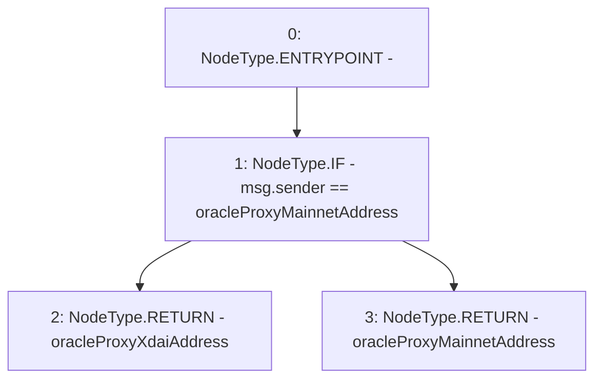

# Context: BridgeMockup.messageSender

**Contract:** `BridgeMockup` (Inherits: None)
**Signature:** `messageSender() returns (address)`
**Method Selector ID:** `0xd67bdd25`
**Visibility:** `external`
**Environment-Free:** `No (reads EVM state context)`
**Modifiers:** None

### State Variables Interaction
- **Reads:** oracleProxyMainnetAddress, oracleProxyXdaiAddress
- **Writes:** None

### Environment & Verification Flags
- **Uses Foundry Cheatcodes:** No
- **Has Echidna Properties:** No

### Internal Calls Tree
- None

### External Calls / Value Transfers
- None

### Control Flow Graph (CFG)


### Source Mapping
Declared in: `contracts/mockups/BridgeMockup.sol` on lines **29** to **36**

```solidity
    function messageSender() external view returns (address) {
        // console.log("oracleProxyXdaiAddress is", oracleProxyXdaiAddress);
        if (msg.sender == oracleProxyMainnetAddress) {
            return oracleProxyXdaiAddress;
        } else {
            return oracleProxyMainnetAddress;
        }
    }

```
