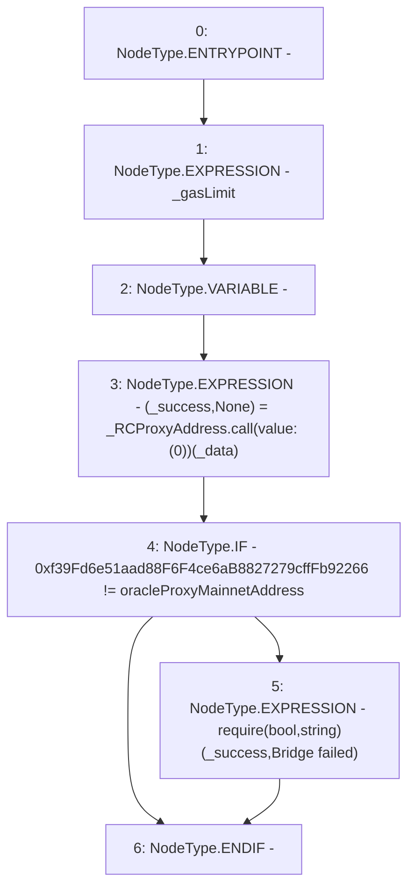

# Context: BridgeMockup.requireToPassMessage

**Contract:** `BridgeMockup` (Inherits: None)
**Signature:** `requireToPassMessage(address,bytes,uint256)`
**Method Selector ID:** `0xdc8601b3`
**Visibility:** `external`
**Environment-Free:** `Yes`
**Modifiers:** None

### State Variables Interaction
- **Reads:** oracleProxyMainnetAddress
- **Writes:** None

### Assertion Checks & Business Requirements
- require/assert: `require(bool,string)(_success,Bridge failed)`

### Environment & Verification Flags
- **Uses Foundry Cheatcodes:** No
- **Has Echidna Properties:** No

### Internal Calls Tree
- None

### External Calls / Value Transfers
- `low-level-call`

### Control Flow Graph (CFG)


### Source Mapping
Declared in: `contracts/mockups/BridgeMockup.sol` on lines **12** to **27**

```solidity
    function requireToPassMessage(
        address _RCProxyAddress,
        bytes calldata _data,
        uint256 _gasLimit
    ) external {
        _gasLimit;
        (bool _success, ) = _RCProxyAddress.call{value: (0)}(_data);
        // this is for a sepcific test where the oracleProxyMainnetAddress is
        // scrambled intentionally
        if (
            0xf39Fd6e51aad88F6F4ce6aB8827279cffFb92266 !=
            oracleProxyMainnetAddress
        ) {
            require(_success, "Bridge failed");
        }
    }

```
