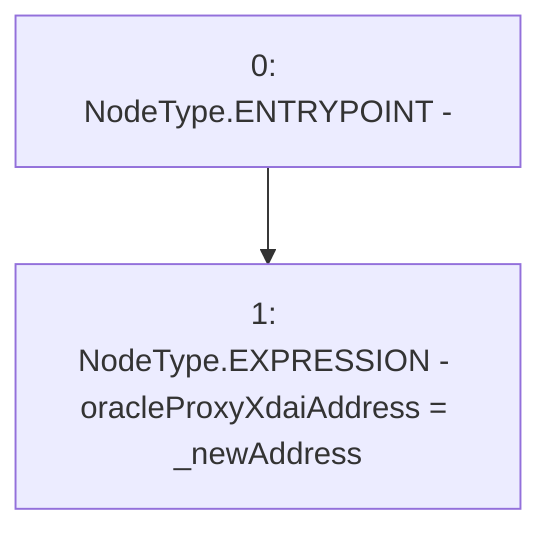

# Context: BridgeMockup.setProxyL2Address

**Contract:** `BridgeMockup` (Inherits: None)
**Signature:** `setProxyL2Address(address)`
**Method Selector ID:** `0xbb59e923`
**Visibility:** `external`
**Environment-Free:** `Yes`
**Modifiers:** None

### State Variables Interaction
- **Reads:** None
- **Writes:** oracleProxyXdaiAddress

### Environment & Verification Flags
- **Uses Foundry Cheatcodes:** No
- **Has Echidna Properties:** No

### Internal Calls Tree
- None

### External Calls / Value Transfers
- None

### Control Flow Graph (CFG)


### Source Mapping
Declared in: `contracts/mockups/BridgeMockup.sol` on lines **42** to **44**

```solidity
    function setProxyL2Address(address _newAddress) external {
        oracleProxyXdaiAddress = _newAddress;
    }

```
