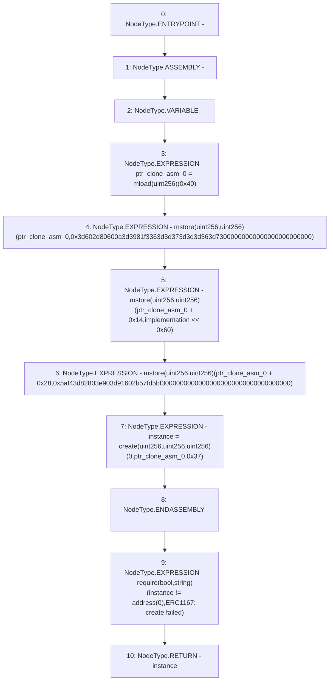

# Context: Clones.clone

**Contract:** `Clones` (Inherits: None)
**Signature:** `clone(address) returns (address)`
**Method Selector ID:** `Internal (No Method ID)`
**Visibility:** `internal`
**Environment-Free:** `Yes`
**Modifiers:** None

### State Variables Interaction
- **Reads:** None
- **Writes:** None

### Assertion Checks & Business Requirements
- require/assert: `require(bool,string)(instance != address(0),ERC1167: create failed)`

### Environment & Verification Flags
- **Uses Foundry Cheatcodes:** No
- **Has Echidna Properties:** No

### Internal Calls Tree
- None

### External Calls / Value Transfers
- None

### Control Flow Graph (CFG)


### Source Mapping
Declared in: `node_modules/@openzeppelin/contracts/proxy/Clones.sol` on lines **24** to **34**

```solidity
    function clone(address implementation) internal returns (address instance) {
        // solhint-disable-next-line no-inline-assembly
        assembly {
            let ptr := mload(0x40)
            mstore(ptr, 0x3d602d80600a3d3981f3363d3d373d3d3d363d73000000000000000000000000)
            mstore(add(ptr, 0x14), shl(0x60, implementation))
            mstore(add(ptr, 0x28), 0x5af43d82803e903d91602b57fd5bf30000000000000000000000000000000000)
            instance := create(0, ptr, 0x37)
        }
        require(instance != address(0), "ERC1167: create failed");
    }

```
