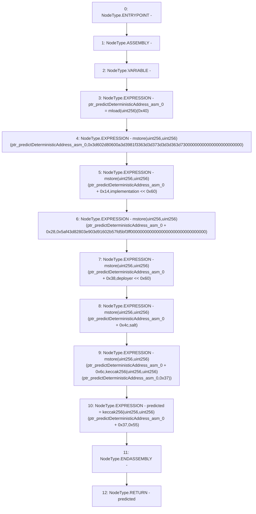

# Context: Clones.predictDeterministicAddress

**Contract:** `Clones` (Inherits: None)
**Signature:** `predictDeterministicAddress(address,bytes32,address) returns (address)`
**Method Selector ID:** `Internal (No Method ID)`
**Visibility:** `internal`
**Environment-Free:** `Yes`
**Modifiers:** None

### State Variables Interaction
- **Reads:** None
- **Writes:** None

### Environment & Verification Flags
- **Uses Foundry Cheatcodes:** No
- **Has Echidna Properties:** No

### Internal Calls Tree
- None

### External Calls / Value Transfers
- None

### Control Flow Graph (CFG)


### Source Mapping
Declared in: `node_modules/@openzeppelin/contracts/proxy/Clones.sol` on lines **58** to **70**

```solidity
    function predictDeterministicAddress(address implementation, bytes32 salt, address deployer) internal pure returns (address predicted) {
        // solhint-disable-next-line no-inline-assembly
        assembly {
            let ptr := mload(0x40)
            mstore(ptr, 0x3d602d80600a3d3981f3363d3d373d3d3d363d73000000000000000000000000)
            mstore(add(ptr, 0x14), shl(0x60, implementation))
            mstore(add(ptr, 0x28), 0x5af43d82803e903d91602b57fd5bf3ff00000000000000000000000000000000)
            mstore(add(ptr, 0x38), shl(0x60, deployer))
            mstore(add(ptr, 0x4c), salt)
            mstore(add(ptr, 0x6c), keccak256(ptr, 0x37))
            predicted := keccak256(add(ptr, 0x37), 0x55)
        }
    }

```
