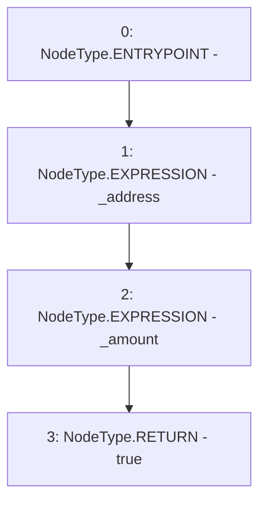

# Context: DaiMockup.approve

**Contract:** `DaiMockup` (Inherits: None)
**Signature:** `approve(address,uint256) returns (bool)`
**Method Selector ID:** `0x095ea7b3`
**Visibility:** `external`
**Environment-Free:** `Yes`
**Modifiers:** None

### State Variables Interaction
- **Reads:** None
- **Writes:** None

### Environment & Verification Flags
- **Uses Foundry Cheatcodes:** No
- **Has Echidna Properties:** No

### Internal Calls Tree
- None

### External Calls / Value Transfers
- None

### Control Flow Graph (CFG)


### Source Mapping
Declared in: `contracts/mockups/DaiMockup.sol` on lines **7** to **15**

```solidity
    function approve(address _address, uint256 _amount)
        external
        pure
        returns (bool)
    {
        _address;
        _amount;
        return true;
    }

```
