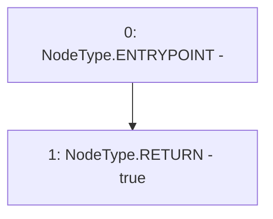

# Context: DaiMockup.transferFrom

**Contract:** `DaiMockup` (Inherits: None)
**Signature:** `transferFrom(address,address,uint256) returns (bool)`
**Method Selector ID:** `0x23b872dd`
**Visibility:** `public`
**Environment-Free:** `Yes`
**Modifiers:** None

### State Variables Interaction
- **Reads:** None
- **Writes:** None

### Environment & Verification Flags
- **Uses Foundry Cheatcodes:** No
- **Has Echidna Properties:** No

### Internal Calls Tree
- None

### External Calls / Value Transfers
- None

### Control Flow Graph (CFG)


### Source Mapping
Declared in: `contracts/mockups/DaiMockup.sol` on lines **17** to **23**

```solidity
    function transferFrom(
        address,
        address,
        uint256
    ) public pure returns (bool) {
        return true;
    }

```
