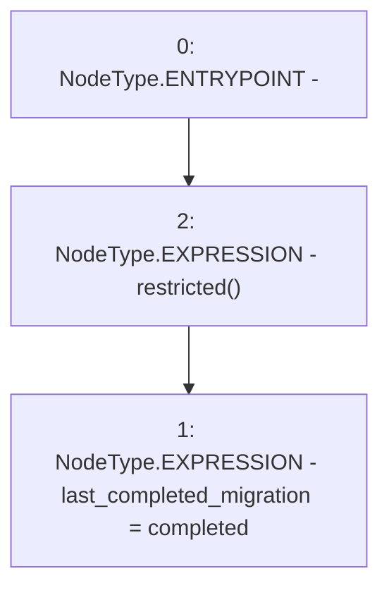

# Context: Migrations.setCompleted

**Contract:** `Migrations` (Inherits: None)
**Signature:** `setCompleted(uint256)`
**Method Selector ID:** `0xfdacd576`
**Visibility:** `public`
**Environment-Free:** `No (reads EVM state context)`
**Modifiers:**
- `restricted`
  ```solidity
  modifier restricted() {
          if (msg.sender == owner) _;
      }
  ```

### State Variables Interaction
- **Reads:** None
- **Writes:** last_completed_migration

### Environment & Verification Flags
- **Uses Foundry Cheatcodes:** No
- **Has Echidna Properties:** No

### Internal Calls Tree
- None

### External Calls / Value Transfers
- None

### Control Flow Graph (CFG)


### Source Mapping
Declared in: `contracts/Migrations.sol` on lines **16** to **18**

```solidity
    function setCompleted(uint256 completed) public restricted {
        last_completed_migration = completed;
    }

```
