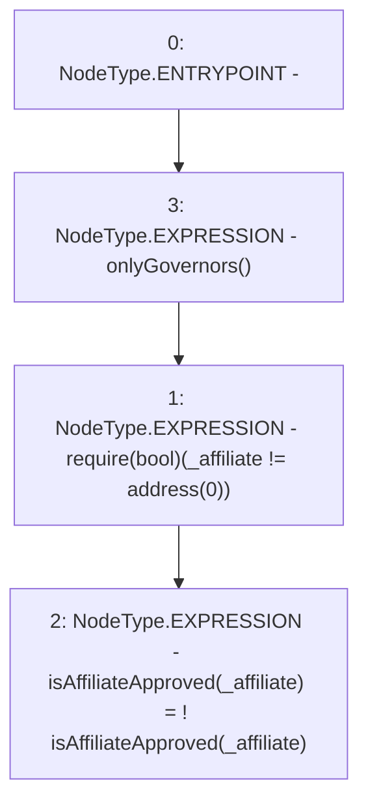

# Context: RCFactory.changeAffiliateApproval

**Contract:** `RCFactory` (Inherits: IRCFactory, NativeMetaTransaction, Ownable, Context)
**Signature:** `changeAffiliateApproval(address)`
**Method Selector ID:** `0x9a93328d`
**Visibility:** `external`
**Environment-Free:** `No (reads EVM state context)`
**Modifiers:**
- `onlyGovernors`
  ```solidity
  modifier onlyGovernors() {
          require(
              governors[msgSender()] || owner() == msgSender(),
              "Not approved"
          );
          _;
      }
  ```

### State Variables Interaction
- **Reads:** isAffiliateApproved
- **Writes:** isAffiliateApproved

### Assertion Checks & Business Requirements
- require/assert: `require(bool)(_affiliate != address(0))`

### Environment & Verification Flags
- **Uses Foundry Cheatcodes:** No
- **Has Echidna Properties:** No

### Internal Calls Tree
- None

### External Calls / Value Transfers
- None

### Control Flow Graph (CFG)


### Source Mapping
Declared in: `contracts/RCFactory.sol` on lines **402** to **408**

```solidity
    function changeAffiliateApproval(address _affiliate)
        external
        onlyGovernors
    {
        require(_affiliate != address(0));
        isAffiliateApproved[_affiliate] = !isAffiliateApproved[_affiliate];
    }

```
