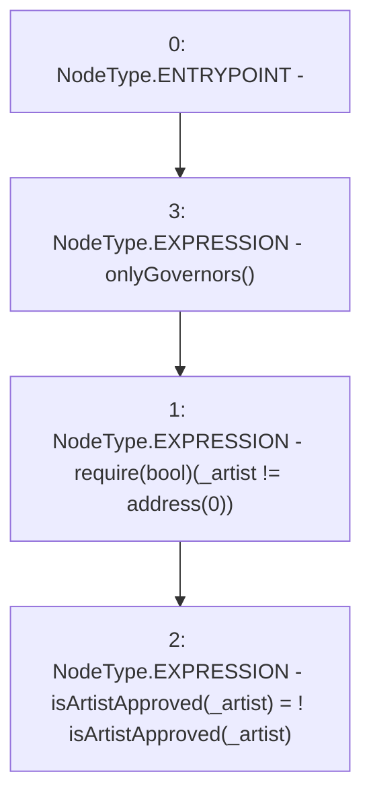

# Context: RCFactory.changeArtistApproval

**Contract:** `RCFactory` (Inherits: IRCFactory, NativeMetaTransaction, Ownable, Context)
**Signature:** `changeArtistApproval(address)`
**Method Selector ID:** `0x391857f5`
**Visibility:** `external`
**Environment-Free:** `No (reads EVM state context)`
**Modifiers:**
- `onlyGovernors`
  ```solidity
  modifier onlyGovernors() {
          require(
              governors[msgSender()] || owner() == msgSender(),
              "Not approved"
          );
          _;
      }
  ```

### State Variables Interaction
- **Reads:** isArtistApproved
- **Writes:** isArtistApproved

### Assertion Checks & Business Requirements
- require/assert: `require(bool)(_artist != address(0))`

### Environment & Verification Flags
- **Uses Foundry Cheatcodes:** No
- **Has Echidna Properties:** No

### Internal Calls Tree
- None

### External Calls / Value Transfers
- None

### Control Flow Graph (CFG)


### Source Mapping
Declared in: `contracts/RCFactory.sol` on lines **395** to **398**

```solidity
    function changeArtistApproval(address _artist) external onlyGovernors {
        require(_artist != address(0));
        isArtistApproved[_artist] = !isArtistApproved[_artist];
    }

```
