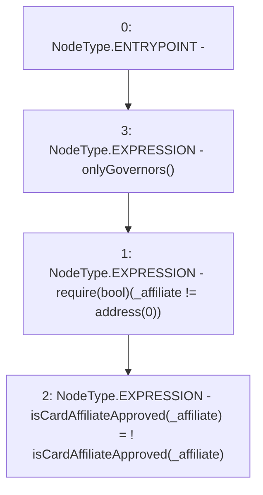

# Context: RCFactory.changeCardAffiliateApproval

**Contract:** `RCFactory` (Inherits: IRCFactory, NativeMetaTransaction, Ownable, Context)
**Signature:** `changeCardAffiliateApproval(address)`
**Method Selector ID:** `0xaf7a616b`
**Visibility:** `external`
**Environment-Free:** `No (reads EVM state context)`
**Modifiers:**
- `onlyGovernors`
  ```solidity
  modifier onlyGovernors() {
          require(
              governors[msgSender()] || owner() == msgSender(),
              "Not approved"
          );
          _;
      }
  ```

### State Variables Interaction
- **Reads:** isCardAffiliateApproved
- **Writes:** isCardAffiliateApproved

### Assertion Checks & Business Requirements
- require/assert: `require(bool)(_affiliate != address(0))`

### Environment & Verification Flags
- **Uses Foundry Cheatcodes:** No
- **Has Echidna Properties:** No

### Internal Calls Tree
- None

### External Calls / Value Transfers
- None

### Control Flow Graph (CFG)


### Source Mapping
Declared in: `contracts/RCFactory.sol` on lines **412** to **420**

```solidity
    function changeCardAffiliateApproval(address _affiliate)
        external
        onlyGovernors
    {
        require(_affiliate != address(0));
        isCardAffiliateApproved[_affiliate] = !isCardAffiliateApproved[
            _affiliate
        ];
    }

```
