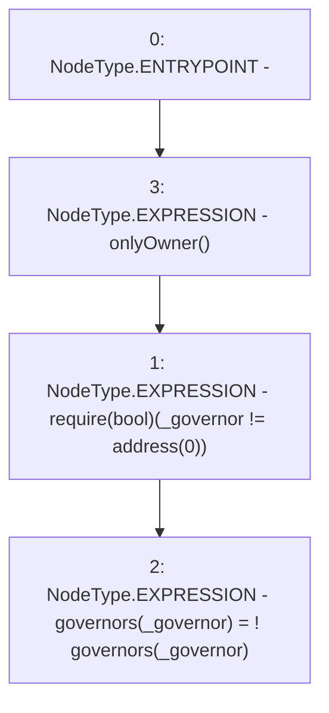

# Context: RCFactory.changeGovernorApproval

**Contract:** `RCFactory` (Inherits: IRCFactory, NativeMetaTransaction, Ownable, Context)
**Signature:** `changeGovernorApproval(address)`
**Method Selector ID:** `0xabc1c50a`
**Visibility:** `external`
**Environment-Free:** `No (reads EVM state context)`
**Modifiers:**
- `onlyOwner`
  ```solidity
  modifier onlyOwner() {
          require(owner() == _msgSender(), "Ownable: caller is not the owner");
          _;
      }
  ```

### State Variables Interaction
- **Reads:** governors
- **Writes:** governors

### Assertion Checks & Business Requirements
- require/assert: `require(bool)(_governor != address(0))`

### Environment & Verification Flags
- **Uses Foundry Cheatcodes:** No
- **Has Echidna Properties:** No

### Internal Calls Tree
- None

### External Calls / Value Transfers
- None

### Control Flow Graph (CFG)


### Source Mapping
Declared in: `contracts/RCFactory.sol` on lines **372** to **375**

```solidity
    function changeGovernorApproval(address _governor) external onlyOwner {
        require(_governor != address(0));
        governors[_governor] = !governors[_governor];
    }

```
