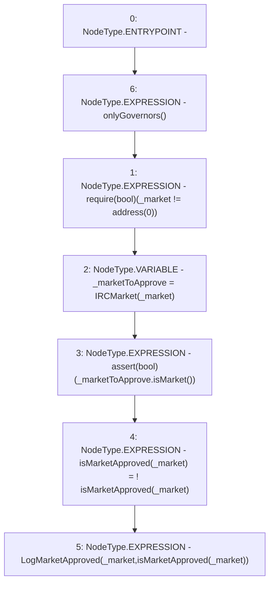

# Context: RCFactory.changeMarketApproval

**Contract:** `RCFactory` (Inherits: IRCFactory, NativeMetaTransaction, Ownable, Context)
**Signature:** `changeMarketApproval(address)`
**Method Selector ID:** `0x4ae54eee`
**Visibility:** `external`
**Environment-Free:** `No (reads EVM state context)`
**Modifiers:**
- `onlyGovernors`
  ```solidity
  modifier onlyGovernors() {
          require(
              governors[msgSender()] || owner() == msgSender(),
              "Not approved"
          );
          _;
      }
  ```

### State Variables Interaction
- **Reads:** isMarketApproved
- **Writes:** isMarketApproved

### Assertion Checks & Business Requirements
- require/assert: `require(bool)(_market != address(0))`
- require/assert: `assert(bool)(_marketToApprove.isMarket())`

### Environment & Verification Flags
- **Uses Foundry Cheatcodes:** No
- **Has Echidna Properties:** No

### Internal Calls Tree
- None

### External Calls / Value Transfers
- `IRCMarket.TMP_730(bool) = HIGH_LEVEL_CALL, dest:_marketToApprove(IRCMarket), function:isMarket, arguments:[]  `

### Control Flow Graph (CFG)


### Source Mapping
Declared in: `contracts/RCFactory.sol` on lines **384** to **391**

```solidity
    function changeMarketApproval(address _market) external onlyGovernors {
        require(_market != address(0));
        // check it's an RC contract
        IRCMarket _marketToApprove = IRCMarket(_market);
        assert(_marketToApprove.isMarket());
        isMarketApproved[_market] = !isMarketApproved[_market];
        emit LogMarketApproved(_market, isMarketApproved[_market]);
    }

```
