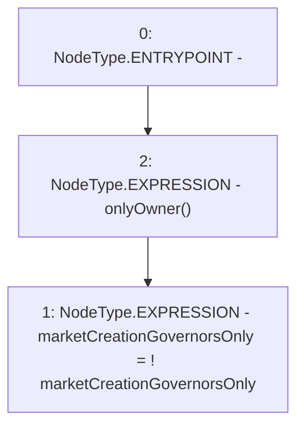

# Context: RCFactory.changeMarketCreationGovernorsOnly

**Contract:** `RCFactory` (Inherits: IRCFactory, NativeMetaTransaction, Ownable, Context)
**Signature:** `changeMarketCreationGovernorsOnly()`
**Method Selector ID:** `0xc0811d5d`
**Visibility:** `external`
**Environment-Free:** `No (reads EVM state context)`
**Modifiers:**
- `onlyOwner`
  ```solidity
  modifier onlyOwner() {
          require(owner() == _msgSender(), "Ownable: caller is not the owner");
          _;
      }
  ```

### State Variables Interaction
- **Reads:** marketCreationGovernorsOnly
- **Writes:** marketCreationGovernorsOnly

### Environment & Verification Flags
- **Uses Foundry Cheatcodes:** No
- **Has Echidna Properties:** No

### Internal Calls Tree
- None

### External Calls / Value Transfers
- None

### Control Flow Graph (CFG)


### Source Mapping
Declared in: `contracts/RCFactory.sol` on lines **310** to **312**

```solidity
    function changeMarketCreationGovernorsOnly() external onlyOwner {
        marketCreationGovernorsOnly = !marketCreationGovernorsOnly;
    }

```
