# Context: RCFactory.createMarket

**Contract:** `RCFactory` (Inherits: IRCFactory, NativeMetaTransaction, Ownable, Context)
**Signature:** `createMarket(uint32,string,uint32[],string[],address,address,address[],string,uint256) returns (address)`
**Method Selector ID:** `0xe8b60644`
**Visibility:** `external`
**Environment-Free:** `No (reads EVM state context)`
**Modifiers:** None

### State Variables Interaction
- **Reads:** advancedWarning, approvedAffilliatesOnly, approvedArtistsOnly, governors, isAffiliateApproved, isArtistApproved, isCardAffiliateApproved, marketAddresses, marketCreationGovernorsOnly, maximumDuration, minimumPriceIncreasePercent, nftMintingLimit, nfthub, orderbook, referenceContractAddress, referenceContractVersion, sponsorshipRequired, totalNftMintCount, treasury
- **Writes:** mappingOfMarkets, marketAddresses, totalNftMintCount

### Assertion Checks & Business Requirements
- require/assert: `require(bool,string)(_sponsorship >= sponsorshipRequired,Insufficient sponsorship)`
- require/assert: `require(bool,string)(isArtistApproved[_artistAddress] || _artistAddress == address(0),Artist not approved)`
- require/assert: `require(bool,string)(isAffiliateApproved[_affiliateAddress] || _affiliateAddress == address(0),Affiliate not approved)`
- require/assert: `require(bool,string)(isCardAffiliateApproved[_cardAffiliateAddresses[i]] || _cardAffiliateAddresses[i] == address(0),Card affiliate not approved)`
- require/assert: `require(bool,string)(governors[_creator] || owner() == _creator,Not approved)`
- require/assert: `require(bool,string)(_timestamps.length == 3,Incorrect number of array elements)`
- require/assert: `require(bool,string)(_timestamps[0] >= block.timestamp,Market opening time not set)`
- require/assert: `require(bool,string)(_timestamps[0] - advancedWarning > block.timestamp,Market opens too soon)`
- require/assert: `require(bool,string)(_timestamps[1] < block.timestamp + maximumDuration,Market locks too late)`
- require/assert: `require(bool,string)(_timestamps[1] + (604800) > _timestamps[2] && _timestamps[1] <= _timestamps[2],Oracle resolution time error)`
- require/assert: `require(bool,string)(_tokenURIs.length <= nftMintingLimit,Too many tokens to mint)`
- require/assert: `require(bool,string)(address(nfthub) != address(0),Nfthub not set)`
- require/assert: `require(bool,string)(nfthub.mint(_newAddress,_tokenId,_tokenURIs[i_scope_0]),Nft Minting Failed)`

### Environment & Verification Flags
- **Uses Foundry Cheatcodes:** No
- **Has Echidna Properties:** No

### Internal Calls Tree
- None

### External Calls / Value Transfers
- `IRCTreasury.HIGH_LEVEL_CALL, dest:treasury(IRCTreasury), function:addMarket, arguments:['_newAddress']  `
- `IRCTreasury.HIGH_LEVEL_CALL, dest:treasury(IRCTreasury), function:checkSponsorship, arguments:['_creator', '_sponsorship']  `
- `IRCOrderbook.HIGH_LEVEL_CALL, dest:orderbook(IRCOrderbook), function:addMarket, arguments:['_newAddress', 'REF_201', 'minimumPriceIncreasePercent']  `
- `IRCNftHubL2.TMP_825(bool) = HIGH_LEVEL_CALL, dest:nfthub(IRCNftHubL2), function:mint, arguments:['_newAddress', '_tokenId', 'REF_211']  `
- `IRCMarket.HIGH_LEVEL_CALL, dest:TMP_830(IRCMarket), function:sponsor, arguments:['_creator', '_sponsorship']  `
- `IRCNftHubL2.HIGH_LEVEL_CALL, dest:nfthub(IRCNftHubL2), function:addMarket, arguments:['_newAddress']  `
- `IRCMarket.HIGH_LEVEL_CALL, dest:TMP_817(IRCMarket), function:initialize, arguments:['_mode', '_timestamps', 'REF_208', 'totalNftMintCount', '_artistAddress', '_affiliateAddress', '_cardAffiliateAddresses', '_creator', '_realitioQuestion']  `
- `Clones.TMP_806(address) = LIBRARY_CALL, dest:Clones, function:Clones.clone(address), arguments:['referenceContractAddress'] `

### Control Flow Graph (CFG)

```mermaid
flowchart TD
    Node_0["0: NodeType.ENTRYPOINT - "]
    Node_0 --> Node_1
    Node_1["1: NodeType.VARIABLE - _creator = msgSender()"]
    Node_1 --> Node_2
    Node_2["2: NodeType.EXPRESSION - require(bool,string)(_sponsorship >= sponsorshipRequired,Insufficient sponsorship)"]
    Node_2 --> Node_3
    Node_3["3: NodeType.EXPRESSION - treasury.checkSponsorship(_creator,_sponsorship)"]
    Node_3 --> Node_4
    Node_4["4: NodeType.IF - approvedArtistsOnly"]
    Node_4 --> Node_5
    Node_4 --> Node_6
    Node_5["5: NodeType.EXPRESSION - require(bool,string)(isArtistApproved(_artistAddress) || _artistAddress == address(0),Artist not approved)"]
    Node_5 --> Node_6
    Node_6["6: NodeType.ENDIF - "]
    Node_6 --> Node_7
    Node_7["7: NodeType.IF - approvedAffilliatesOnly"]
    Node_7 --> Node_8
    Node_7 --> Node_15
    Node_8["8: NodeType.EXPRESSION - require(bool,string)(isAffiliateApproved(_affiliateAddress) || _affiliateAddress == address(0),Affiliate not approved)"]
    Node_8 --> Node_11
    Node_9["9: NodeType.STARTLOOP - "]
    Node_9 --> Node_12
    Node_10["10: NodeType.ENDLOOP - "]
    Node_10 --> Node_15
    Node_11["11: NodeType.VARIABLE - i = 0"]
    Node_11 --> Node_9
    Node_12["12: NodeType.IFLOOP - i < _cardAffiliateAddresses.length"]
    Node_12 --> Node_13
    Node_12 --> Node_10
    Node_13["13: NodeType.EXPRESSION - require(bool,string)(isCardAffiliateApproved(_cardAffiliateAddresses(i)) || _cardAffiliateAddresses(i) == address(0),Card affiliate not approved)"]
    Node_13 --> Node_14
    Node_14["14: NodeType.EXPRESSION - i ++"]
    Node_14 --> Node_12
    Node_15["15: NodeType.ENDIF - "]
    Node_15 --> Node_16
    Node_16["16: NodeType.IF - marketCreationGovernorsOnly"]
    Node_16 --> Node_17
    Node_16 --> Node_18
    Node_17["17: NodeType.EXPRESSION - require(bool,string)(governors(_creator) || owner() == _creator,Not approved)"]
    Node_17 --> Node_18
    Node_18["18: NodeType.ENDIF - "]
    Node_18 --> Node_19
    Node_19["19: NodeType.EXPRESSION - require(bool,string)(_timestamps.length == 3,Incorrect number of array elements)"]
    Node_19 --> Node_20
    Node_20["20: NodeType.IF - advancedWarning != 0"]
    Node_20 --> Node_21
    Node_20 --> Node_23
    Node_21["21: NodeType.EXPRESSION - require(bool,string)(_timestamps(0) >= block.timestamp,Market opening time not set)"]
    Node_21 --> Node_22
    Node_22["22: NodeType.EXPRESSION - require(bool,string)(_timestamps(0) - advancedWarning > block.timestamp,Market opens too soon)"]
    Node_22 --> Node_23
    Node_23["23: NodeType.ENDIF - "]
    Node_23 --> Node_24
    Node_24["24: NodeType.IF - maximumDuration != 0"]
    Node_24 --> Node_25
    Node_24 --> Node_26
    Node_25["25: NodeType.EXPRESSION - require(bool,string)(_timestamps(1) < block.timestamp + maximumDuration,Market locks too late)"]
    Node_25 --> Node_26
    Node_26["26: NodeType.ENDIF - "]
    Node_26 --> Node_27
    Node_27["27: NodeType.EXPRESSION - require(bool,string)(_timestamps(1) + (604800) > _timestamps(2) && _timestamps(1) <= _timestamps(2),Oracle resolution time error)"]
    Node_27 --> Node_28
    Node_28["28: NodeType.EXPRESSION - require(bool,string)(_tokenURIs.length <= nftMintingLimit,Too many tokens to mint)"]
    Node_28 --> Node_29
    Node_29["29: NodeType.VARIABLE - _newAddress = Clones.clone(referenceContractAddress)"]
    Node_29 --> Node_30
    Node_30["30: NodeType.EXPRESSION - LogMarketCreated1(_newAddress,address(treasury),address(nfthub),referenceContractVersion)"]
    Node_30 --> Node_31
    Node_31["31: NodeType.EXPRESSION - LogMarketCreated2(_newAddress,_mode,_tokenURIs,_ipfsHash,_timestamps,totalNftMintCount)"]
    Node_31 --> Node_32
    Node_32["32: NodeType.EXPRESSION - treasury.addMarket(_newAddress)"]
    Node_32 --> Node_33
    Node_33["33: NodeType.EXPRESSION - nfthub.addMarket(_newAddress)"]
    Node_33 --> Node_34
    Node_34["34: NodeType.EXPRESSION - orderbook.addMarket(_newAddress,_tokenURIs.length,minimumPriceIncreasePercent)"]
    Node_34 --> Node_35
    Node_35["35: NodeType.EXPRESSION - marketAddresses(_mode).push(_newAddress)"]
    Node_35 --> Node_36
    Node_36["36: NodeType.EXPRESSION - mappingOfMarkets(_newAddress) = true"]
    Node_36 --> Node_37
    Node_37["37: NodeType.EXPRESSION - IRCMarket(_newAddress).initialize((_mode:_mode,_timestamps:_timestamps,_numberOfTokens:_tokenURIs.length,_totalNftMintCount:totalNftMintCount,_artistAddress:_artistAddress,_affiliateAddress:_affiliateAddress,_cardAffiliateAddresses:_cardAffiliateAddresses,_marketCreatorAddress:_creator,_realitioQuestion:_realitioQuestion))"]
    Node_37 --> Node_38
    Node_38["38: NodeType.EXPRESSION - require(bool,string)(address(nfthub) != address(0),Nfthub not set)"]
    Node_38 --> Node_41
    Node_39["39: NodeType.STARTLOOP - "]
    Node_39 --> Node_42
    Node_40["40: NodeType.ENDLOOP - "]
    Node_40 --> Node_46
    Node_41["41: NodeType.VARIABLE - i_scope_0 = 0"]
    Node_41 --> Node_39
    Node_42["42: NodeType.IFLOOP - i_scope_0 < _tokenURIs.length"]
    Node_42 --> Node_43
    Node_42 --> Node_40
    Node_43["43: NodeType.VARIABLE - _tokenId = i_scope_0 + totalNftMintCount"]
    Node_43 --> Node_44
    Node_44["44: NodeType.EXPRESSION - require(bool,string)(nfthub.mint(_newAddress,_tokenId,_tokenURIs(i_scope_0)),Nft Minting Failed)"]
    Node_44 --> Node_45
    Node_45["45: NodeType.EXPRESSION - i_scope_0 ++"]
    Node_45 --> Node_42
    Node_46["46: NodeType.EXPRESSION - totalNftMintCount = totalNftMintCount + _tokenURIs.length"]
    Node_46 --> Node_47
    Node_47["47: NodeType.IF - _sponsorship > 0"]
    Node_47 --> Node_48
    Node_47 --> Node_49
    Node_48["48: NodeType.EXPRESSION - IRCMarket(_newAddress).sponsor(_creator,_sponsorship)"]
    Node_48 --> Node_49
    Node_49["49: NodeType.ENDIF - "]
    Node_49 --> Node_50
    Node_50["50: NodeType.RETURN - _newAddress"]
```


### Source Mapping
Declared in: `contracts/RCFactory.sol` on lines **465** to **613**

```solidity
    function createMarket(
        uint32 _mode,
        string memory _ipfsHash,
        uint32[] memory _timestamps,
        string[] memory _tokenURIs,
        address _artistAddress,
        address _affiliateAddress,
        address[] memory _cardAffiliateAddresses,
        string calldata _realitioQuestion,
        uint256 _sponsorship
    ) external returns (address) {
        address _creator = msgSender();

        // check sponsorship
        require(
            _sponsorship >= sponsorshipRequired,
            "Insufficient sponsorship"
        );
        treasury.checkSponsorship(_creator, _sponsorship);

        // check stakeholder addresses
        // artist
        if (approvedArtistsOnly) {
            require(
                isArtistApproved[_artistAddress] ||
                    _artistAddress == address(0),
                "Artist not approved"
            );
        }
        // affiliate
        if (approvedAffilliatesOnly) {
            require(
                isAffiliateApproved[_affiliateAddress] ||
                    _affiliateAddress == address(0),
                "Affiliate not approved"
            );
            // card affiliates
            for (uint256 i = 0; i < _cardAffiliateAddresses.length; i++) {
                require(
                    isCardAffiliateApproved[_cardAffiliateAddresses[i]] ||
                        _cardAffiliateAddresses[i] == address(0),
                    "Card affiliate not approved"
                );
            }
        }

        // check market creator is approved
        if (marketCreationGovernorsOnly) {
            require(governors[_creator] || owner() == _creator, "Not approved");
        }

        // check timestamps
        require(_timestamps.length == 3, "Incorrect number of array elements");
        // check market opening time
        if (advancedWarning != 0) {
            require(
                _timestamps[0] >= block.timestamp,
                "Market opening time not set"
            );
            require(
                _timestamps[0] - advancedWarning > block.timestamp,
                "Market opens too soon"
            );
        }
        // check market locking time
        if (maximumDuration != 0) {
            require(
                _timestamps[1] < block.timestamp + maximumDuration,
                "Market locks too late"
            );
        }
        // check oracle resolution time (no more than 1 week after market locking to get result)
        require(
            _timestamps[1] + (1 weeks) > _timestamps[2] &&
                _timestamps[1] <= _timestamps[2],
            "Oracle resolution time error"
        );

        // check the number of NFTs to mint is within limits
        require(
            _tokenURIs.length <= nftMintingLimit,
            "Too many tokens to mint"
        );

        // create the market and emit the appropriate events
        // two events to avoid stack too deep error
        address _newAddress = Clones.clone(referenceContractAddress);
        emit LogMarketCreated1(
            _newAddress,
            address(treasury),
            address(nfthub),
            referenceContractVersion
        );
        emit LogMarketCreated2(
            _newAddress,
            _mode,
            _tokenURIs,
            _ipfsHash,
            _timestamps,
            totalNftMintCount
        );

        // tell Treasury, Orderbook, and NFT hub about new market
        // before initialize as during initialize the market may call the treasury
        treasury.addMarket(_newAddress);
        nfthub.addMarket(_newAddress);
        orderbook.addMarket(
            _newAddress,
            _tokenURIs.length,
            minimumPriceIncreasePercent
        );

        // update internals
        marketAddresses[_mode].push(_newAddress);
        mappingOfMarkets[_newAddress] = true;

        // initialize the market
        IRCMarket(_newAddress).initialize({
            _mode: _mode,
            _timestamps: _timestamps,
            _numberOfTokens: _tokenURIs.length,
            _totalNftMintCount: totalNftMintCount,
            _artistAddress: _artistAddress,
            _affiliateAddress: _affiliateAddress,
            _cardAffiliateAddresses: _cardAffiliateAddresses,
            _marketCreatorAddress: _creator,
            _realitioQuestion: _realitioQuestion
        });

        // create the NFTs
        require(address(nfthub) != address(0), "Nfthub not set");
        for (uint256 i = 0; i < _tokenURIs.length; i++) {
            uint256 _tokenId = i + totalNftMintCount;
            require(
                nfthub.mint(_newAddress, _tokenId, _tokenURIs[i]),
                "Nft Minting Failed"
            );
        }

        // increment totalNftMintCount
        totalNftMintCount = totalNftMintCount + _tokenURIs.length;

        // pay sponsorship, if applicable
        if (_sponsorship > 0) {
            IRCMarket(_newAddress).sponsor(_creator, _sponsorship);
        }

        return _newAddress;
    }

```
