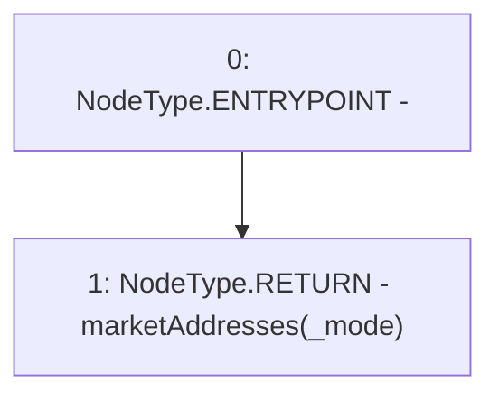

# Context: RCFactory.getAllMarkets

**Contract:** `RCFactory` (Inherits: IRCFactory, NativeMetaTransaction, Ownable, Context)
**Signature:** `getAllMarkets(uint256) returns (address[])`
**Method Selector ID:** `0x78a40a1d`
**Visibility:** `external`
**Environment-Free:** `Yes`
**Modifiers:** None

### State Variables Interaction
- **Reads:** marketAddresses
- **Writes:** None

### Environment & Verification Flags
- **Uses Foundry Cheatcodes:** No
- **Has Echidna Properties:** No

### Internal Calls Tree
- None

### External Calls / Value Transfers
- None

### Control Flow Graph (CFG)


### Source Mapping
Declared in: `contracts/RCFactory.sol` on lines **158** to **164**

```solidity
    function getAllMarkets(uint256 _mode)
        external
        view
        returns (address[] memory)
    {
        return marketAddresses[_mode];
    }

```
