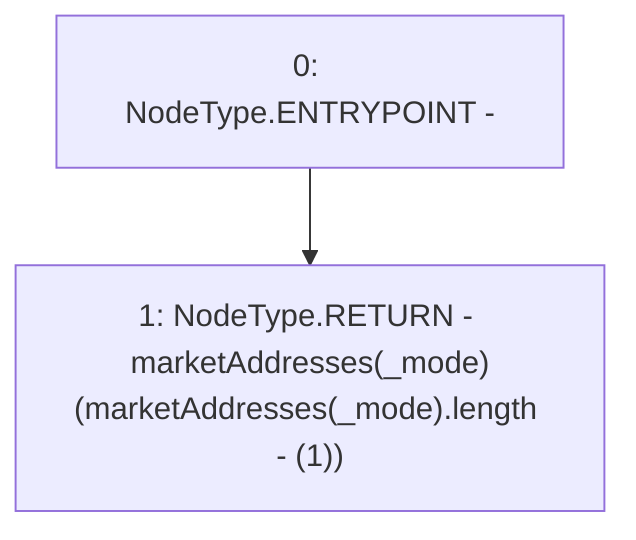

# Context: RCFactory.getMostRecentMarket

**Contract:** `RCFactory` (Inherits: IRCFactory, NativeMetaTransaction, Ownable, Context)
**Signature:** `getMostRecentMarket(uint256) returns (address)`
**Method Selector ID:** `0x1ff0ef6e`
**Visibility:** `external`
**Environment-Free:** `Yes`
**Modifiers:** None

### State Variables Interaction
- **Reads:** marketAddresses
- **Writes:** None

### Environment & Verification Flags
- **Uses Foundry Cheatcodes:** No
- **Has Echidna Properties:** No

### Internal Calls Tree
- None

### External Calls / Value Transfers
- None

### Control Flow Graph (CFG)


### Source Mapping
Declared in: `contracts/RCFactory.sol` on lines **147** to **153**

```solidity
    function getMostRecentMarket(uint256 _mode)
        external
        view
        returns (address)
    {
        return marketAddresses[_mode][marketAddresses[_mode].length - (1)];
    }

```
