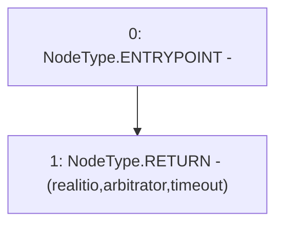

# Context: RCFactory.getOracleSettings

**Contract:** `RCFactory` (Inherits: IRCFactory, NativeMetaTransaction, Ownable, Context)
**Signature:** `getOracleSettings() returns (IRealitio, address, uint32)`
**Method Selector ID:** `0xf8e9eec3`
**Visibility:** `external`
**Environment-Free:** `Yes`
**Modifiers:** None

### State Variables Interaction
- **Reads:** arbitrator, realitio, timeout
- **Writes:** None

### Environment & Verification Flags
- **Uses Foundry Cheatcodes:** No
- **Has Echidna Properties:** No

### Internal Calls Tree
- None

### External Calls / Value Transfers
- None

### Control Flow Graph (CFG)


### Source Mapping
Declared in: `contracts/RCFactory.sol` on lines **617** to **628**

```solidity
    function getOracleSettings()
        external
        view
        override
        returns (
            IRealitio,
            address,
            uint32
        )
    {
        return (realitio, arbitrator, timeout);
    }

```
