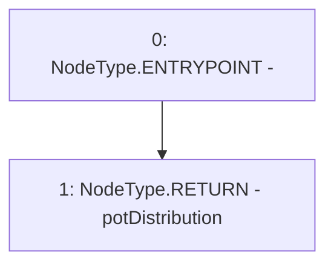

# Context: RCFactory.getPotDistribution

**Contract:** `RCFactory` (Inherits: IRCFactory, NativeMetaTransaction, Ownable, Context)
**Signature:** `getPotDistribution() returns (uint256[5])`
**Method Selector ID:** `0x39118220`
**Visibility:** `external`
**Environment-Free:** `Yes`
**Modifiers:** None

### State Variables Interaction
- **Reads:** potDistribution
- **Writes:** None

### Environment & Verification Flags
- **Uses Foundry Cheatcodes:** No
- **Has Echidna Properties:** No

### Internal Calls Tree
- None

### External Calls / Value Transfers
- None

### Control Flow Graph (CFG)


### Source Mapping
Declared in: `contracts/RCFactory.sol` on lines **168** to **175**

```solidity
    function getPotDistribution()
        external
        view
        override
        returns (uint256[5] memory)
    {
        return potDistribution;
    }

```
