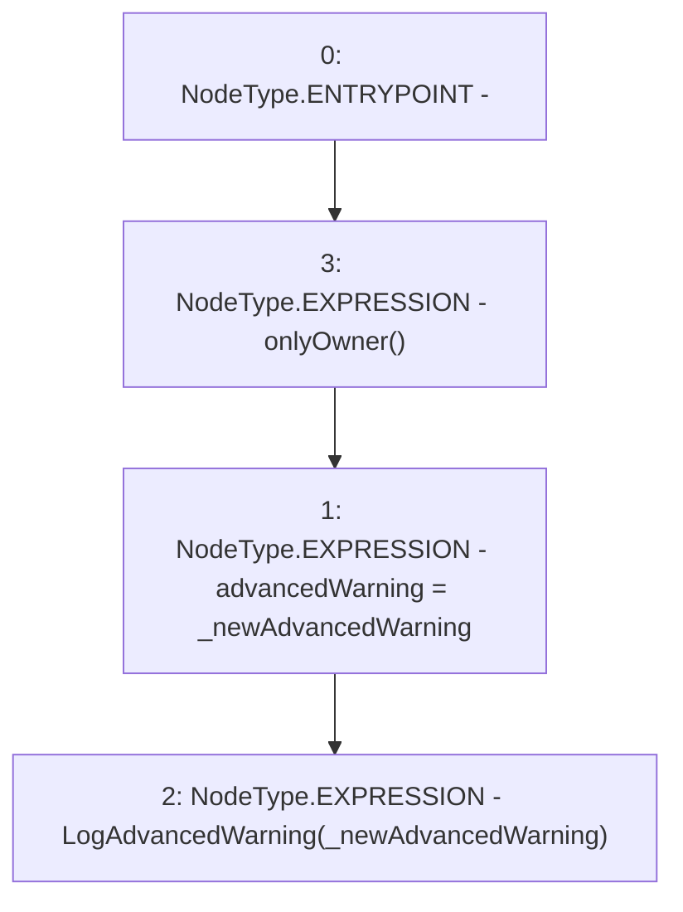

# Context: RCFactory.setAdvancedWarning

**Contract:** `RCFactory` (Inherits: IRCFactory, NativeMetaTransaction, Ownable, Context)
**Signature:** `setAdvancedWarning(uint32)`
**Method Selector ID:** `0x191573da`
**Visibility:** `external`
**Environment-Free:** `No (reads EVM state context)`
**Modifiers:**
- `onlyOwner`
  ```solidity
  modifier onlyOwner() {
          require(owner() == _msgSender(), "Ownable: caller is not the owner");
          _;
      }
  ```

### State Variables Interaction
- **Reads:** None
- **Writes:** advancedWarning

### Environment & Verification Flags
- **Uses Foundry Cheatcodes:** No
- **Has Echidna Properties:** No

### Internal Calls Tree
- None

### External Calls / Value Transfers
- None

### Control Flow Graph (CFG)


### Source Mapping
Declared in: `contracts/RCFactory.sol` on lines **337** to **340**

```solidity
    function setAdvancedWarning(uint32 _newAdvancedWarning) external onlyOwner {
        advancedWarning = _newAdvancedWarning;
        emit LogAdvancedWarning(_newAdvancedWarning);
    }

```
