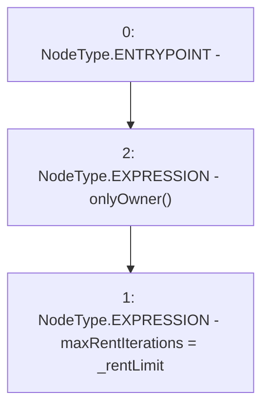

# Context: RCFactory.setMaxRentIterations

**Contract:** `RCFactory` (Inherits: IRCFactory, NativeMetaTransaction, Ownable, Context)
**Signature:** `setMaxRentIterations(uint256)`
**Method Selector ID:** `0x28f38ce7`
**Visibility:** `public`
**Environment-Free:** `No (reads EVM state context)`
**Modifiers:**
- `onlyOwner`
  ```solidity
  modifier onlyOwner() {
          require(owner() == _msgSender(), "Ownable: caller is not the owner");
          _;
      }
  ```

### State Variables Interaction
- **Reads:** None
- **Writes:** maxRentIterations

### Environment & Verification Flags
- **Uses Foundry Cheatcodes:** No
- **Has Echidna Properties:** No

### Internal Calls Tree
- None

### External Calls / Value Transfers
- None

### Control Flow Graph (CFG)


### Source Mapping
Declared in: `contracts/RCFactory.sol` on lines **277** to **283**

```solidity
    function setMaxRentIterations(uint256 _rentLimit)
        public
        override
        onlyOwner
    {
        maxRentIterations = _rentLimit;
    }

```
