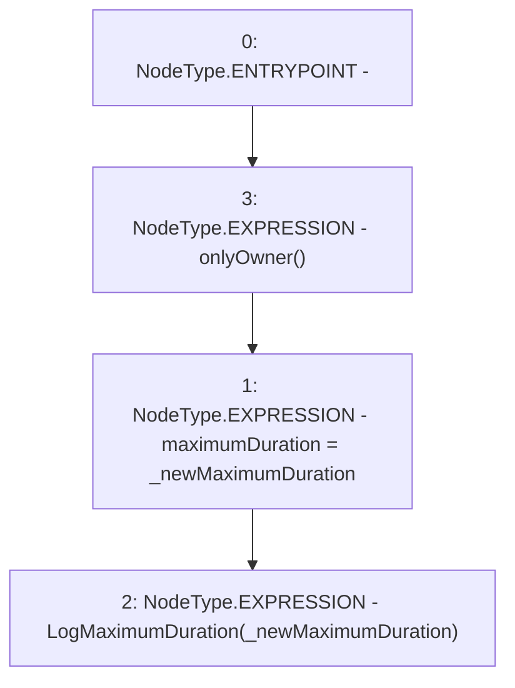

# Context: RCFactory.setMaximumDuration

**Contract:** `RCFactory` (Inherits: IRCFactory, NativeMetaTransaction, Ownable, Context)
**Signature:** `setMaximumDuration(uint32)`
**Method Selector ID:** `0x6e17dae3`
**Visibility:** `external`
**Environment-Free:** `No (reads EVM state context)`
**Modifiers:**
- `onlyOwner`
  ```solidity
  modifier onlyOwner() {
          require(owner() == _msgSender(), "Ownable: caller is not the owner");
          _;
      }
  ```

### State Variables Interaction
- **Reads:** None
- **Writes:** maximumDuration

### Environment & Verification Flags
- **Uses Foundry Cheatcodes:** No
- **Has Echidna Properties:** No

### Internal Calls Tree
- None

### External Calls / Value Transfers
- None

### Control Flow Graph (CFG)


### Source Mapping
Declared in: `contracts/RCFactory.sol` on lines **344** to **347**

```solidity
    function setMaximumDuration(uint32 _newMaximumDuration) external onlyOwner {
        maximumDuration = _newMaximumDuration;
        emit LogMaximumDuration(_newMaximumDuration);
    }

```
