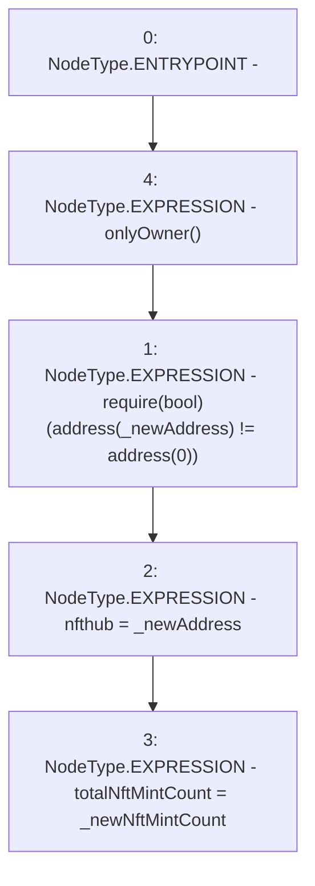

# Context: RCFactory.setNftHubAddress

**Contract:** `RCFactory` (Inherits: IRCFactory, NativeMetaTransaction, Ownable, Context)
**Signature:** `setNftHubAddress(IRCNftHubL2,uint256)`
**Method Selector ID:** `0x6ea136e3`
**Visibility:** `external`
**Environment-Free:** `No (reads EVM state context)`
**Modifiers:**
- `onlyOwner`
  ```solidity
  modifier onlyOwner() {
          require(owner() == _msgSender(), "Ownable: caller is not the owner");
          _;
      }
  ```

### State Variables Interaction
- **Reads:** None
- **Writes:** nfthub, totalNftMintCount

### Assertion Checks & Business Requirements
- require/assert: `require(bool)(address(_newAddress) != address(0))`

### Environment & Verification Flags
- **Uses Foundry Cheatcodes:** No
- **Has Echidna Properties:** No

### Internal Calls Tree
- None

### External Calls / Value Transfers
- None

### Control Flow Graph (CFG)


### Source Mapping
Declared in: `contracts/RCFactory.sol` on lines **200** to **207**

```solidity
    function setNftHubAddress(IRCNftHubL2 _newAddress, uint256 _newNftMintCount)
        external
        onlyOwner
    {
        require(address(_newAddress) != address(0));
        nfthub = _newAddress;
        totalNftMintCount = _newNftMintCount;
    }

```
