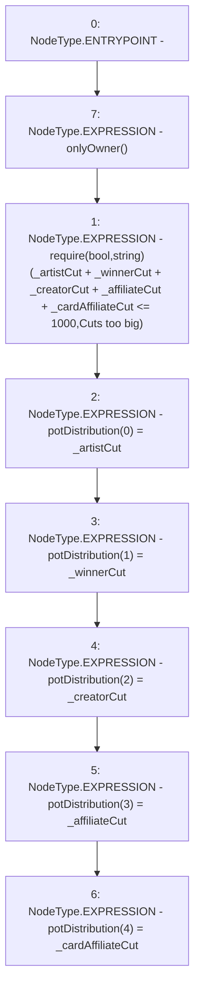

# Context: RCFactory.setPotDistribution

**Contract:** `RCFactory` (Inherits: IRCFactory, NativeMetaTransaction, Ownable, Context)
**Signature:** `setPotDistribution(uint256,uint256,uint256,uint256,uint256)`
**Method Selector ID:** `0x1b549e3e`
**Visibility:** `public`
**Environment-Free:** `No (reads EVM state context)`
**Modifiers:**
- `onlyOwner`
  ```solidity
  modifier onlyOwner() {
          require(owner() == _msgSender(), "Ownable: caller is not the owner");
          _;
      }
  ```

### State Variables Interaction
- **Reads:** None
- **Writes:** potDistribution

### Assertion Checks & Business Requirements
- require/assert: `require(bool,string)(_artistCut + _winnerCut + _creatorCut + _affiliateCut + _cardAffiliateCut <= 1000,Cuts too big)`

### Environment & Verification Flags
- **Uses Foundry Cheatcodes:** No
- **Has Echidna Properties:** No

### Internal Calls Tree
- None

### External Calls / Value Transfers
- None

### Control Flow Graph (CFG)


### Source Mapping
Declared in: `contracts/RCFactory.sol` on lines **234** to **255**

```solidity
    function setPotDistribution(
        uint256 _artistCut,
        uint256 _winnerCut,
        uint256 _creatorCut,
        uint256 _affiliateCut,
        uint256 _cardAffiliateCut
    ) public onlyOwner {
        require(
            _artistCut +
                _winnerCut +
                _creatorCut +
                _affiliateCut +
                _cardAffiliateCut <=
                1000,
            "Cuts too big"
        );
        potDistribution[0] = _artistCut;
        potDistribution[1] = _winnerCut;
        potDistribution[2] = _creatorCut;
        potDistribution[3] = _affiliateCut;
        potDistribution[4] = _cardAffiliateCut;
    }

```
