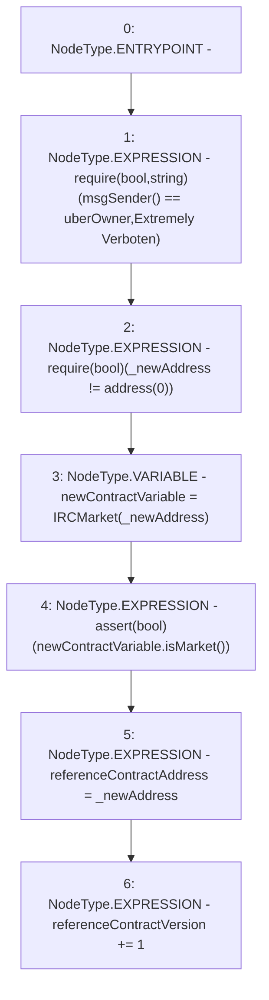

# Context: RCFactory.setReferenceContractAddress

**Contract:** `RCFactory` (Inherits: IRCFactory, NativeMetaTransaction, Ownable, Context)
**Signature:** `setReferenceContractAddress(address)`
**Method Selector ID:** `0xa72f5286`
**Visibility:** `external`
**Environment-Free:** `No (reads EVM state context)`
**Modifiers:** None

### State Variables Interaction
- **Reads:** referenceContractVersion, uberOwner
- **Writes:** referenceContractAddress, referenceContractVersion

### Assertion Checks & Business Requirements
- require/assert: `require(bool,string)(msgSender() == uberOwner,Extremely Verboten)`
- require/assert: `require(bool)(_newAddress != address(0))`
- require/assert: `assert(bool)(newContractVariable.isMarket())`

### Environment & Verification Flags
- **Uses Foundry Cheatcodes:** No
- **Has Echidna Properties:** No

### Internal Calls Tree
- None

### External Calls / Value Transfers
- `IRCMarket.TMP_757(bool) = HIGH_LEVEL_CALL, dest:newContractVariable(IRCMarket), function:isMarket, arguments:[]  `

### Control Flow Graph (CFG)


### Source Mapping
Declared in: `contracts/RCFactory.sol` on lines **432** to **442**

```solidity
    function setReferenceContractAddress(address _newAddress) external {
        require(msgSender() == uberOwner, "Extremely Verboten");
        require(_newAddress != address(0));
        // check it's an RC contract
        IRCMarket newContractVariable = IRCMarket(_newAddress);
        assert(newContractVariable.isMarket());
        // set
        referenceContractAddress = _newAddress;
        // increment version
        referenceContractVersion += 1;
    }

```
