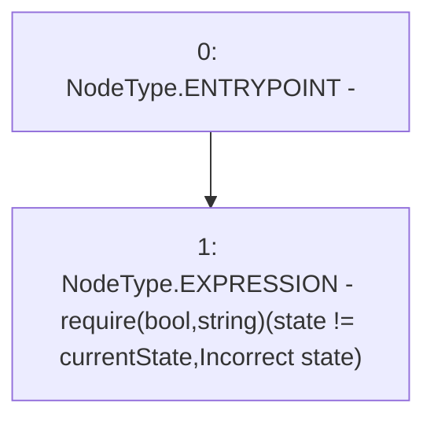

# Context: RCMarket._checkNotState

**Contract:** `RCMarket` (Inherits: IRCMarket, NativeMetaTransaction, Initializable)
**Signature:** `_checkNotState(IRCMarket.States)`
**Method Selector ID:** `Internal (No Method ID)`
**Visibility:** `internal`
**Environment-Free:** `Yes`
**Modifiers:** None

### State Variables Interaction
- **Reads:** state
- **Writes:** None

### Assertion Checks & Business Requirements
- require/assert: `require(bool,string)(state != currentState,Incorrect state)`

### Environment & Verification Flags
- **Uses Foundry Cheatcodes:** No
- **Has Echidna Properties:** No

### Internal Calls Tree
- None

### External Calls / Value Transfers
- None

### Control Flow Graph (CFG)


### Source Mapping
Declared in: `contracts/RCMarket.sol` on lines **1089** to **1091**

```solidity
    function _checkNotState(States currentState) internal view {
        require(state != currentState, "Incorrect state");
    }

```
