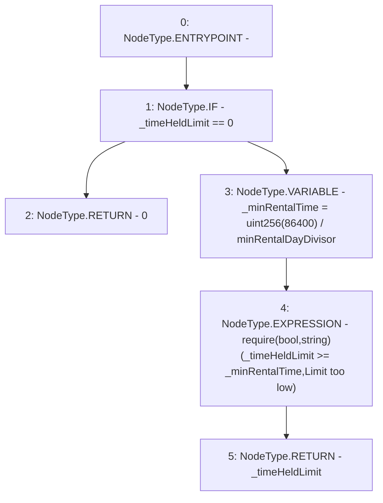

# Context: RCMarket._checkTimeHeldLimit

**Contract:** `RCMarket` (Inherits: IRCMarket, NativeMetaTransaction, Initializable)
**Signature:** `_checkTimeHeldLimit(uint256) returns (uint256)`
**Method Selector ID:** `Internal (No Method ID)`
**Visibility:** `internal`
**Environment-Free:** `Yes`
**Modifiers:** None

### State Variables Interaction
- **Reads:** minRentalDayDivisor
- **Writes:** None

### Assertion Checks & Business Requirements
- require/assert: `require(bool,string)(_timeHeldLimit >= _minRentalTime,Limit too low)`

### Environment & Verification Flags
- **Uses Foundry Cheatcodes:** No
- **Has Echidna Properties:** No

### Internal Calls Tree
- None

### External Calls / Value Transfers
- None

### Control Flow Graph (CFG)


### Source Mapping
Declared in: `contracts/RCMarket.sol` on lines **736** to **748**

```solidity
    function _checkTimeHeldLimit(uint256 _timeHeldLimit)
        internal
        view
        returns (uint256)
    {
        if (_timeHeldLimit == 0) {
            return 0;
        } else {
            uint256 _minRentalTime = uint256(1 days) / minRentalDayDivisor;
            require(_timeHeldLimit >= _minRentalTime, "Limit too low");
            return _timeHeldLimit;
        }
    }

```
