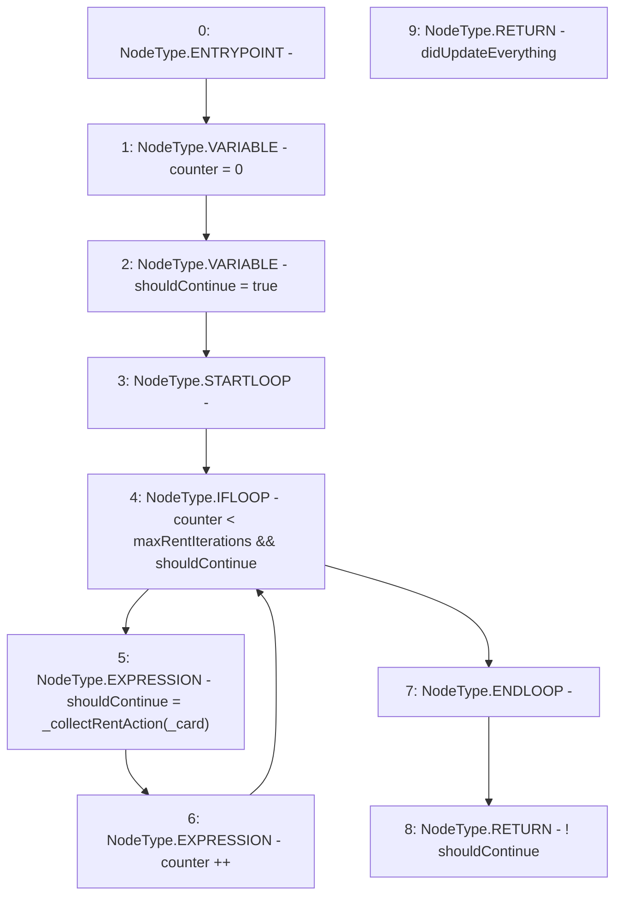

# Context: RCMarket._collectRent

**Contract:** `RCMarket` (Inherits: IRCMarket, NativeMetaTransaction, Initializable)
**Signature:** `_collectRent(uint256) returns (bool)`
**Method Selector ID:** `Internal (No Method ID)`
**Visibility:** `internal`
**Environment-Free:** `No (reads EVM state context)`
**Modifiers:** None

### State Variables Interaction
- **Reads:** maxRentIterations
- **Writes:** None

### Environment & Verification Flags
- **Uses Foundry Cheatcodes:** No
- **Has Echidna Properties:** No

### Internal Calls Tree
- None

### External Calls / Value Transfers
- None

### Control Flow Graph (CFG)


### Source Mapping
Declared in: `contracts/RCMarket.sol` on lines **1038** to **1049**

```solidity
    function _collectRent(uint256 _card)
        internal
        returns (bool didUpdateEverything)
    {
        uint32 counter = 0;
        bool shouldContinue = true;
        while (counter < maxRentIterations && shouldContinue) {
            shouldContinue = _collectRentAction(_card);
            counter++;
        }
        return !shouldContinue;
    }

```
