# Context: RCMarket._collectRentAction

**Contract:** `RCMarket` (Inherits: IRCMarket, NativeMetaTransaction, Initializable)
**Signature:** `_collectRentAction(uint256) returns (bool)`
**Method Selector ID:** `Internal (No Method ID)`
**Visibility:** `internal`
**Environment-Free:** `No (reads EVM state context)`
**Modifiers:** None

### State Variables Interaction
- **Reads:** cardPrice, cardTimeLimit, marketLockingTime, orderbook, timeLastCollected, treasury
- **Writes:** timeLastCollected

### Environment & Verification Flags
- **Uses Foundry Cheatcodes:** No
- **Has Echidna Properties:** No

### Internal Calls Tree
- None

### External Calls / Value Transfers
- `IRCOrderbook.TMP_1211(address) = HIGH_LEVEL_CALL, dest:orderbook(IRCOrderbook), function:findNewOwner, arguments:['_card', '_timeOfThisCollection']  `
- `IRCTreasury.HIGH_LEVEL_CALL, dest:treasury(IRCTreasury), function:refundUser, arguments:['_user', '_refundAmount']  `
- `IRCTreasury.TMP_1156(uint256) = HIGH_LEVEL_CALL, dest:treasury(IRCTreasury), function:collectRentUser, arguments:['_user', 'block.timestamp']  `

### Control Flow Graph (CFG)

```mermaid
flowchart TD
    Node_0["0: NodeType.ENTRYPOINT - "]
    Node_0 --> Node_1
    Node_1["1: NodeType.VARIABLE - _user = ownerOf(_card)"]
    Node_1 --> Node_2
    Node_2["2: NodeType.VARIABLE - _timeOfThisCollection = block.timestamp"]
    Node_2 --> Node_3
    Node_3["3: NodeType.IF - marketLockingTime <= block.timestamp"]
    Node_3 --> Node_4
    Node_3 --> Node_5
    Node_4["4: NodeType.EXPRESSION - _timeOfThisCollection = marketLockingTime"]
    Node_4 --> Node_5
    Node_5["5: NodeType.ENDIF - "]
    Node_5 --> Node_6
    Node_6["6: NodeType.IF - _user != address(this) && timeLastCollected(_card) < _timeOfThisCollection"]
    Node_6 --> Node_7
    Node_6 --> Node_86
    Node_7["7: NodeType.VARIABLE - _timeUserForeclosed = treasury.collectRentUser(_user,block.timestamp)"]
    Node_7 --> Node_8
    Node_8["8: NodeType.VARIABLE - _cardTimeLimitTimestamp = timeLastCollected(_card) + cardTimeLimit(_card)"]
    Node_8 --> Node_9
    Node_9["9: NodeType.VARIABLE - _foreclosed = _timeUserForeclosed != 0"]
    Node_9 --> Node_10
    Node_10["10: NodeType.VARIABLE - _limitHit = cardTimeLimit(_card) != 0 && _cardTimeLimitTimestamp < block.timestamp"]
    Node_10 --> Node_11
    Node_11["11: NodeType.VARIABLE - _marketLocked = marketLockingTime <= block.timestamp"]
    Node_11 --> Node_12
    Node_12["12: NodeType.VARIABLE - "]
    Node_12 --> Node_13
    Node_13["13: NodeType.VARIABLE - "]
    Node_13 --> Node_14
    Node_14["14: NodeType.IF - ! _foreclosed && ! _limitHit && ! _marketLocked"]
    Node_14 --> Node_15
    Node_14 --> Node_18
    Node_15["15: NodeType.EXPRESSION - _timeOfThisCollection = _timeOfThisCollection"]
    Node_15 --> Node_16
    Node_16["16: NodeType.EXPRESSION - _newOwner = false"]
    Node_16 --> Node_17
    Node_17["17: NodeType.EXPRESSION - _refundTime = 0"]
    Node_17 --> Node_76
    Node_18["18: NodeType.IF - ! _foreclosed && ! _limitHit && _marketLocked"]
    Node_18 --> Node_19
    Node_18 --> Node_22
    Node_19["19: NodeType.EXPRESSION - _timeOfThisCollection = marketLockingTime"]
    Node_19 --> Node_20
    Node_20["20: NodeType.EXPRESSION - _newOwner = false"]
    Node_20 --> Node_21
    Node_21["21: NodeType.EXPRESSION - _refundTime = block.timestamp - marketLockingTime"]
    Node_21 --> Node_75
    Node_22["22: NodeType.IF - ! _foreclosed && _limitHit && ! _marketLocked"]
    Node_22 --> Node_23
    Node_22 --> Node_26
    Node_23["23: NodeType.EXPRESSION - _timeOfThisCollection = _cardTimeLimitTimestamp"]
    Node_23 --> Node_24
    Node_24["24: NodeType.EXPRESSION - _newOwner = true"]
    Node_24 --> Node_25
    Node_25["25: NodeType.EXPRESSION - _refundTime = block.timestamp - _cardTimeLimitTimestamp"]
    Node_25 --> Node_74
    Node_26["26: NodeType.IF - ! _foreclosed && _limitHit && _marketLocked"]
    Node_26 --> Node_27
    Node_26 --> Node_35
    Node_27["27: NodeType.IF - _cardTimeLimitTimestamp < marketLockingTime"]
    Node_27 --> Node_28
    Node_27 --> Node_31
    Node_28["28: NodeType.EXPRESSION - _timeOfThisCollection = _cardTimeLimitTimestamp"]
    Node_28 --> Node_29
    Node_29["29: NodeType.EXPRESSION - _newOwner = true"]
    Node_29 --> Node_30
    Node_30["30: NodeType.EXPRESSION - _refundTime = block.timestamp - _cardTimeLimitTimestamp"]
    Node_30 --> Node_34
    Node_31["31: NodeType.EXPRESSION - _timeOfThisCollection = marketLockingTime"]
    Node_31 --> Node_32
    Node_32["32: NodeType.EXPRESSION - _newOwner = false"]
    Node_32 --> Node_33
    Node_33["33: NodeType.EXPRESSION - _refundTime = block.timestamp - marketLockingTime"]
    Node_33 --> Node_34
    Node_34["34: NodeType.ENDIF - "]
    Node_34 --> Node_73
    Node_35["35: NodeType.IF - _foreclosed && ! _limitHit && ! _marketLocked"]
    Node_35 --> Node_36
    Node_35 --> Node_39
    Node_36["36: NodeType.EXPRESSION - _timeOfThisCollection = _timeUserForeclosed"]
    Node_36 --> Node_37
    Node_37["37: NodeType.EXPRESSION - _newOwner = true"]
    Node_37 --> Node_38
    Node_38["38: NodeType.EXPRESSION - _refundTime = 0"]
    Node_38 --> Node_72
    Node_39["39: NodeType.IF - _foreclosed && ! _limitHit && _marketLocked"]
    Node_39 --> Node_40
    Node_39 --> Node_48
    Node_40["40: NodeType.IF - _timeUserForeclosed < marketLockingTime"]
    Node_40 --> Node_41
    Node_40 --> Node_44
    Node_41["41: NodeType.EXPRESSION - _timeOfThisCollection = _timeUserForeclosed"]
    Node_41 --> Node_42
    Node_42["42: NodeType.EXPRESSION - _newOwner = true"]
    Node_42 --> Node_43
    Node_43["43: NodeType.EXPRESSION - _refundTime = 0"]
    Node_43 --> Node_47
    Node_44["44: NodeType.EXPRESSION - _timeOfThisCollection = marketLockingTime"]
    Node_44 --> Node_45
    Node_45["45: NodeType.EXPRESSION - _newOwner = false"]
    Node_45 --> Node_46
    Node_46["46: NodeType.EXPRESSION - _refundTime = block.timestamp - marketLockingTime"]
    Node_46 --> Node_47
    Node_47["47: NodeType.ENDIF - "]
    Node_47 --> Node_71
    Node_48["48: NodeType.IF - _foreclosed && _limitHit && ! _marketLocked"]
    Node_48 --> Node_49
    Node_48 --> Node_57
    Node_49["49: NodeType.IF - _timeUserForeclosed < _cardTimeLimitTimestamp"]
    Node_49 --> Node_50
    Node_49 --> Node_53
    Node_50["50: NodeType.EXPRESSION - _timeOfThisCollection = _timeUserForeclosed"]
    Node_50 --> Node_51
    Node_51["51: NodeType.EXPRESSION - _newOwner = true"]
    Node_51 --> Node_52
    Node_52["52: NodeType.EXPRESSION - _refundTime = 0"]
    Node_52 --> Node_56
    Node_53["53: NodeType.EXPRESSION - _timeOfThisCollection = _cardTimeLimitTimestamp"]
    Node_53 --> Node_54
    Node_54["54: NodeType.EXPRESSION - _newOwner = true"]
    Node_54 --> Node_55
    Node_55["55: NodeType.EXPRESSION - _refundTime = _timeUserForeclosed - _cardTimeLimitTimestamp"]
    Node_55 --> Node_56
    Node_56["56: NodeType.ENDIF - "]
    Node_56 --> Node_70
    Node_57["57: NodeType.IF - _timeUserForeclosed <= _cardTimeLimitTimestamp && _timeUserForeclosed < marketLockingTime"]
    Node_57 --> Node_58
    Node_57 --> Node_61
    Node_58["58: NodeType.EXPRESSION - _timeOfThisCollection = _timeUserForeclosed"]
    Node_58 --> Node_59
    Node_59["59: NodeType.EXPRESSION - _newOwner = true"]
    Node_59 --> Node_60
    Node_60["60: NodeType.EXPRESSION - _refundTime = 0"]
    Node_60 --> Node_69
    Node_61["61: NodeType.IF - _cardTimeLimitTimestamp < _timeUserForeclosed && _cardTimeLimitTimestamp < marketLockingTime"]
    Node_61 --> Node_62
    Node_61 --> Node_65
    Node_62["62: NodeType.EXPRESSION - _timeOfThisCollection = _cardTimeLimitTimestamp"]
    Node_62 --> Node_63
    Node_63["63: NodeType.EXPRESSION - _newOwner = true"]
    Node_63 --> Node_64
    Node_64["64: NodeType.EXPRESSION - _refundTime = _timeUserForeclosed - _cardTimeLimitTimestamp"]
    Node_64 --> Node_68
    Node_65["65: NodeType.EXPRESSION - _timeOfThisCollection = marketLockingTime"]
    Node_65 --> Node_66
    Node_66["66: NodeType.EXPRESSION - _newOwner = false"]
    Node_66 --> Node_67
    Node_67["67: NodeType.EXPRESSION - _refundTime = _timeUserForeclosed - marketLockingTime"]
    Node_67 --> Node_68
    Node_68["68: NodeType.ENDIF - "]
    Node_68 --> Node_69
    Node_69["69: NodeType.ENDIF - "]
    Node_69 --> Node_70
    Node_70["70: NodeType.ENDIF - "]
    Node_70 --> Node_71
    Node_71["71: NodeType.ENDIF - "]
    Node_71 --> Node_72
    Node_72["72: NodeType.ENDIF - "]
    Node_72 --> Node_73
    Node_73["73: NodeType.ENDIF - "]
    Node_73 --> Node_74
    Node_74["74: NodeType.ENDIF - "]
    Node_74 --> Node_75
    Node_75["75: NodeType.ENDIF - "]
    Node_75 --> Node_76
    Node_76["76: NodeType.ENDIF - "]
    Node_76 --> Node_77
    Node_77["77: NodeType.IF - _refundTime != 0"]
    Node_77 --> Node_78
    Node_77 --> Node_80
    Node_78["78: NodeType.VARIABLE - _refundAmount = (_refundTime * cardPrice(_card)) / 86400"]
    Node_78 --> Node_79
    Node_79["79: NodeType.EXPRESSION - treasury.refundUser(_user,_refundAmount)"]
    Node_79 --> Node_80
    Node_80["80: NodeType.ENDIF - "]
    Node_80 --> Node_81
    Node_81["81: NodeType.EXPRESSION - _processRentCollection(_user,_card,_timeOfThisCollection)"]
    Node_81 --> Node_82
    Node_82["82: NodeType.IF - _newOwner"]
    Node_82 --> Node_83
    Node_82 --> Node_85
    Node_83["83: NodeType.EXPRESSION - orderbook.findNewOwner(_card,_timeOfThisCollection)"]
    Node_83 --> Node_84
    Node_84["84: NodeType.RETURN - true"]
    Node_85["85: NodeType.ENDIF - "]
    Node_85 --> Node_87
    Node_86["86: NodeType.EXPRESSION - timeLastCollected(_card) = _timeOfThisCollection"]
    Node_86 --> Node_87
    Node_87["87: NodeType.ENDIF - "]
    Node_87 --> Node_88
    Node_88["88: NodeType.RETURN - false"]
    Node_89["89: NodeType.RETURN - shouldContinue"]
```


### Source Mapping
Declared in: `contracts/RCMarket.sol` on lines **854** to **1034**

```solidity
    function _collectRentAction(uint256 _card)
        internal
        returns (bool shouldContinue)
    {
        address _user = ownerOf(_card);
        uint256 _timeOfThisCollection = block.timestamp;

        // don't collect rent beyond the locking time
        if (marketLockingTime <= block.timestamp) {
            _timeOfThisCollection = marketLockingTime;
        }

        //only collect rent if the card is owned (ie, if owned by the contract this implies unowned)
        // AND if the last collection was in the past (ie, don't do 2+ rent collections in the same block)
        if (
            _user != address(this) &&
            timeLastCollected[_card] < _timeOfThisCollection
        ) {
            // User rent collect and fetch the time the user foreclosed, 0 means they didn't foreclose yet
            uint256 _timeUserForeclosed =
                treasury.collectRentUser(_user, block.timestamp);

            // Calculate the card timeLimitTimestamp
            uint256 _cardTimeLimitTimestamp =
                timeLastCollected[_card] + cardTimeLimit[_card];

            // input bools
            bool _foreclosed = _timeUserForeclosed != 0;
            bool _limitHit =
                cardTimeLimit[_card] != 0 &&
                    _cardTimeLimitTimestamp < block.timestamp;
            bool _marketLocked = marketLockingTime <= block.timestamp;

            // outputs
            bool _newOwner;
            uint256 _refundTime; // seconds of rent to refund the user

            /* Permutations of the events: Foreclosure, Time limit and Market Locking
            ┌───────────┬─┬─┬─┬─┬─┬─┬─┬─┐
            │Case       │1│2│3│4│5│6│7│8│
            ├───────────┼─┼─┼─┼─┼─┼─┼─┼─┤
            │Foreclosure│0│0│0│0│1│1│1│1│
            │Time Limit │0│0│1│1│0│0│1│1│
            │Market Lock│0│1│0│1│0│1│0│1│
            └───────────┴─┴─┴─┴─┴─┴─┴─┴─┘
            */

            if (!_foreclosed && !_limitHit && !_marketLocked) {
                // CASE 1
                // didn't foreclose AND
                // didn't hit time limit AND
                // didn't lock market
                // THEN simple rent collect, same owner
                _timeOfThisCollection = _timeOfThisCollection;
                _newOwner = false;
                _refundTime = 0;
            } else if (!_foreclosed && !_limitHit && _marketLocked) {
                // CASE 2
                // didn't foreclose AND
                // didn't hit time limit AND
                // did lock market
                // THEN refund rent between locking and now
                _timeOfThisCollection = marketLockingTime;
                _newOwner = false;
                _refundTime = block.timestamp - marketLockingTime;
            } else if (!_foreclosed && _limitHit && !_marketLocked) {
                // CASE 3
                // didn't foreclose AND
                // did hit time limit AND
                // didn't lock market
                // THEN refund rent between time limit and now
                _timeOfThisCollection = _cardTimeLimitTimestamp;
                _newOwner = true;
                _refundTime = block.timestamp - _cardTimeLimitTimestamp;
            } else if (!_foreclosed && _limitHit && _marketLocked) {
                // CASE 4
                // didn't foreclose AND
                // did hit time limit AND
                // did lock market
                // THEN refund rent between the earliest event and now
                if (_cardTimeLimitTimestamp < marketLockingTime) {
                    // time limit hit before market locked
                    _timeOfThisCollection = _cardTimeLimitTimestamp;
                    _newOwner = true;
                    _refundTime = block.timestamp - _cardTimeLimitTimestamp;
                } else {
                    // market locked before time limit hit
                    _timeOfThisCollection = marketLockingTime;
                    _newOwner = false;
                    _refundTime = block.timestamp - marketLockingTime;
                }
            } else if (_foreclosed && !_limitHit && !_marketLocked) {
                // CASE 5
                // did foreclose AND
                // didn't hit time limit AND
                // didn't lock market
                // THEN rent OK, find new owner
                _timeOfThisCollection = _timeUserForeclosed;
                _newOwner = true;
                _refundTime = 0;
            } else if (_foreclosed && !_limitHit && _marketLocked) {
                // CASE 6
                // did foreclose AND
                // didn't hit time limit AND
                // did lock market
                // THEN if foreclosed first rent ok, otherwise refund after locking
                if (_timeUserForeclosed < marketLockingTime) {
                    // user foreclosed before market locked
                    _timeOfThisCollection = _timeUserForeclosed;
                    _newOwner = true;
                    _refundTime = 0;
                } else {
                    // market locked before user foreclosed
                    _timeOfThisCollection = marketLockingTime;
                    _newOwner = false;
                    _refundTime = block.timestamp - marketLockingTime;
                }
            } else if (_foreclosed && _limitHit && !_marketLocked) {
                // CASE 7
                // did foreclose AND
                // did hit time limit AND
                // didn't lock market
                // THEN if foreclosed first rent ok, otherwise refund after limit
                if (_timeUserForeclosed < _cardTimeLimitTimestamp) {
                    // user foreclosed before time limit
                    _timeOfThisCollection = _timeUserForeclosed;
                    _newOwner = true;
                    _refundTime = 0;
                } else {
                    // time limit hit before user foreclosed
                    _timeOfThisCollection = _cardTimeLimitTimestamp;
                    _newOwner = true;
                    _refundTime = _timeUserForeclosed - _cardTimeLimitTimestamp;
                }
            } else {
                // CASE 8
                // did foreclose AND
                // did hit time limit AND
                // did lock market
                // THEN (╯°益°)╯彡┻━┻
                if (
                    _timeUserForeclosed <= _cardTimeLimitTimestamp &&
                    _timeUserForeclosed < marketLockingTime
                ) {
                    // user foreclosed first (or at same time as time limit)
                    _timeOfThisCollection = _timeUserForeclosed;
                    _newOwner = true;
                    _refundTime = 0;
                } else if (
                    _cardTimeLimitTimestamp < _timeUserForeclosed &&
                    _cardTimeLimitTimestamp < marketLockingTime
                ) {
                    // time limit hit first
                    _timeOfThisCollection = _cardTimeLimitTimestamp;
                    _newOwner = true;
                    _refundTime = _timeUserForeclosed - _cardTimeLimitTimestamp;
                } else {
                    // market locked first
                    _timeOfThisCollection = marketLockingTime;
                    _newOwner = false;
                    _refundTime = _timeUserForeclosed - marketLockingTime;
                }
            }
            if (_refundTime != 0) {
                uint256 _refundAmount =
                    (_refundTime * cardPrice[_card]) / 1 days;
                treasury.refundUser(_user, _refundAmount);
            }
            _processRentCollection(_user, _card, _timeOfThisCollection); // where the rent collection actually happens

            if (_newOwner) {
                orderbook.findNewOwner(_card, _timeOfThisCollection);
                return true;
            }
        } else {
            // timeLastCollected is updated regardless of whether the card is owned, so that the clock starts ticking
            // ... when the first owner buys it, because this function is run before ownership changes upon calling newRental
            timeLastCollected[_card] = _timeOfThisCollection;
        }
        return false;
    }

```
