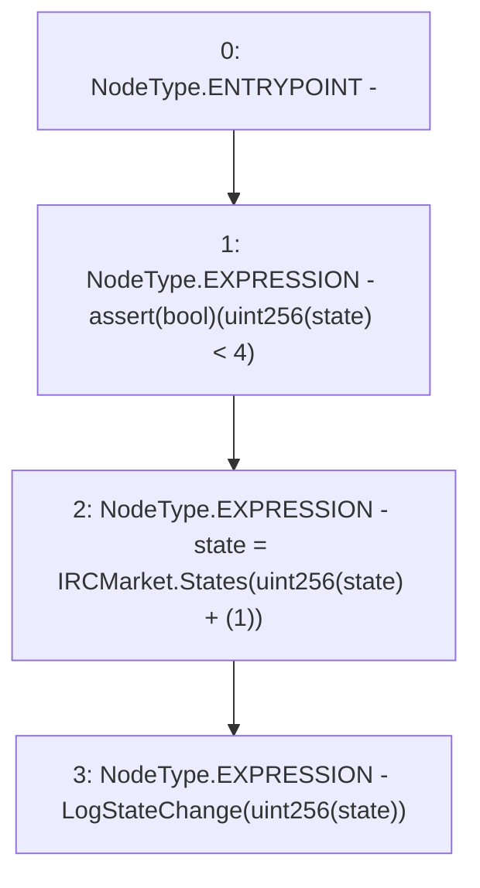

# Context: RCMarket._incrementState

**Contract:** `RCMarket` (Inherits: IRCMarket, NativeMetaTransaction, Initializable)
**Signature:** `_incrementState()`
**Method Selector ID:** `Internal (No Method ID)`
**Visibility:** `internal`
**Environment-Free:** `Yes`
**Modifiers:** None

### State Variables Interaction
- **Reads:** state
- **Writes:** state

### Assertion Checks & Business Requirements
- require/assert: `assert(bool)(uint256(state) < 4)`

### Environment & Verification Flags
- **Uses Foundry Cheatcodes:** No
- **Has Echidna Properties:** No

### Internal Calls Tree
- None

### External Calls / Value Transfers
- None

### Control Flow Graph (CFG)


### Source Mapping
Declared in: `contracts/RCMarket.sol` on lines **1094** to **1098**

```solidity
    function _incrementState() internal {
        assert(uint256(state) < 4);
        state = States(uint256(state) + (1));
        emit LogStateChange(uint256(state));
    }

```
