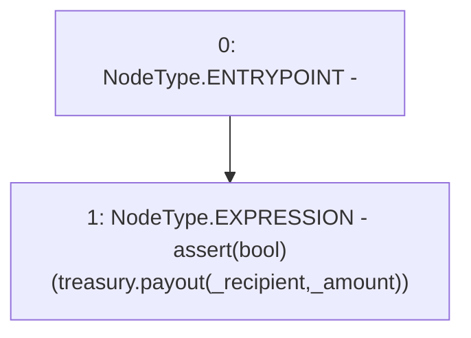

# Context: RCMarket._payout

**Contract:** `RCMarket` (Inherits: IRCMarket, NativeMetaTransaction, Initializable)
**Signature:** `_payout(address,uint256)`
**Method Selector ID:** `Internal (No Method ID)`
**Visibility:** `internal`
**Environment-Free:** `Yes`
**Modifiers:** None

### State Variables Interaction
- **Reads:** treasury
- **Writes:** None

### Assertion Checks & Business Requirements
- require/assert: `assert(bool)(treasury.payout(_recipient,_amount))`

### Environment & Verification Flags
- **Uses Foundry Cheatcodes:** No
- **Has Echidna Properties:** No

### Internal Calls Tree
- None

### External Calls / Value Transfers
- `IRCTreasury.TMP_1008(bool) = HIGH_LEVEL_CALL, dest:treasury(IRCTreasury), function:payout, arguments:['_recipient', '_amount']  `

### Control Flow Graph (CFG)


### Source Mapping
Declared in: `contracts/RCMarket.sol` on lines **550** to **552**

```solidity
    function _payout(address _recipient, uint256 _amount) internal {
        assert(treasury.payout(_recipient, _amount));
    }

```
