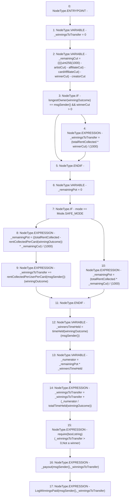

# Context: RCMarket._payoutWinnings

**Contract:** `RCMarket` (Inherits: IRCMarket, NativeMetaTransaction, Initializable)
**Signature:** `_payoutWinnings()`
**Method Selector ID:** `Internal (No Method ID)`
**Visibility:** `internal`
**Environment-Free:** `No (reads EVM state context)`
**Modifiers:** None

### State Variables Interaction
- **Reads:** affiliateCut, artistCut, cardAffiliateCut, creatorCut, longestOwner, mode, rentCollectedPerCard, rentCollectedPerUserPerCard, timeHeld, totalRentCollected, totalTimeHeld, winnerCut, winningOutcome
- **Writes:** None

### Assertion Checks & Business Requirements
- require/assert: `require(bool,string)(_winningsToTransfer > 0,Not a winner)`

### Environment & Verification Flags
- **Uses Foundry Cheatcodes:** No
- **Has Echidna Properties:** No

### Internal Calls Tree
- None

### External Calls / Value Transfers
- None

### Control Flow Graph (CFG)


### Source Mapping
Declared in: `contracts/RCMarket.sol` on lines **503** to **534**

```solidity
    function _payoutWinnings() internal {
        uint256 _winningsToTransfer = 0;
        uint256 _remainingCut =
            ((((uint256(1000) - artistCut) - affiliateCut) - cardAffiliateCut) -
                winnerCut) - creatorCut;
        // calculate longest owner's extra winnings, if relevant
        if (longestOwner[winningOutcome] == msgSender() && winnerCut > 0) {
            _winningsToTransfer = (totalRentCollected * winnerCut) / (1000);
        }
        uint256 _remainingPot = 0;
        if (mode == Mode.SAFE_MODE) {
            // return all rent paid on winning card
            _remainingPot =
                ((totalRentCollected - rentCollectedPerCard[winningOutcome]) *
                    _remainingCut) /
                (1000);
            _winningsToTransfer += rentCollectedPerUserPerCard[msgSender()][
                winningOutcome
            ];
        } else {
            // calculate normal winnings, if any
            _remainingPot = (totalRentCollected * _remainingCut) / (1000);
        }
        uint256 _winnersTimeHeld = timeHeld[winningOutcome][msgSender()];
        uint256 _numerator = _remainingPot * _winnersTimeHeld;
        _winningsToTransfer =
            _winningsToTransfer +
            (_numerator / totalTimeHeld[winningOutcome]);
        require(_winningsToTransfer > 0, "Not a winner");
        _payout(msgSender(), _winningsToTransfer);
        emit LogWinningsPaid(msgSender(), _winningsToTransfer);
    }

```
