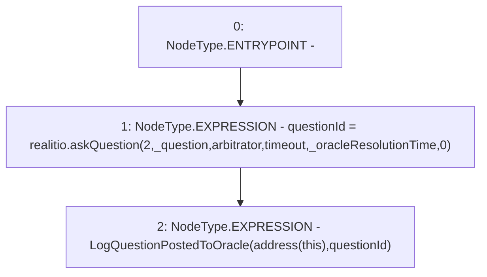

# Context: RCMarket._postQuestionToOracle

**Contract:** `RCMarket` (Inherits: IRCMarket, NativeMetaTransaction, Initializable)
**Signature:** `_postQuestionToOracle(string,uint32)`
**Method Selector ID:** `Internal (No Method ID)`
**Visibility:** `internal`
**Environment-Free:** `Yes`
**Modifiers:** None

### State Variables Interaction
- **Reads:** arbitrator, questionId, realitio, timeout
- **Writes:** questionId

### Environment & Verification Flags
- **Uses Foundry Cheatcodes:** No
- **Has Echidna Properties:** No

### Internal Calls Tree
- None

### External Calls / Value Transfers
- `IRealitio.TMP_912(bytes32) = HIGH_LEVEL_CALL, dest:realitio(IRealitio), function:askQuestion, arguments:['2', '_question', 'arbitrator', 'timeout', '_oracleResolutionTime', '0']  `

### Control Flow Graph (CFG)


### Source Mapping
Declared in: `contracts/RCMarket.sol` on lines **394** to **407**

```solidity
    function _postQuestionToOracle(
        string calldata _question,
        uint32 _oracleResolutionTime
    ) internal {
        questionId = realitio.askQuestion(
            2,
            _question,
            arbitrator,
            timeout,
            _oracleResolutionTime,
            0
        );
        emit LogQuestionPostedToOracle(address(this), questionId);
    }

```
