# Context: RCMarket._processRentCollection

**Contract:** `RCMarket` (Inherits: IRCMarket, NativeMetaTransaction, Initializable)
**Signature:** `_processRentCollection(address,uint256,uint256)`
**Method Selector ID:** `Internal (No Method ID)`
**Visibility:** `internal`
**Environment-Free:** `Yes`
**Modifiers:** None

### State Variables Interaction
- **Reads:** cardPrice, cardTimeLimit, longestTimeHeld, orderbook, rentCollectedPerCard, rentCollectedPerUser, rentCollectedPerUserPerCard, timeHeld, timeLastCollected, totalRentCollected, totalTimeHeld, treasury
- **Writes:** cardTimeLimit, longestOwner, longestTimeHeld, rentCollectedPerCard, rentCollectedPerUser, rentCollectedPerUserPerCard, timeHeld, timeLastCollected, totalRentCollected, totalTimeHeld

### Environment & Verification Flags
- **Uses Foundry Cheatcodes:** No
- **Has Echidna Properties:** No

### Internal Calls Tree
- None

### External Calls / Value Transfers
- `IRCTreasury.TMP_1220(bool) = HIGH_LEVEL_CALL, dest:treasury(IRCTreasury), function:payRent, arguments:['_rentOwed']  `
- `IRCOrderbook.HIGH_LEVEL_CALL, dest:orderbook(IRCOrderbook), function:reduceTimeHeldLimit, arguments:['_user', '_card', '_timeHeldToIncrement']  `

### Control Flow Graph (CFG)

```mermaid
flowchart TD
    Node_0["0: NodeType.ENTRYPOINT - "]
    Node_0 --> Node_1
    Node_1["1: NodeType.VARIABLE - _rentOwed = (cardPrice(_card) * (_timeOfCollection - timeLastCollected(_card))) / 86400"]
    Node_1 --> Node_2
    Node_2["2: NodeType.EXPRESSION - treasury.payRent(_rentOwed)"]
    Node_2 --> Node_3
    Node_3["3: NodeType.VARIABLE - _timeHeldToIncrement = (_timeOfCollection - timeLastCollected(_card))"]
    Node_3 --> Node_4
    Node_4["4: NodeType.IF - cardTimeLimit(_card) != 0"]
    Node_4 --> Node_5
    Node_4 --> Node_7
    Node_5["5: NodeType.EXPRESSION - orderbook.reduceTimeHeldLimit(_user,_card,_timeHeldToIncrement)"]
    Node_5 --> Node_6
    Node_6["6: NodeType.EXPRESSION - cardTimeLimit(_card) -= _timeHeldToIncrement"]
    Node_6 --> Node_7
    Node_7["7: NodeType.ENDIF - "]
    Node_7 --> Node_8
    Node_8["8: NodeType.EXPRESSION - timeHeld(_card)(_user) += _timeHeldToIncrement"]
    Node_8 --> Node_9
    Node_9["9: NodeType.EXPRESSION - totalTimeHeld(_card) += _timeHeldToIncrement"]
    Node_9 --> Node_10
    Node_10["10: NodeType.EXPRESSION - rentCollectedPerUser(_user) += _rentOwed"]
    Node_10 --> Node_11
    Node_11["11: NodeType.EXPRESSION - rentCollectedPerCard(_card) += _rentOwed"]
    Node_11 --> Node_12
    Node_12["12: NodeType.EXPRESSION - rentCollectedPerUserPerCard(_user)(_card) += _rentOwed"]
    Node_12 --> Node_13
    Node_13["13: NodeType.EXPRESSION - totalRentCollected += _rentOwed"]
    Node_13 --> Node_14
    Node_14["14: NodeType.EXPRESSION - timeLastCollected(_card) = _timeOfCollection"]
    Node_14 --> Node_15
    Node_15["15: NodeType.IF - timeHeld(_card)(_user) > longestTimeHeld(_card)"]
    Node_15 --> Node_16
    Node_15 --> Node_18
    Node_16["16: NodeType.EXPRESSION - longestTimeHeld(_card) = timeHeld(_card)(_user)"]
    Node_16 --> Node_17
    Node_17["17: NodeType.EXPRESSION - longestOwner(_card) = _user"]
    Node_17 --> Node_18
    Node_18["18: NodeType.ENDIF - "]
    Node_18 --> Node_19
    Node_19["19: NodeType.EXPRESSION - LogRentCollection(_rentOwed,timeHeld(_card)(_user),_card,_user)"]
```


### Source Mapping
Declared in: `contracts/RCMarket.sol` on lines **1052** to **1083**

```solidity
    function _processRentCollection(
        address _user,
        uint256 _card,
        uint256 _timeOfCollection
    ) internal {
        uint256 _rentOwed =
            (cardPrice[_card] *
                (_timeOfCollection - timeLastCollected[_card])) / 1 days;
        treasury.payRent(_rentOwed);
        uint256 _timeHeldToIncrement =
            (_timeOfCollection - timeLastCollected[_card]);

        // if the user has a timeLimit, adjust it as necessary
        if (cardTimeLimit[_card] != 0) {
            orderbook.reduceTimeHeldLimit(_user, _card, _timeHeldToIncrement);
            cardTimeLimit[_card] -= _timeHeldToIncrement;
        }
        timeHeld[_card][_user] += _timeHeldToIncrement;
        totalTimeHeld[_card] += _timeHeldToIncrement;
        rentCollectedPerUser[_user] += _rentOwed;
        rentCollectedPerCard[_card] += _rentOwed;
        rentCollectedPerUserPerCard[_user][_card] += _rentOwed;
        totalRentCollected += _rentOwed;
        timeLastCollected[_card] = _timeOfCollection;

        // longest owner tracking
        if (timeHeld[_card][_user] > longestTimeHeld[_card]) {
            longestTimeHeld[_card] = timeHeld[_card][_user];
            longestOwner[_card] = _user;
        }
        emit LogRentCollection(_rentOwed, timeHeld[_card][_user], _card, _user);
    }

```
