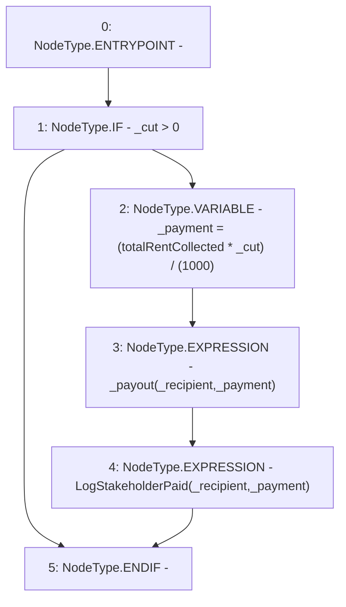

# Context: RCMarket._processStakeholderPayment

**Contract:** `RCMarket` (Inherits: IRCMarket, NativeMetaTransaction, Initializable)
**Signature:** `_processStakeholderPayment(uint256,address)`
**Method Selector ID:** `Internal (No Method ID)`
**Visibility:** `internal`
**Environment-Free:** `Yes`
**Modifiers:** None

### State Variables Interaction
- **Reads:** totalRentCollected
- **Writes:** None

### Environment & Verification Flags
- **Uses Foundry Cheatcodes:** No
- **Has Echidna Properties:** No

### Internal Calls Tree
- None

### External Calls / Value Transfers
- None

### Control Flow Graph (CFG)


### Source Mapping
Declared in: `contracts/RCMarket.sol` on lines **601** to **609**

```solidity
    function _processStakeholderPayment(uint256 _cut, address _recipient)
        internal
    {
        if (_cut > 0) {
            uint256 _payment = (totalRentCollected * _cut) / (1000);
            _payout(_recipient, _payment);
            emit LogStakeholderPaid(_recipient, _payment);
        }
    }

```
