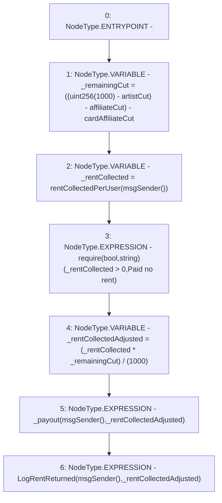

# Context: RCMarket._returnRent

**Contract:** `RCMarket` (Inherits: IRCMarket, NativeMetaTransaction, Initializable)
**Signature:** `_returnRent()`
**Method Selector ID:** `Internal (No Method ID)`
**Visibility:** `internal`
**Environment-Free:** `No (reads EVM state context)`
**Modifiers:** None

### State Variables Interaction
- **Reads:** affiliateCut, artistCut, cardAffiliateCut, rentCollectedPerUser
- **Writes:** None

### Assertion Checks & Business Requirements
- require/assert: `require(bool,string)(_rentCollected > 0,Paid no rent)`

### Environment & Verification Flags
- **Uses Foundry Cheatcodes:** No
- **Has Echidna Properties:** No

### Internal Calls Tree
- None

### External Calls / Value Transfers
- None

### Control Flow Graph (CFG)


### Source Mapping
Declared in: `contracts/RCMarket.sol` on lines **537** to **547**

```solidity
    function _returnRent() internal {
        // deduct artist share and card specific share if relevant but NOT market creator share or winner's share (no winner, market creator does not deserve)
        uint256 _remainingCut =
            ((uint256(1000) - artistCut) - affiliateCut) - cardAffiliateCut;
        uint256 _rentCollected = rentCollectedPerUser[msgSender()];
        require(_rentCollected > 0, "Paid no rent");
        uint256 _rentCollectedAdjusted =
            (_rentCollected * _remainingCut) / (1000);
        _payout(msgSender(), _rentCollectedAdjusted);
        emit LogRentReturned(msgSender(), _rentCollectedAdjusted);
    }

```
