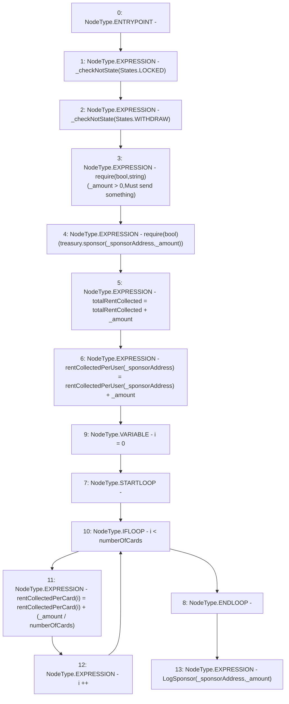

# Context: RCMarket._sponsor

**Contract:** `RCMarket` (Inherits: IRCMarket, NativeMetaTransaction, Initializable)
**Signature:** `_sponsor(address,uint256)`
**Method Selector ID:** `Internal (No Method ID)`
**Visibility:** `internal`
**Environment-Free:** `Yes`
**Modifiers:** None

### State Variables Interaction
- **Reads:** numberOfCards, rentCollectedPerCard, rentCollectedPerUser, totalRentCollected, treasury
- **Writes:** rentCollectedPerCard, rentCollectedPerUser, totalRentCollected

### Assertion Checks & Business Requirements
- require/assert: `require(bool,string)(_amount > 0,Must send something)`
- require/assert: `require(bool)(treasury.sponsor(_sponsorAddress,_amount))`

### Environment & Verification Flags
- **Uses Foundry Cheatcodes:** No
- **Has Echidna Properties:** No

### Internal Calls Tree
- None

### External Calls / Value Transfers
- `TMP_1140(None) = SOLIDITY_CALL require(bool,string)(TMP_1139,Must send something)`
- `IRCTreasury.TMP_1141(bool) = HIGH_LEVEL_CALL, dest:treasury(IRCTreasury), function:sponsor, arguments:['_sponsorAddress', '_amount']  `

### Control Flow Graph (CFG)


### Source Mapping
Declared in: `contracts/RCMarket.sol` on lines **825** to **843**

```solidity
    function _sponsor(address _sponsorAddress, uint256 _amount) internal {
        _checkNotState(States.LOCKED);
        _checkNotState(States.WITHDRAW);
        require(_amount > 0, "Must send something");
        // send tokens to the Treasury
        require(treasury.sponsor(_sponsorAddress, _amount));
        totalRentCollected = totalRentCollected + _amount;
        // just so user can get it back if invalid outcome
        rentCollectedPerUser[_sponsorAddress] =
            rentCollectedPerUser[_sponsorAddress] +
            _amount;
        // allocate equally to each card, in case card specific affiliates
        for (uint256 i = 0; i < numberOfCards; i++) {
            rentCollectedPerCard[i] =
                rentCollectedPerCard[i] +
                (_amount / numberOfCards);
        }
        emit LogSponsor(_sponsorAddress, _amount);
    }

```
